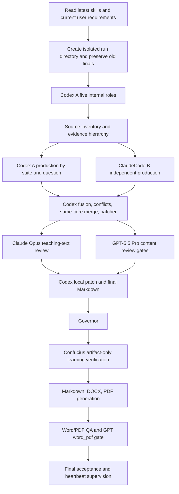

# Skill Compliance Audit

time: 2026-05-04 09:25 CST
status: PASS
scope: feige-politics-garden, feige-politics-garden-xuanbiyi, feige-politics-garden-book-orchestrator, documents skill

## Flowchart

## Mandatory Rings

| Ring | Required By Skill | Evidence | Status |
|---|---|---|---|
| Latest skill reread | Garden and orchestrator skills | current run notes and this audit | PASS |
| Independent directory | Do not delete or overwrite old finals | `选必一_当代国际政治与经济_四线终极全书_2026-05-03` | PASS |
| Codex A roles | 决策者、劳动者、补丁者、监管者/Governor、自动化检测者 must exist inside Codex production lane A | `codex_lane/agents/ROLE_LEDGER.md` plus role subdirectories; final automation sync in `08_review/role_reviews/automation_consistency_final_sync_20260504.md`; real subagent closeout in `08_review/role_reviews/subagent_status_final_reconciliation_20260504.md` | PASS |
| ClaudeCode B | Real independent production lane, logs retained | `claudecode_lane/logs/`, final `screen -ls` = no sockets, log count = 33 | PASS |
| Claude Opus 4.7 | Real Claude teaching-text lane, not Codex simulation | `08_review/claude_content_review/final_markdown_targeted_regate_response_20260504.md` | PASS |
| GPT-5.5 Pro | Same ChatGPT Pro conversation, fixed content gates | `08_review/gpt_content_review/gpt_content_review_index.md`; final Markdown PASS; clean rerun `word_pdf` PASS | PASS |
| Evidence hierarchy | Scoring/rubric sources outrank reference answers; weak evidence guarded | `SOURCE_LEDGER.csv`, `COVERAGE_MATRIX.csv`, `06_conflicts/` | PASS |
| 选必一 six buckets | 时代背景、理论、经济全球化、政治多极化、中国、联合国 | final handout and teacher index | PASS |
| Same-core merge | Preserve high-information terms while merging variants | final handout keeps terms such as `开放、包容、普惠、平衡、共赢` and variant accumulations | PASS |
| Student shape | 完整设问 -> 设问触发 -> 材料触发 -> 框架落点 -> 答题点自身积累 -> 答案句 | `09_delivery/document_generation_qa_20260504.md` counts 48 question chains and 177 item chains | PASS |
| Exclusion | `2026石景山期末` excluded | clean scan and acceptance reports | PASS |
| Governor | Final veto gate | `08_review/role_reviews/governor_final_markdown_regate.md` | PASS |
| Confucius | Artifact-only learning verification | `08_review/role_reviews/confucius_final_markdown_regate.md` | PASS |
| Documents | Markdown, DOCX, PDF and visual/text QA | `09_delivery/word_visual_check.md`, `09_delivery/pdf_visual_check.md` | PASS_WITH_FALLBACK |
| Final artifacts | Markdown, DOCX, PDF, acceptance report | `09_delivery/` and `FINAL_ACCEPTANCE_REPORT.md` | PASS |

## GPT Fixed Triggers

| Trigger | Record | Status |
|---|---|---|
| outline | Phase 01 startup/route outline sent as commander review; later superseded by section/final gates | PASS_WITH_EQUIVALENT_RECORD |
| section_batch | `section_batch_review_response_20260503.md` returned blockers; blockers converted into the by-question refactor and final Markdown corrections | CLOSED_BY_FINAL_REGATE |
| final_markdown | `final_markdown_targeted_regate_response_20260504.md` | PASS |
| word_pdf | `word_pdf_clean_rerun_response_20260504.md` | PASS |

## Final Note

The late skill gap found during the reread was the missing separate `word_pdf` GPT gate. After the user noticed the first web-visible prompt looked garbled, Codex reran that gate cleanly in the same ChatGPT Pro conversation. The clean rerun returned `verdict: PASS`, and the final acceptance files were updated after that gate.
