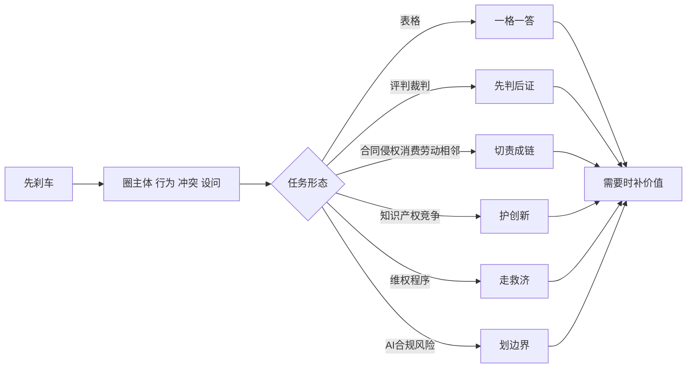

# 选必二《法律与生活》主观题框架 v3 夜间分批重构版

## 版本定位

本版从 STEP_29 的 65 道主观题证据底座出发：61 formal，4 reference_only，0 missing。它吸收“先发现，不建构”的方法：先做动作卡与分批机制，再合成主干框架。

它不是教材目录，也不是法考式要件清单。它是学生在考场把材料转成法律语言的动作系统。

## 证据边界

- core_candidate: 53
- reference_only: 4
- boundary_open: 3
- low_frequency_container: 5

reference_only 不进入核心支撑。boundary/open 和 low-frequency singleton 进入全量容器，给作答方法，不制造稳定套路。

## 总框架

先刹车 -> 圈主体和行为 -> 判法律关系或任务形态 -> 嵌材料进规则 -> 落责任/程序/边界 -> 需要时补价值。

## 七个主节点

### N01 格子题：一格一答

学生版：有表格先服从格子

教师解释：先看每一格问的是机制、理由、措施还是意义；一格只答一个任务，绝不跨格抄模板。

材料触发：表格、填入、表中、机制/理由/措施/意义分栏。

满分句模板：这一格要求说明【格子任务】。材料中【事实】对应【法律规则/程序】，因此应写【最短结论】。

易错路径：跨格写一大段“维护合法权益、促进公平正义”，格子问机制却写意义。

支撑题源：CC0061_2024_西城_一模_18, CC0077_2025_东城_一模_19, CC0084_2025_东城_二模_19, CC0137_2025_昌平_二模_20, CC0157_2025_朝阳_期末_20, CC0289_2026_朝阳_二模_18, RECOVER_2025_海淀_二模_18, RECOVER_2026_通州_一模_20

### N02 评判裁判题：先判后证

学生版：问是否、判决、认识，先表态

教师解释：先写支持/不支持、有效/无效、构成/不构成、法院判决有依据；再写规则和材料事实。

材料触发：是否、支持、不支持、有效、无效、构成、判决、法院、谈谈认识、法理依据。

满分句模板：我认为【结论】。人民法院以事实为根据、以法律为准绳。根据【法律规则】，材料中【事实】符合/不符合【要件】，所以【责任/判决/请求】成立。

易错路径：没有首句表态；只写法条不落到本案；把裁判锚句当成整题答案。

支撑题源：CC0002_2024_丰台_一模_17, CC0025_2024_朝阳_二模_17, CC0045_2024_海淀_二模_19, CC0054_2024_石景山_一模_17, CC0061_2024_西城_一模_18, CC0063_2024_西城_二模_16, CC0077_2025_东城_一模_19, CC0084_2025_东城_二模_19, CC0092_2025_东城_期末_19_1, CC0103_2025_丰台_一模_19, CC0119_2025_丰台_期末_19, CC0125_2025_延庆_一模_19, CC0131_2025_房山_一模_19, CC0137_2025_昌平_二模_20, CC0143_2025_朝阳_一模_19, CC0157_2025_朝阳_期末_20, CC0180_2025_海淀_期末_20, CC0181_2025_海淀_期末_21 ...

### N03 私法责任题：切责成链

学生版：合同、侵权、消费、劳动、相邻都走责任链

教师解释：定主体关系，定行为性质，放入规则要件，落责任/效力/请求。

材料触发：合同、要约、承诺、履行、违约、侵权、赔偿、消费者、欺诈、劳动、相邻、人格权、生命健康权。

满分句模板：【主体A】与【主体B】之间形成【法律关系】。【行为】符合【规则要件】。材料中【事实】说明【要件成立/不成立】，因此【责任、效力或诉求】应当【支持/不支持】。

易错路径：只背权利名称，不判断法律关系；材料事实贴在后面当故事，没有塞进规则要件。

支撑题源：CC0002_2024_丰台_一模_17, CC0019_2024_朝阳_一模_19, CC0025_2024_朝阳_二模_17, CC0045_2024_海淀_二模_19, CC0054_2024_石景山_一模_17, CC0061_2024_西城_一模_18, CC0063_2024_西城_二模_16, CC0077_2025_东城_一模_19, CC0084_2025_东城_二模_19, CC0092_2025_东城_期末_19_1, CC0103_2025_丰台_一模_19, CC0119_2025_丰台_期末_19, CC0125_2025_延庆_一模_19, CC0131_2025_房山_一模_19, CC0137_2025_昌平_二模_20, CC0143_2025_朝阳_一模_19, CC0150_2025_朝阳_二模_20, CC0157_2025_朝阳_期末_20 ...

### N04 创新竞争题：定行为、护秩序

学生版：知识产权和竞争题先定行为

教师解释：先判断侵犯的是著作权、商标、专利、商业秘密，还是不正当竞争；再写保护创新和市场秩序。

材料触发：知识产权、著作权、商标、专利、商业秘密、商业诋毁、混淆、不正当竞争、AI作品、核心代码、创新。

满分句模板：材料中【行为】属于【侵权/不正当竞争类型】，损害了【权利/竞争秩序】。依法应【停止侵害/赔偿/承担责任】，这有利于保护创新成果、规范市场竞争秩序。

易错路径：一看到创新就空写新质生产力；著作权、商标、商业秘密混用；漏法院具体责任。

支撑题源：CC0103_2025_丰台_一模_19, CC0131_2025_房山_一模_19, CC0137_2025_昌平_二模_20, CC0143_2025_朝阳_一模_19, CC0150_2025_朝阳_二模_20, CC0157_2025_朝阳_期末_20, CC0180_2025_海淀_期末_20, CC0181_2025_海淀_期末_21, CC0189_2025_石景山_一模_20, CC0206_2025_西城_期末_19, CC0213_2025_门头沟_一模_20, CC0223_2025_顺义_一模_19, CC0229_2026_东城_一模_18, CC0238_2026_东城_二模_19, CC0244_2026_东城_期末_18, CC0251_2026_丰台_一模_20, CC0277_2026_房山_二模_18, CC0283_2026_朝阳_一模_18 ...

### N05 程序救济题：路径、证据、请求

学生版：问怎么办、如何维权，先走路径

教师解释：先选协商、调解、仲裁、诉讼或司法确认；再写证据和请求；公益诉讼单列公益主体和强制执行。

材料触发：调解、仲裁、诉讼、起诉状、证据、举证、诉讼请求、司法确认、强制执行、公益诉讼、和解。

满分句模板：当事人可以通过【路径】解决纠纷，并围绕【争议事实】提交【证据】，提出【请求】。若经法院依法确认，【协议/裁判】具有相应法律效力。

易错路径：把所有题都写成起诉；调解题写成判决；公益诉讼写成个人维权。

支撑题源：CC0025_2024_朝阳_二模_17, CC0045_2024_海淀_二模_19, CC0054_2024_石景山_一模_17, CC0061_2024_西城_一模_18, CC0063_2024_西城_二模_16, CC0077_2025_东城_一模_19, CC0103_2025_丰台_一模_19, CC0119_2025_丰台_期末_19, CC0125_2025_延庆_一模_19, CC0131_2025_房山_一模_19, CC0137_2025_昌平_二模_20, CC0143_2025_朝阳_一模_19, CC0150_2025_朝阳_二模_20, CC0157_2025_朝阳_期末_20, CC0181_2025_海淀_期末_21, CC0189_2025_石景山_一模_20, CC0206_2025_西城_期末_19, CC0213_2025_门头沟_一模_20 ...

### N06 风险合规题：一险一界一措施

学生版：AI、数据、平台、合规题先分风险

教师解释：一项风险对应一条法律边界和一项治理/合规措施；区分具体权利风险和宏观治理开放题。

材料触发：风险、合规、AI、人工智能、数字员工、数据、算法、平台、开源智能体、治理、边界。

满分句模板：材料中的【风险】触及【法律边界/权利义务】。应当通过【制度/合同/告知/授权/审核/责任机制】加以规范，做到【具体效果】。

易错路径：一看到 AI 就写科技伦理；一看到风险就写诉讼赔偿；不把风险和措施一一对应。

支撑题源：CC0025_2024_朝阳_二模_17, CC0054_2024_石景山_一模_17, CC0077_2025_东城_一模_19, CC0084_2025_东城_二模_19, CC0137_2025_昌平_二模_20, CC0143_2025_朝阳_一模_19, CC0150_2025_朝阳_二模_20, CC0157_2025_朝阳_期末_20, CC0206_2025_西城_期末_19, CC0213_2025_门头沟_一模_20, CC0223_2025_顺义_一模_19, CC0238_2026_东城_二模_19, CC0251_2026_丰台_一模_20, CC0277_2026_房山_二模_18, CC0289_2026_朝阳_二模_18, CC0373_2026_顺义_一模_18, RECOVER_2026_通州_一模_20, RECOVER_2025_丰台_二模_19_2 ...

### N07 意义价值题：从本案推出三层价值

学生版：问意义、作用、价值，最后补三层

教师解释：先处理本案法律规则，再写保护谁、规范什么秩序、弘扬什么价值。

材料触发：意义、作用、价值、有利于、弘扬、促进、维护、规范、秩序、公平、正义、诚信、核心价值观。

满分句模板：该处理有利于保护【具体主体】的合法权益，有利于规范【具体司法/行业/市场秩序】，有利于弘扬【诚信/公平/友善/法治】等具体价值。

易错路径：上来空喊公平正义；三层主语重复；价值句没有从本案法律规则推出。

支撑题源：CC0002_2024_丰台_一模_17, CC0019_2024_朝阳_一模_19, CC0025_2024_朝阳_二模_17, CC0045_2024_海淀_二模_19, CC0054_2024_石景山_一模_17, CC0061_2024_西城_一模_18, CC0063_2024_西城_二模_16, CC0077_2025_东城_一模_19, CC0084_2025_东城_二模_19, CC0103_2025_丰台_一模_19, CC0119_2025_丰台_期末_19, CC0125_2025_延庆_一模_19, CC0131_2025_房山_一模_19, CC0137_2025_昌平_二模_20, CC0143_2025_朝阳_一模_19, CC0150_2025_朝阳_二模_20, CC0157_2025_朝阳_期末_20, CC0180_2025_海淀_期末_20 ...

## 全量容器

### reference_only 容器

CC0040、CC0162、CC0311、CC0353 只能作为写法参考。教师可以展示其语言，但不能说它们支撑核心节点。

### boundary/open 容器

CC0276、CC0380、RECOVER_2026_西城_二模_18_3 formal 但边界明显。处理方式：按制度、机制、程序、效果写，不把它们升成合同侵权维权模板。

### low-frequency singleton 容器

生态保护、绿色发展、校园欺凌惩教、诉讼时效、法治德治结合等，可以教作答方法，但暂不制造稳定主干。
