# 选必二《法律与生活》AB双轴学生宝典

本稿沿用 AB 双轴：A 轴定法律关系，B 轴定答案形状。每个 A 轴核心要点下，穷尽列入当前三年题源中归入该点的主观题。

## AB 双轴总规则

- A 轴：先判断生活冲突属于哪类法律关系，防止整题跑偏。
- B 轴：再判断设问要表格、判责、诉求、评析、意义、维权路径还是短答识别，防止答案形状跑偏。
- 写法：材料事实必须进入法律规则，法律规则必须落到结论。

## A1 民事行为与时效

本节共 4 个分问。

### 核心答题点和必备知识
- 核心入口：未成年人、意思表示、代理、追认、合同效力、限制民事行为能力、诉讼时效、不适用时效。
- 第一判断：先判断行为是否有效、权利是否还能主张，再落到交易安全或特殊身份利益保护。
- 易错边界：诉讼时效不是权利消灭；未成年人案件不能只写同情，要写行为能力、追认和责任分配。
- 必背句：先判断行为能力、意思表示、追认、时效或行为效力，再落请求能否支持。

### 2024 · 东城 · 一模 · 第19题

- 题目来源：2024 · 东城 · 一模 · 第19题
- 框架归位：A1 民事行为与时效｜B5 意义价值
- 同题组：本题组仅本分问。

#### 材料
案件1 2018年，郭某为李某制作电表箱，李
某 郭某出具欠据，约定2019年2月1日前还
清。期间，郭某从未催要钱款。2024年3月，郭某
向李某催讨钱款，李某拒绝还款。郭某无奈将李
某告上法庭，最终因李某主张诉讼时效届满而
败诉。
案件2 冯某与其母程某约定，自2018年3
月起，冯某每月向程某支付赡养费。2019年1月
资料卡
诉讼时效是指权利主体
在法定期间内不行使权利，
义务人便享有抗辩权（权利
人行使其请求权时，义务人
享有的拒绝其请求的权利），
从而导致权利人无法胜诉的
法律制度。
起，冯某再未支付上述费用，程某从未催讨。2024
年2月，程某将冯某诉至法庭，要求其支付5年来未支付的相关费用。冯某以诉讼
时效届满为由进行抗辩。法院依据《中华人民共和国民法典》第一百九十六条，以
请求支付赡养费不适用诉讼时效为由，对冯某的主张不予支持，判令冯某如数支付
相关费用。

#### 设问
针对上述案件，运用《法律与生活》知识，谈谈法律规定诉讼时效并对其不适用
的情形加以规定的原因。

#### 细则
19.（6分）
法律规定诉讼时效有助于督促当事人积极主张权利，推动纠纷解决，节约司法资源。赡
养问题事关老年人的基本生存权利，成年子女对父母有赡养的义务。请求支付赡养费不
适用诉讼时效的规定有助于保护老年人的合法权益，彰显公序良俗，体现人文关怀，构建
和谐家庭。

#### 答案落点
- 19.（6分）法律规定诉讼时效有助于督促当事人积极主张权利，推动纠纷解决，节约司法资源。
- 赡养问题事关老年人的基本生存权利，成年子女对父母有赡养的义务。
- 请求支付赡养费不适用诉讼时效的规定有助于保护老年人的合法权益，彰显公序良俗，体现人文关怀，构建和谐家庭。

### 2025 · 东城 · 二模 · 第19题

- 题目来源：2025 · 东城 · 二模 · 第19题
- 框架归位：A1 民事行为与时效｜B1 补表/补链
- 同题组：本题组仅本分问。

#### 材料
(8分)法律以清晰的边界和公正的尺度守护社会秩序，营造美好生活。
案件一 龙某为 13 周岁的钱某在所经营的美容工作室进行了大面积文身并收取费用。钱某母亲发现后，为
避免对钱某求学及就业造成影响，要求龙某为钱某清洗文身并赔偿。因协商未果，钱某诉至法院，最终法
院判决龙某退还文身费用并赔偿精神损失。
案件二 杨某在其运营的自媒体账号发布文章，在没有事实依据的情况下，评价某公司“搅乱市场”“打劫同
行”“无赖”“强盗”，引发社会关注，造成严重负面影响。该公司诉至法院，最终法院判决杨某公开道歉并赔
偿损失。
案件三 邬某通过某公司的 App预定境外客房，支付方式为“到店支付”，下单后即被从银行卡中扣除房款，
邬某不知情也未入住。邬某发现扣款后要求退还，而公司认为其服务条款中已注明“部分酒店住宿可能会
对您的银行卡预先收取全额预订费用”，拒绝退款。邬某诉至法院，最终法院判决该公司退还房款。

#### 原题图
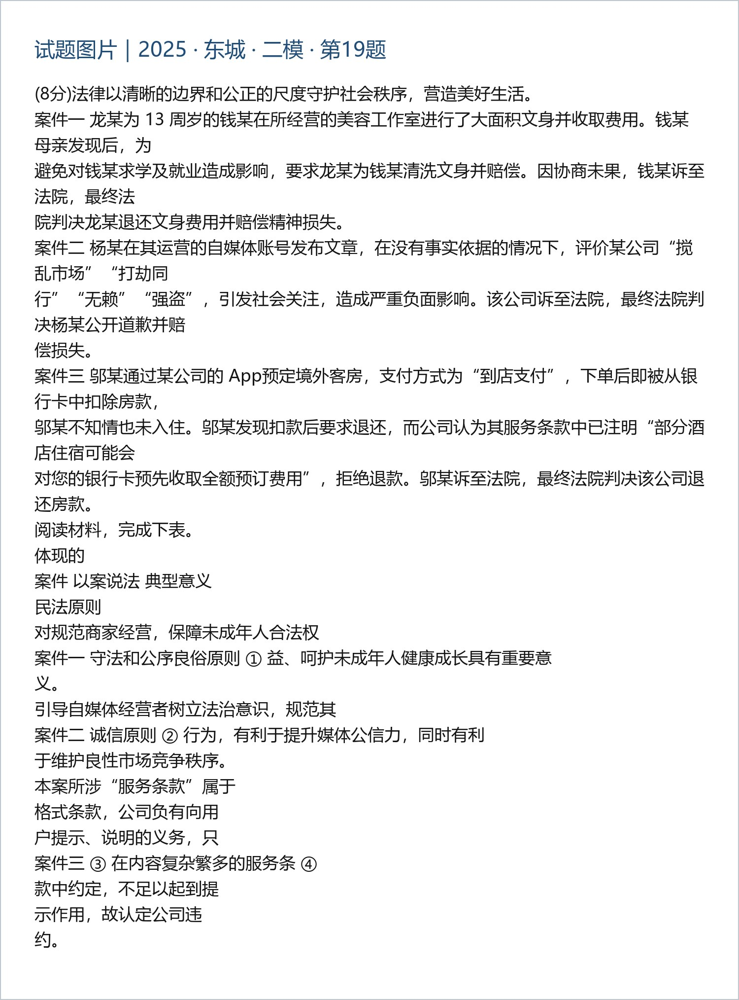

#### 设问
阅读材料，完成下表。
案件 | 体现的民法原则 | 以案说法 | 典型意义
案件一 | 守法和公序良俗原则 | ① | 对规范商家经营，保障未成年人合法权益、呵护未成年人健康成长具有重要意义。
案件二 | 诚信原则 | ② | 引导自媒体经营者树立法治意识，规范其行为，有利于提升媒体公信力，同时有利于维护良性市场竞争秩序。
案件三 | ③ | 本案所涉“服务条款”属于格式条款，公司负有向用户提示、说明的义务，只在内容复杂繁多的服务条款中约定，不足以起到提示作用，故认定公司违约。 | ④

#### 细则
19.阅读材料，完成表格。
（一）本题标准和变通
①龙某为钱某文身案例（2分）：该情境有两个问题，即合同效力问题和侵权问题：
学生可以通过把一个问题说清楚得2分，也可以通过呈现2个准确的知识点得2分
合同效力问题：限制民事行为能力人/法定代理人未追认（1分）+ 合同无效（1分）
侵权问题：龙某没有尽到核实义务/存在过错（1分）+ 侵犯身体权/健康权（1分）
呈现了两个知识点，如：钱某事限制民事行为能力人（1分）+龙某侵犯了身体权/健康
权（1分）
②杨某自媒体案例（2分）
杨某利用自媒体，故意侮辱/诽谤某公司，造成其社会评价降低（任意一个要件1分）+ 侵
害名誉权（不可替换，1分）
构成要件替换：诬陷、捏造、造谣、诋毁、抹黑、不实信息；损害形象、损害该公司声誉；
邬某服务条款案例：
③体现的民法原则（1分）：
公平原则（1分）
可替换：诚信原则（1分）
④典型意义：意义一条2分，两条3分：
第一条：维护消费者合法权益
第二条：规范格式条款的使用
如本题消费者权益和格式条款都没提到，提到规范商家经营给1分。

#### 细则图
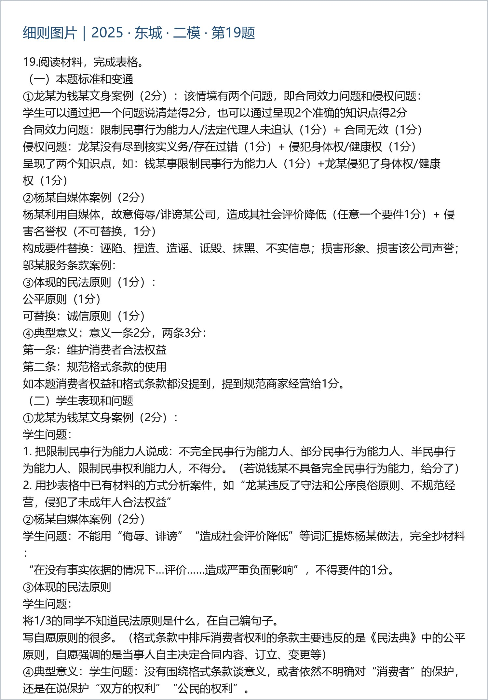
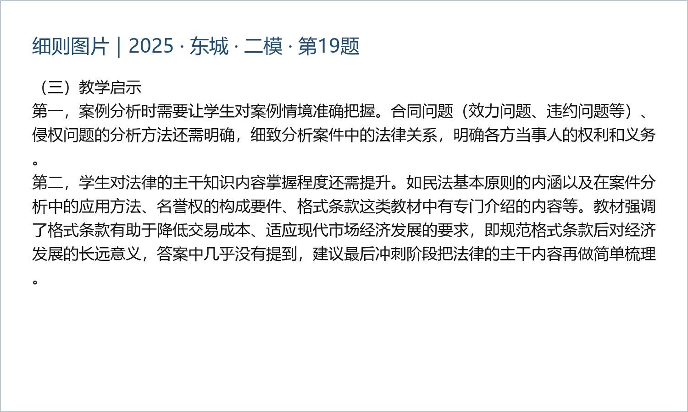

#### 答案落点
- 19.阅读材料，完成表格。
- （一）本题标准和变通①龙某为钱某文身案例（2分）：该情境有两个问题，即合同效力问题和侵权问题：学生可以通过把一个问题说清楚得2分，
- 也可以通过呈现2个准确的知识点得2分合同效力问题：限制民事行为能力人/法定代理人未追认（1分）+ 合同无效（1分）侵权问题：龙某没有尽到核实义务/存在过错（1分）+ 侵犯身体权/健康权（1分）呈现了两个知识点，
- 如：钱某事限制民事行为能力人（1分）+龙某侵犯了身体权/健康权（1分）②杨某自媒体案例（2分）杨某利用自媒体，故意侮辱/诽谤某公司，造成其社会评价降低（任意一个要件1分）+ 侵害名誉权（不可替换，1分）构成要件替换：诬陷、捏造、造谣、诋毁、抹黑、不实信息；
- 损害形象、损害该公司声誉；
- 邬某服务条款案例：③体现的民法原则（1分）：公平原则（1分）可替换：诚信原则（1分）④典型意义：意义一条2分，两条3分：第一条：维护消费者合法权益第二条：规范格式条款的使用如本题消费者权益和格式条款都没提到，提到规范商家经营给1分。

### 2025 · 西城 · 二模 · 第18题

- 题目来源：2025 · 西城 · 二模 · 第18题
- 框架归位：A1 民事行为与时效｜B2 判责/理由
- 同题组：本题组仅本分问。

#### 材料
17岁的小刘背着家长、绕过平台监管打赏多名网络主播，金额高达45万余元。
家长：我们发现之后，先跟主播沟通，有几位主播退了一部分钱，总计5万余元。后与平台客服沟通，想要回其余40万余元的打赏款，遭到拒绝。所以，我们现在将平台告上人民法院，要求返还充值款项。
平台：注意到小刘账号的异常消费后，采取了消费限制措施，停止了该账户的充值和打赏权限。但随后，小刘冒充监护人的身份与平台客服电话沟通，平台才解除了涉案账号的全部限制措施，平台不应承担责任。
人民法院一审判定，由被告平台退还未成年人充值款24万元。平台不服提出上诉，二审法院维持了一审判决。
【资料卡】《中华人民共和国民法典》第一百五十七条规定：民事法律行为无效、被撤销或者确定不发生效力后，行为人因该行为取得的财产应当予以返还；不能返还或者没有必要返还的应当折价补偿。有过错的一方应当赔偿对方由此所受到的损失；各方都有过错的，应当各自承担相应的责任。

#### 原题图
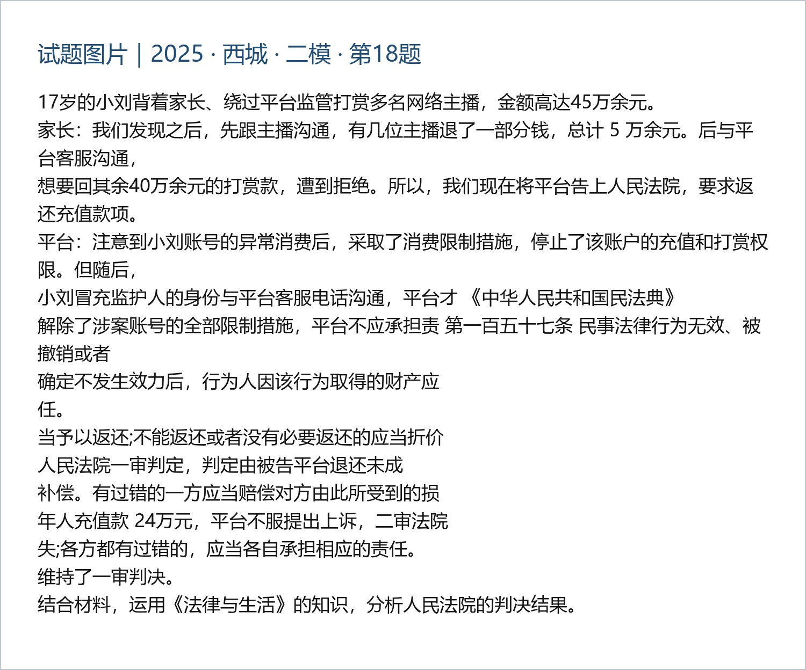

#### 设问
结合材料，运用《法律与生活》的知识，分析人民法院的判决结果。

#### 细则
18．（8分）小刘为限制民事行为能力人，其大额打赏行为，家长事先不知情、事后也不同意追认，交易行为无效。平台的审核措施不完善，未能尽到合理审查的义务，存在过错。小刘父母疏于监管，未能履行好监护职责，行为存在过错。小刘沉迷打赏，并通过欺骗手段规避监管，自身行为也有过错。综合各方过错程度，根据民法典157条规定，法院判定平台和小刘父母都应承担相应责任，符合公平原则。本案判决警示，平台应健全审核机制、担当社会责任，监护人应履行监护义务，教育引导未成年人树立正确消费观。
【细则】
小刘为限制民事行为能力人（1分），其大额打赏行为，家长事先不知情、事后也不同意追认，交易行为（民事法律行为）无效。（1分）
平台的审核措施不完善，未能尽到合理审查的义务，存在过错。小刘父母疏于监管，未能履行好监护职责，行为存在过错。小刘沉迷打赏，并通过欺骗手段规避监管，自身行为也有过错。（过错分析，共3分）
综合各方过错程度，根据民法典157条规定，法院判定平台和小刘父母都应承担相应责任，符合公平原则（1分）。
判决意义：2分。引导平台健全审核机制、担当社会责任（或促进平台经济健康发展）（1分），警示监护人依法履行监护义务，或教育引导未成年人树立正确消费观。（1分）
（即规范引导平台…1分，规范引导监护人或未成年人…）

#### 细则图
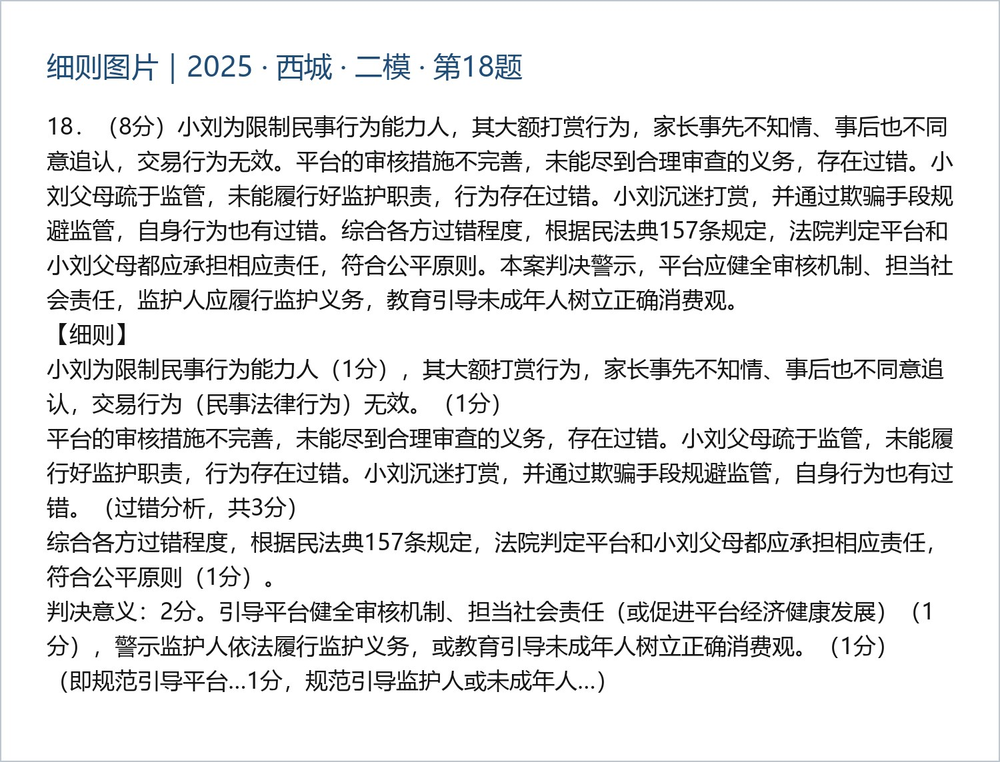

#### 答案落点
- 18．（8分）小刘为限制民事行为能力人，其大额打赏行为，家长事先不知情、事后也不同意追认，交易行为无效。
- 平台的审核措施不完善，未能尽到合理审查的义务，存在过错。
- 小刘父母疏于监管，未能履行好监护职责，行为存在过错。
- 小刘沉迷打赏，并通过欺骗手段规避监管，自身行为也有过错。
- 综合各方过错程度，根据民法典157条规定，法院判定平台和小刘父母都应承担相应责任，符合公平原则。
- 本案判决警示，平台应健全审核机制、担当社会责任，监护人应履行监护义务，教育引导未成年人树立正确消费观。
- 【细则】小刘为限制民事行为能力人（1分），其大额打赏行为，家长事先不知情、事后也不同意追认，交易行为（民事法律行为）无效。

### 2026 · 房山 · 二模 · 第18题第1问

- 题目来源：2026 · 房山 · 二模 · 第18题第1问
- 框架归位：A1 民事行为与时效｜B4 评析认识
- 同题组：本题组仅本分问。

#### 材料
当OPC（One Person Company）遇上“数字员工”，未来的创业模式，只需要一个充满创意的“头脑”，加上一个不知疲倦的“数字员工”，你就能开启自己的“商业版图”。

材料一：OPC与“数字员工”正以前所未有的速度，重塑着我们的商业生态。但在拥抱这份“未来”的同时，你是否清楚，法律的边界在哪里？

风险1 一本正经地胡说八道：你的“数字员工”撰写了一篇行业文章，其中生成了某家公司的虚假负面数据。文章发布后，该公司向你发来律师函。

风险2 “泄露”危机：为了图方便，你将公司的核心代码、独家运营策略上传到公共AI平台优化。不久后，竞争对手也拥有了类似的方案。

风险3 生成的可能只是“旧作”：你让“数字员工”设计了一款国潮风的手机壳图案，既有传统纹样又有现代元素，直接生产销售。不久，就收到法院传票。

#### 设问
结合材料一，运用《法律与生活》知识，分析上述场景可能涉及的法律边界，并提出应对措施。（7分）

#### 细则
18.（1）（7分）法律边界及应对措施。
风险1：数字员工生成虚假负面数据文章，违反《反不正当竞争法》的商业诋毁规定，同时可能侵犯该公司的名誉权。应履行审核义务，依法经营。
风险2：将公司的核心代码等上传公共AI平台，可能造成商业秘密泄露。应完善保密措施，与平台签订保密合同。
风险3：数字员工设计的图案直接用作商业用途，可能会侵犯他人的著作权。应履行审核义务。
细则：风险4分，不正当竞争/商业诋毁1分，名誉权1分，商业秘密泄露1分，著作权/外观设计1分；措施2+1分，履行审核义务2分，应完善保密措施1分。

#### 答案落点
- 18.（1）（7分）法律边界及应对措施。
- 风险1：数字员工生成虚假负面数据文章，违反《反不正当竞争法》的商业诋毁规定，同时可能侵犯该公司的名誉权。
- 应履行审核义务，依法经营。
- 风险2：将公司的核心代码等上传公共AI平台，可能造成商业秘密泄露。
- 应完善保密措施，与平台签订保密合同。
- 风险3：数字员工设计的图案直接用作商业用途，可能会侵犯他人的著作权。
- 应履行审核义务。

## A2 人格权与个人信息

本节共 3 个分问。

### 核心答题点和必备知识
- 核心入口：名誉、隐私、肖像、姓名、生命健康、个人信息、未成年人身心权益、平台数据使用。
- 第一判断：先锁定被保护的人格利益，再写侵害方式、损害后果、责任承担和必要的治理边界。
- 易错边界：网络、AI、平台背景不能替代具体人格权；必须写清侵犯的是哪项权利。
- 必背句：先叫准人格利益或个人信息权益，再写侵害行为、损害后果和责任。

### 2026 · 延庆 · 一模 · 第18题第1问

- 题目来源：2026 · 延庆 · 一模 · 第18题第1问
- 框架归位：A2 人格权与个人信息｜B3 诉求支持
- 同题组：本题组仅本分问。

#### 材料
技术创新犹如一把双刃剑，在带来发展机遇的同时，也伴随着诸多挑战。
材料一 近年来，在AI技术驱动下，虚拟数字人实现了由静态向动态、拟人化向真人化、单向功能向
交互功能的跨越式发展，并在新闻报道、影视制作等多个领域大放异彩。然而，随之出现的AI仿冒乱象也
对社会伦理秩序与法律规制体系提出了严峻挑战。
名词解释 案 例
利用 AI 仿冒公众人物直播营销，是指借助深度 2025 年，北京 M 公司在未经授权的情况下，
伪造、语音合成、形象模拟等 AI 技术，在未经授权 利用AI技术合成著名主持人李某的形象，在粉丝
的情况下，擅自对公众人物的外貌、声音、行为等 量88万的网络账号直播间内，将普通糖果类鱼油
特征进行高精度模拟，生成与该公众人物高度仿真 包装成具有治疗头晕、改善记忆功效的“神药”，
的虚拟数字人，进而开展直播营销活动，其目的是 售价 59.9 元/3 瓶，累计售出 17.7 万单，还伪造
利用公众人物的社会声誉、粉丝信任关系实现商业 用户评价。
流量的不当攫取。

#### 设问
（1）结合材料一，运用《法律与生活》知识，分析 M 公司涉嫌哪些违法行为，若主持人李某诉至法
院，可提出哪些诉讼请求并说明理由。（8分）

#### 细则
18.（15分）
（1）（8分）
M公司涉嫌侵犯李某的肖像权、名誉权；侵犯消费者的知情权；进行虚假和引人误解的商业宣传，构成不正当竞争。
诉讼请求：停止侵害、赔偿损失、承担诉讼费用、赔礼道歉。
事实与理由：M公司未经李某允许，利用AI技术合成李某形象用于虚假直播营销活动，不当攫取流量。M公司的行为侵犯了李某的肖像权，虚假宣传也在一定程度上影响了李某的社会评价，侵犯了李某的名誉权。被告的行为，违背了诚实信用原则，损害了原告的合法权益。
评分细则：
①违法行为3分，每个角度1分（人格权角度、消费者权益角度、不正当竞争）
②诉讼请求1分可替代
③事实1分；侵权行为1分；违背诚信原则1分；
④事实与侵权分析恰当1分（形象-肖像；虚假宣传-名誉）

#### 答案落点
- 18.（15分）
（1）（8分）
M公司涉嫌侵犯李某的肖像权、名誉权；侵犯消费者的知情权；进行虚假和引人误解的商业宣传，构成不正当竞争。
诉讼请求：停止侵害、赔偿损失、承担诉讼费用、赔礼道歉。
事实与理由：M公司未经李某允许，利用AI技术合成李某形象用于虚假直播营销活动，不当攫取流量。M公司的行为侵犯了李某的肖像权，虚假宣传也在一定程度上影响了李某的社会评价，侵犯了李某的名誉权。被告的行为，违背了诚实信用原则，损害了原告的合法权益。
评分细则：
①违法行为3分，每个角度1分（人格权角度、消费者权益角度、不正当竞争）
②诉讼请求1分可替代
③事实1分；侵权行为1分；违背诚信原则1分；
④事实与侵权分析恰当1分（形象-肖像；虚假宣传-名誉）

### 2026 · 石景山 · 二模 · 第19题

- 题目来源：2026 · 石景山 · 二模 · 第19题
- 框架归位：A2 人格权与个人信息｜B4 评析认识
- 同题组：本题组仅本分问。

#### 材料
2026年1月1日，新修订的《中华人民共和国治安管理处罚法》正式施行，首次将校园欺凌纳入治安管理处罚范畴，明确以殴打、侮辱、恐吓等方式实施学生欺凌的，公安机关可直接介入，对违反治安管理的欺凌行为依法处罚，同时采取矫治教育等措施。“他还是个孩子”，不再是校园欺凌的挡箭牌。
本次修订打破了“未成年人违法不拘留”的惯例，规定已满14周岁不满16周岁的未成年人，一年内两次以上违反治安管理的，依法执行行政拘留；已满14周岁不满18周岁，初次违反治安管理但情节严重、影响恶劣的，依法执行行政拘留。实践中，涉事未成年人往往存在“失管失教”或“失学辍学”等问题，处罚同步通知学校和家长，并启动后续帮教，形成“惩教闭环”。本次修订在遵循“教育为主、惩罚为辅”原则的同时，传递出“法不能向不法让步”的鲜明导向，对“教育与惩罚”的关系作出精准再平衡。

#### 设问
结合材料，运用《法律与生活》知识，谈谈对未成年人校园欺凌违法行为“惩”“教”并行的认识。

#### 细则
19．（8分）从“惩”“教”两个维度出发，正确表述1条法律依据+1点实践意义，得4分；2点得8分。
依据民法典，自然人享有生命权、身体权、健康权等人格权以及财产权，本次修订通过明确处罚标准，强化了对未成年人校园欺凌违法行为的惩罚，/为保护学生合法权益提供了更有力的法律支持，/有利于营造尊法学法守法用法的良好氛围、切实维护校园和谐稳定。（4分）民法典规定父母有对未成年子女的行为进行必要的约束和引导以及批评教育、合理惩戒的义务。本次修订倡导“惩教闭环”，强化执法机关、家庭、学校等机构形成协同治理合力，/既让未成年人认识到法律威严，又通过系统化矫治教育帮助未成年人树立法治观念，/真正帮助涉事未成年人回归正途。（4分）

#### 答案落点
- 19．（8分）从“惩”“教”两个维度出发，正确表述1条法律依据+1点实践意义，得4分；
- 2点得8分。
- 依据民法典，自然人享有生命权、身体权、健康权等人格权以及财产权，本次修订通过明确处罚标准，强化了对未成年人校园欺凌违法行为的惩罚，/为保护学生合法权益提供了更有力的法律支持，/有利于营造尊法学法守法用法的良好氛围、切实维护校园和谐稳定。
- （4分）民法典规定父母有对未成年子女的行为进行必要的约束和引导以及批评教育、合理惩戒的义务。
- 本次修订倡导“惩教闭环”，强化执法机关、家庭、学校等机构形成协同治理合力，/既让未成年人认识到法律威严，又通过系统化矫治教育帮助未成年人树立法治观念，/真正帮助涉事未成年人回归正途。

### 2026 · 顺义 · 二模 · 第18题第2问

- 题目来源：2026 · 顺义 · 二模 · 第18题第2问
- 框架归位：A2 人格权与个人信息｜B6 维权路径
- 同题组：本题组仅本分问。

#### 材料
材料二：2026年一款名为OpenClaw的开源AI智能体风靡。它能接管键盘鼠标，自动整理文件、起草邮件、填写表格、分析数据，图标是一只鲜红龙虾。开源智能体能力不断扩展的同时，也出现了新的风险：有人账户里的钱被悄悄转走，有人电脑被黑客远程控制，还有人积累多年的工作文件被一键清空。

#### 设问
结合材料，运用法治知识，谈谈该开源智能体可能会侵犯用户的哪些民事权利，并分析如何规避该开源智能体在推广应用过程中的风险。（8分）

#### 细则
（2）（8分）该开源智能体可能侵犯用户的财产权、隐私权、个人信息利益等。
选必2《法律与生活》角度：民法典明确规定保护用户人身权益和财产权益。任何组织或者个人不得侵害他人的财产权、隐私权，处理个人信息应遵循合法、正当、必要原则。当用户人格权益和财产权益受到侵害时，权利人可通过协商、调解、仲裁、诉讼等途径维护自身权益，可依法请求行为人停止侵害、排除妨碍、消除危险、赔礼道歉等；造成损害的，还可依法请求损害赔偿。

#### 答案落点
- （2）（8分）该开源智能体可能侵犯用户的财产权、隐私权、个人信息利益等。
- 选必2《法律与生活》角度：民法典明确规定保护用户人身权益和财产权益。
- 任何组织或者个人不得侵害他人的财产权、隐私权，处理个人信息应遵循合法、正当、必要原则。
- 当用户人格权益和财产权益受到侵害时，权利人可通过协商、调解、仲裁、诉讼等途径维护自身权益，可依法请求行为人停止侵害、排除妨碍、消除危险、赔礼道歉等；
- 造成损害的，还可依法请求损害赔偿。

## A3 物权相邻与共有

本节共 8 个分问。

### 核心答题点和必备知识
- 核心入口：所有权、财产权、共有部分、相邻通行、采光、加装电梯、业主共同决定、物业服务、绿色居住。
- 第一判断：先找不动产或财产权边界，再落到有利生产、方便生活、团结互助、公平合理。
- 易错边界：多数人同意不等于少数人合法权益自动消失；物业和相邻关系要分清合同义务与物权边界。
- 必背句：先判权利归属、共有或相邻边界，再处理公平合理和实际影响。

### 2024 · 顺义思政 · 二模 · 第17题

- 题目来源：2024 · 顺义思政 · 二模 · 第17题
- 框架归位：A3 物权相邻与共有｜B6 维权路径
- 同题组：本题组仅本分问。

#### 材料
某校学习小组围绕“财产制度助力经济社会发展”的议题开展探究，搜集整理的资料如下。
我国财产制度改革重要节点：
2002年：党的十六大报告提出完善保护私人财产的法律制度。
2004年：宪法修正案在宪法第十三条增加规定：“公民的合法私有财产不受侵犯。”
2007年：十届全国人大五次会议通过物权法，它是我国规范财产关系的民事基本法律。
2016年：《中共中央、国务院关于完善产权保护制度依法保护产权的意见》发布，这是我国首次以中央名义出台关于产权保护的顶层设计文件。这一文件指出：“改革开放以来，通过大力推进产权制度改革，我国基本形成了归属清晰、权责明确、保护严格、流转顺畅的现代产权制度和产权保护法律框架，全社会产权保护意识不断增强，保护力度不断加大。”
2020年：十三届全国人大三次会议通过民法典，进一步完善物权法律制度和其他财产制度。
2022年：党的二十大报告指出：“加强知识产权法治保障，形成支持全面创新的基础制度。”

#### 原题图
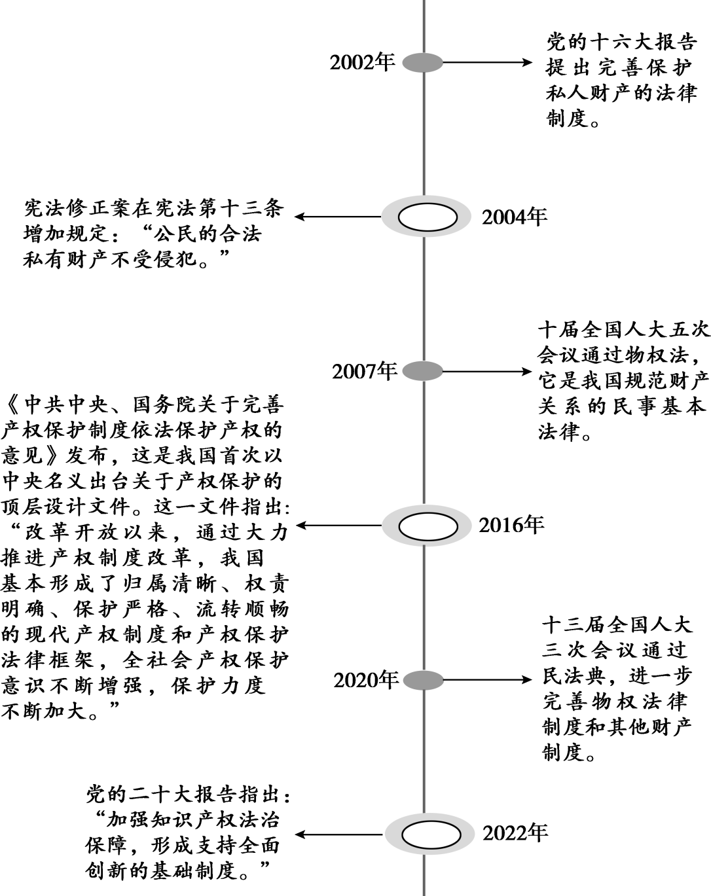

#### 设问
结合材料，运用所学知识，说明我国财产制度改革如何助力经济社会发展。

#### 细则
17．（7分）
①财产制度规范民事主体的财产关系，坚持物权平等保护原则，依法有效保护各种所有制经济组织和公民的财产权，确定财产归属，增强人民群众的财产财富安全感，增强社会信心，稳定市场主体投资、交易预期，促进财产的流通使用，促进经济社会持续健康发展和国家长治久安。
②建立财产权保护的长效机制，保护财产权，就是保护劳动、保护发明创造、保护和发展生产力，贯彻创新驱动发展战略，增强各类经济主体创新创业动力，促进经济高质量发展。
③完善产权制度，促进生产关系的调整，激活社会主义市场经济蓬勃发展的内生动力，夯实社会主义市场经济的基石，从而推动经济社会的进步。

#### 答案落点
- 17．（7分）①财产制度规范民事主体的财产关系，坚持物权平等保护原则，依法有效保护各种所有制经济组织和公民的财产权，确定财产归属，增强人民群众的财产财富安全感，增强社会信心，稳定市场主体投资、交易预期，促进财产的流通使用，促进经济社会持续健康发展和国家长治久安。
- ②建立财产权保护的长效机制，保护财产权，就是保护劳动、保护发明创造、保护和发展生产力，贯彻创新驱动发展战略，增强各类经济主体创新创业动力，促进经济高质量发展。
- ③完善产权制度，促进生产关系的调整，激活社会主义市场经济蓬勃发展的内生动力，夯实社会主义市场经济的基石，从而推动经济社会的进步。

### 2025 · 东城 · 期末 · 第19题第1问

- 题目来源：2025 · 东城 · 期末 · 第19题第1问
- 框架归位：A3 物权相邻与共有｜B7 短答识别
- 同题组：本题组仅本分问。

#### 材料
某校开展“我为社区献一策”的社会实践活动。下面是一组同学撰写的调查报告。
一、调查背景
近年来，电动自行车以其经济、便利的特点成为市民重要的交通工具。然而，保有量与充电设施数量不
匹配，让充电成为困扰居民的问题。
二、调查发现
某社区有 446 辆电动自行车，却只有 60 个充电接口，对车主新增充电设施的提议，大家产生了意见分
歧。
甲：我没有电动自行车，建车栩会占用绿地，影响我遛弯了。
乙：既不能飞线充电，小区也没有配套设备能集中充电，让我们怎么办？
丙：消防安全问题谁来管？影响居民通行、采光怎么办？
三、学生建议
为解决这一困扰，让电动自行车在楼下待得住，该组同学为社区设计了“在公共区域设置电池充电柜，
车电分离”的方案。

#### 设问
资料卡
《高层民用建筑消防安全管理规定）
第三十七条……电动自行车存放、充电场所应当配备必要的消防器材，充电设施应当具备充
满自动断电功能。
《中华人民共和国民法典》
第二百七十八条下列事项由业主共同决定：……（八）改变共有部分的用途或者利用共有部
分从事经营活动。
（1）遇到的法律问题： 、 。

#### 细则
19（1）评分细则（两种思路都可以得分，如果在同样的思路中，要求涉及具体问题不同，1个问题1分）
思路1.充电桩方案的具体内容是否符合/违反规定（依法依规）
如：
设置充电柜是否违反消防规定；
改变公有部分用途的法律程序问题；
涉及民法典对公共区域功能改变的规定；
思路2.充电桩方案的具体内容涉及哪些权利？
如：
公共区域设置充电柜是否涉及侵权问题；
可能侵害部分业主对公共部分的合法权利
充电柜建设是否损害相邻权的问题
充电柜安全问题可能侵犯居民的人身安全和财产权
xx问题侵犯了居民的合法权益

#### 答案落点
- 19（1）评分细则（两种思路都可以得分，如果在同样的思路中，要求涉及具体问题不同，1个问题1分）
思路1.充电桩方案的具体内容是否符合/违反规定（依法依规）
如：
设置充电柜是否违反消防规定；
改变公有部分用途的法律程序问题；
涉及民法典对公共区域功能改变的规定；
思路2.充电桩方案的具体内容涉及哪些权利？
如：
公共区域设置充电柜是否涉及侵权问题；
可能侵害部分业主对公共部分的合法权利
充电柜建设是否损害相邻权的问题
充电柜安全问题可能侵犯居民的人身安全和财产权
xx问题侵犯了居民的合法权益

### 2025 · 朝阳 · 二模 · 第20题第1问

- 题目来源：2025 · 朝阳 · 二模 · 第20题第1问
- 框架归位：A3 物权相邻与共有｜B4 评析认识
- 同题组：2025 · 朝阳 · 二模 · 第20题第1问；2025 · 朝阳 · 二模 · 第20题第2问

#### 材料
(10分)在日常生活中,要把握好权利和义务的关系。
材料一 孙女士和刘先生是同一楼层的邻居,两家入户门相对,相距约 2 米。刘先生在自家入户门安装
了具有“智能人脸识别”“180 度超广角”“自动人体侦测”“云存储”等功能的可视门铃摄像头,可通过
手机远程操控。孙女士认为该摄像头可能拍摄到自己及家人的日常出行规律及其他动态信息,要求刘先生
拆除该摄像头,双方由此产生纠纷。
材料二 《中华人民共和国民法典》(节选)
第二百七十一条 业主对建筑物内的住宅、经营性用房等专有部分享有所有权,对专有部分以外的共
有部分享有共有和共同管理的权利。

#### 设问
(1)结合材料,运用《法律与生活》知识,分析上述案例。(8分)

#### 细则
20（1）（8分）结合材料，运用《法律与生活》知识，分析上述案例。
①定性：刘先生侵犯了孙女士的隐私权（2分）。必须在侵权框架内作答；“隐私权”字样写错不给分。刘先生应当承担侵权责任（1分）。
②确权：根据民法典规定，楼道属于双方各自专有部分以外的共有部分，双方享有共有和共同管理的权利（1分）。
③解释隐私权：摄像头能拍摄到孙女士家的日常进出信息，特别是日常出行规律及其他动态信息，该事实分析1分。只笼统写“拍到家门口”或“拍到信息”不给该事实分。
④分析过错：刘先生主观上具有过错（1分）。可替代表述包括：安装设备范围、功能已超出必要限度；使用摄像头超出合理范围；行使权利损害他人正当权益；安装前未尽到妥善注意义务。
⑤相邻关系：根据民法典关于相邻关系的规定，处理邻里纠纷应遵循有利生产、方便生活、团结互助、公平合理原则（1分）。

#### 答案落点
- 定性：刘先生侵犯了孙女士的隐私权，应当承担侵权责任。
- 确权：楼道属于双方专有部分以外的共有部分，双方享有共有和共同管理的权利。
- 隐私分析：摄像头可能拍摄孙女士及家人的日常出行规律和其他动态信息，与私人生活习惯高度关联，属于隐私利益。
- 过错分析：刘先生为保障财产安全可以采取合理措施，但本案设备功能和拍摄范围超出必要限度，安装前未尽妥善注意义务。
- 相邻关系：相邻权利人应按照有利生产、方便生活、团结互助、公平合理原则正确处理邻里关系。

### 2025 · 朝阳 · 二模 · 第20题第2问

- 题目来源：2025 · 朝阳 · 二模 · 第20题第2问
- 框架归位：A3 物权相邻与共有｜B6 维权路径
- 同题组：2025 · 朝阳 · 二模 · 第20题第1问；2025 · 朝阳 · 二模 · 第20题第2问

#### 材料
(10分)在日常生活中,要把握好权利和义务的关系。
材料一 孙女士和刘先生是同一楼层的邻居,两家入户门相对,相距约 2 米。刘先生在自家入户门安装
了具有“智能人脸识别”“180 度超广角”“自动人体侦测”“云存储”等功能的可视门铃摄像头,可通过
手机远程操控。孙女士认为该摄像头可能拍摄到自己及家人的日常出行规律及其他动态信息,要求刘先生
拆除该摄像头,双方由此产生纠纷。
材料二 《中华人民共和国民法典》(节选)
第二百七十一条 业主对建筑物内的住宅、经营性用房等专有部分享有所有权,对专有部分以外的共
有部分享有共有和共同管理的权利。

#### 设问
(2)假如你是人民调解员,提出解决上述纠纷的建议。(2分)

#### 细则
20.（10分）
（2）（2分）
①拆除设备。建议刘先生及时拆除摄像头， 1分
②清除信息。已拍摄的孙女士及家人的视频信息。1分
或：在双方协商一致情况下，双方可共享摄像头。

只写“更换/拆除设备”，或只写“清除云存储信息”，只给1分。
只建议改用仅具备基础安防功能的设备， 只给1分。
只写出赔礼道歉，未写出具体措施， 只给1分。
只笼统写其他侵权责任承担方式， 都不给分。

#### 答案落点
- 建议刘先生及时拆除摄像头。
- 建议刘先生清除已拍摄的孙女士及其家人的视频信息。
- 也可在双方协商一致的情况下，由双方共享摄像头。
- 只写更换或拆除设备、只写清除云存储信息、只建议改用基础安防设备，均只能按1分处理。
- 只写赔礼道歉或笼统写其他侵权责任承担方式，不能替代具体解决措施。

### 2025 · 顺义 · 一模 · 第19题第1问

- 题目来源：2025 · 顺义 · 一模 · 第19题第1问
- 框架归位：A3 物权相邻与共有｜B6 维权路径
- 同题组：2025 · 顺义 · 一模 · 第19题第1问；2025 · 顺义 · 一模 · 第19题第2问

#### 材料
法者，所以兴功惧暴也；律者，所以定分止争也；令者，所以令人知事也。
材料一
案例1 高某与刘某为邻居。刘某一家经常在门口堆放杂物及生活垃圾。高某跟刘某沟通过多次，要求其清除杂物及垃圾，对方均不予理会，饱受困扰的高某曾找过物业、在微信群反映，刘某依旧我行我素，还在微信群内辱骂高某。高某将刘某诉至法院，经法院调解，刘某向高某表达了歉意，双方握手言和。
案例2 甲公司从事娱乐、游戏、动漫产业几十年，其品牌已经具有较高知名度和显著性。乙公司经营范围为动漫游戏、动漫、游艺用品销售等，其将企业名称变更登记为与甲公司相似的名称。甲公司认为该名称存在侵权，向市场监督管理局（以下简称市监局）提出《请求企业名称争议裁决》申请，市监局确认乙公司的名称侵犯甲公司公司合法权益，应予以纠正。乙公司不服市监局裁决，提起诉讼，法院驳回乙公司诉讼请求。

#### 原题图
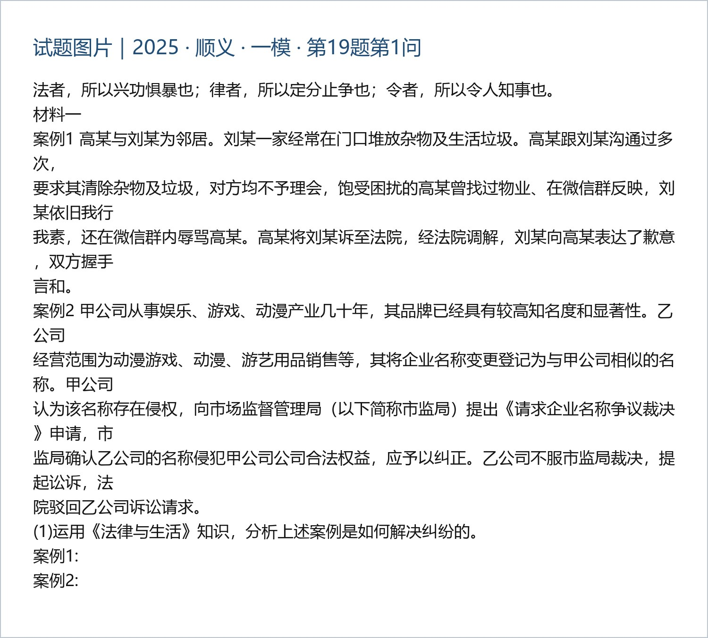

#### 设问
(1)运用《法律与生活》知识，分析上述案例是如何解决纠纷的。
案例1:
案例2:

#### 细则
（1）评分细则：
案例1：解决纠纷方式：法院坚持诉讼调解，实现邻里和谐、实质化解纠纷。（1分）
理由：通道为公共通行的通道，属于建筑物的共有部分，应当在合理限度内恰当使用；刘某为自家方便堆放垃圾和杂物，不仅影响邻居通行，存在重大安全隐患，而且违反民法典关于相邻权的规定，也有违邻里之间和谐相处的文化传统。（1分）
要求：不动产的相邻各方要按照有利于生产、方便生活、团结互助、公平合理的原则，正确处理通风、采光、通行等相邻关系；给相邻方造成妨碍的，应当主动排除妨碍。（1分，可替换为正确处理相邻关系、遵守民法典相关原则）
案例2：事实分析：甲公司对字号使用在先，该字号在中国市场已经具有较高知名度和显著性；乙公司擅自将该字号登记为企业名称使用，主观上具有攀附他人已经建立的商业信誉的故意，造成公众混淆，损害甲公司的商业信誉，影响其品牌形象和市场份额，同时对消费者构成欺诈，损害社会公共利益。（1分）
性质认定：乙公司行为属于不正当竞争，可替换为“搭便车”或违反公平原则。（1分）
解决纠纷方式：市监局作出的裁决证据确实充分，适用法律法规正确，法院遂判决驳回乙公司诉讼请求。（1分）

#### 细则图
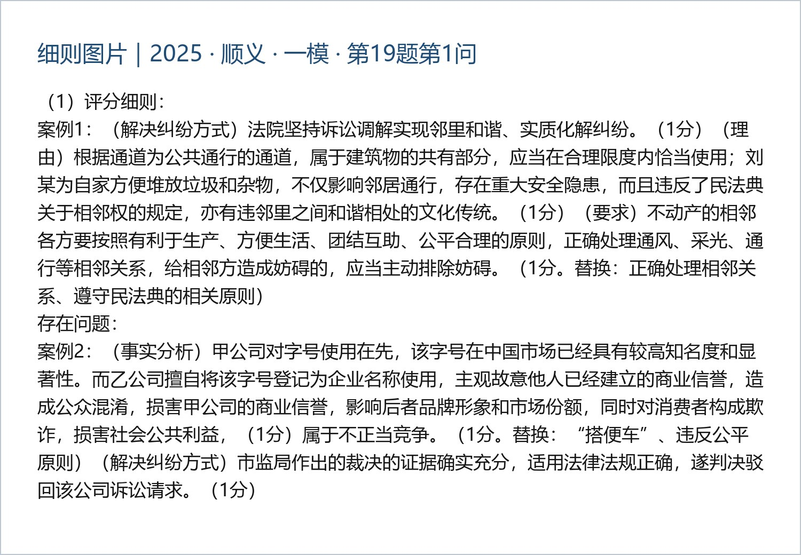

#### 答案落点
- 案例1通过法院诉讼调解解决邻里纠纷，实现邻里和谐、实质化解纠纷。
- 公共通道属于建筑物共有部分，刘某堆放垃圾杂物影响通行、存在安全隐患，违反相邻权规则和邻里和谐传统。
- 相邻各方应按照有利生产、方便生活、团结互助、公平合理原则正确处理相邻关系，造成妨碍应主动排除。
- 案例2中，甲公司对字号使用在先并具有较高知名度和显著性。
- 乙公司擅自将相似字号登记为企业名称，具有攀附他人商业信誉的故意，造成公众混淆并损害甲公司商业信誉和公共利益。
- 乙公司行为属于不正当竞争；市监局裁决证据充分、适用法律正确，法院判决驳回乙公司诉讼请求。

### 2025 · 顺义 · 一模 · 第19题第2问

- 题目来源：2025 · 顺义 · 一模 · 第19题第2问
- 框架归位：A3 物权相邻与共有｜B5 意义价值
- 同题组：2025 · 顺义 · 一模 · 第19题第1问；2025 · 顺义 · 一模 · 第19题第2问

#### 材料
法者，所以兴功惧暴也；律者，所以定分止争也；令者，所以令人知事也。
材料一
案例1 高某与刘某为邻居。刘某一家经常在门口堆放杂物及生活垃圾。高某跟刘某沟通过多次，要求其清除杂物及垃圾，对方均不予理会，饱受困扰的高某曾找过物业、在微信群反映，刘某依旧我行我素，还在微信群内辱骂高某。高某将刘某诉至法院，经法院调解，刘某向高某表达了歉意，双方握手言和。
案例2 甲公司从事娱乐、游戏、动漫产业几十年，其品牌已经具有较高知名度和显著性。乙公司经营范围为动漫游戏、动漫、游艺用品销售等，其将企业名称变更登记为与甲公司相似的名称。甲公司认为该名称存在侵权，向市场监督管理局（以下简称市监局）提出《请求企业名称争议裁决》申请，市监局确认乙公司的名称侵犯甲公司公司合法权益，应予以纠正。乙公司不服市监局裁决，提起诉讼，法院驳回乙公司诉讼请求。
材料二 定分止争——案结事了人和，让公平正义充分彰显。司法裁判的最高境界，从来不是简单的胜败之争，而是以“和合”之力让公平正义在人与人相互理解的土壤中生根发芽，绽放出绚烂的人性之花。

#### 设问
(2)结合材料一与材料二，运用法治知识，阐释定分止争的价值。

#### 细则
19（2）
参考答案：民事主体行使民事权利不得超过正当界限，不得损害国家、社会、他人合法权益；在解决纠纷中，公民既要有维权意识，又要选择适当途径解决纠纷践行文明、和谐的社会主义核心价值观。坚持多元纠纷解决机制，支持人们理性表达诉求、依法维护权益，社会形成尊法学法守法用法的氛围，增进社会共识，维护社会秩序；通过适当的解决纠纷机制之间协调运行，能更好协调各方利益，有效化解社会矛盾，实现社会和谐，提升社会治理水平。
阅卷细则：
对个人的价值：维护(企业）公民的合法权益/ 增强公众对法律的信任和遵守意识(2分）
对企业的价值：保护企业的合法权益/规范市场主体的行为(促进企业依法、诚信经营）/维护公平的市场竞争秩序（两个合法权益不重复给分）（2分）
对社会的价值：化解社会矛盾/促进社会和谐/维护社会秩序/促进公平正义/提升社会治理水平（2分）
1个角度2分，2个角度4分，3个角度5分，满分不超过5分

#### 答案落点
- 19（2）参考答案：民事主体行使民事权利不得超过正当界限，不得损害国家、社会、他人合法权益；
- 在解决纠纷中，公民既要有维权意识，又要选择适当途径解决纠纷践行文明、和谐的社会主义核心价值观。
- 坚持多元纠纷解决机制，支持人们理性表达诉求、依法维护权益，社会形成尊法学法守法用法的氛围，增进社会共识，维护社会秩序；
- 通过适当的解决纠纷机制之间协调运行，能更好协调各方利益，有效化解社会矛盾，实现社会和谐，提升社会治理水平。
- 阅卷细则：对个人的价值：维护(企业）公民的合法权益/ 增强公众对法律的信任和遵守意识(2分）对企业的价值：保护企业的合法权益/规范市场主体的行为(促进企业依法、诚信经营）/维护公平的市场竞争秩序（两个合法权益不重复给分）（2分）对社会的价值：化解社会矛盾/促进社会和谐/维护社会秩序/促进公平正义/提升社会治理水平（2分）1个角度2分，
- 2个角度4分，3个角度5分，满分不超过5分

### 2026 · 西城 · 一模 · 第17题

- 题目来源：2026 · 西城 · 一模 · 第17题
- 框架归位：A3 物权相邻与共有｜B6 维权路径
- 同题组：本题组仅本分问。

#### 材料
良好生态环境是最公平的公共产品，是最普惠的民生福祉。
【民法典物权编】
第286条：
业主应当遵守法律、法规以及管理规约，相关行为应当符合节约资源、保护生态环境的要求。对于物业服务企业或者其他管理人执行政府依法实施的应急处置措施和其他管理措施，业主应当依法予以配合。
业主大会或者业主委员会，对任意弃置垃圾、排放污染物或者噪声等损害他人合法权益的行为，有权依照法律、法规以及管理规约，请求行为人停止侵害、排除妨碍、消除危险、恢复原状、赔偿损失。
……
第294条：不动产权利人不得违反国家规定弃置固体废物，排放大气污染物、水污染物、土壤污染物、噪声、光辐射、电磁辐射等有害物质。
第326条：用益物权人行使权利，应当遵守法律有关保护和合理开发利用资源、保护生态环境的规定。所有权人不得干涉用益物权人行使权利。

#### 设问
结合材料，运用法律相关知识，说明民法典物权编的上述规定如何推动国家绿色发展。

#### 细则
17.结合材料，运用法律相关知识，说明民法典物权编的上述规定如何推动国家绿色发展。（8分）
【细则】
●法律依据（2分）
贯彻落实民法绿色原则 1分
为绿色发展提供法律依据/法律保障/使生态环境保护有法可依 1分
●作用路径（4分）
合理划定权利界限、强化法定义务、明确法律责任与权利救济（变通：禁止违法排污/明确侵权责任减少环境损害/坚持权利与义务统一/强化权利救济/协调各方利益关系） 3分
结合法条内容，分析合理 1分
●意义价值（2分）
平衡个人利益和生态公共利益/公共利益/社会利益 1分
促进资源开发利用绿色转型/推动可持续发展/节约资源保护环境 1分

#### 答案落点
- 17.结合材料，运用法律相关知识，说明民法典物权编的上述规定如何推动国家绿色发展。
- （8分）【细则】●法律依据（2分）贯彻落实民法绿色原则 1分为绿色发展提供法律依据/法律保障/使生态环境保护有法可依 1分●作用路径（4分）合理划定权利界限、强化法定义务、明确法律责任与权利救济（变通：禁止违法排污/明确侵权责任减少环境损害/坚持权利与义务统一/强化权利救济/协调各方利益关系） 3分结合法条内容，
- 分析合理 1分●意义价值（2分）平衡个人利益和生态公共利益/公共利益/社会利益 1分促进资源开发利用绿色转型/推动可持续发展/节约资源保护环境 1分

### 2026 · 通州 · 期末 · 第19题第1问

- 题目来源：2026 · 通州 · 期末 · 第19题第1问
- 框架归位：A3 物权相邻与共有｜B2 判责/理由
- 同题组：本题组仅本分问。

#### 材料
【案件事实】
某小区 3 号楼 2 单元全体业主一致签字同意增设电梯，并于小区主要出入口张贴意见征集单、公示、
承诺及图纸等相关材料，公示期间未收到异议。随后，该项目取得了主管部门的审批手续并正式开工。居
住于相邻楼的业主范某认为，电梯安装位置影响其采光，侵犯其合法权益，遂多次在现场阻碍施工，导致
项目停工。2 单元全体业主向人民法院起诉，请求判令范某停止对加装电梯工程的妨害行为。法院经现场
勘查，案涉加装电梯采用全玻璃设计，未对相邻楼采光造成影响，遂判决范某停止对电梯加装工程的阻挠
行为。同时，法院明确，若电梯投入使用后，确在采光、通风等方面对部分业主造成较大影响，相关权利
人可就补偿事宜另行协商或通过法律途径解决。
【法律依据】

#### 设问
（1）结合材料，运用《法律与生活》知识，分析判决结果并说明理由。

#### 细则
（1）（8分）
法院判决以事实为根据，以法律为准绳。老旧小区加装电梯属民生工程，已获法定比例业主同意，程序合法。电梯采用玻璃幕墙设计，在提升本楼业主出行便利的同时，能尽量减少对相邻楼业主的影响。依据《中华人民共和国民法典》规定，不动产的相邻权利人应当按照有利生产、方便生活、团结互助、公平合理的原则，正确处理相邻关系。本案判决维护了相邻业主合法权益，有助于促进邻里和谐，践行友善的社会主义核心价值观。

#### 答案落点
- （1）（8分）法院判决以事实为根据，以法律为准绳。
- 老旧小区加装电梯属民生工程，已获法定比例业主同意，程序合法。
- 电梯采用玻璃幕墙设计，在提升本楼业主出行便利的同时，能尽量减少对相邻楼业主的影响。
- 依据《中华人民共和国民法典》规定，不动产的相邻权利人应当按照有利生产、方便生活、团结互助、公平合理的原则，正确处理相邻关系。
- 本案判决维护了相邻业主合法权益，有助于促进邻里和谐，践行友善的社会主义核心价值观。

## A4 合同与诚信

本节共 14 个分问。

### 核心答题点和必备知识
- 核心入口：要约、承诺、合同成立、合同效力、履行、违约、格式条款、补充协议、诚实信用。
- 第一判断：先判断合同是否成立有效、内容是否明确，再写全面履行、诚信协商、违约责任。
- 易错边界：不能只喊诚信，要把约定、回复、履行、违约事实压进规则。
- 必背句：先判断合同成立生效和约定内容，再写全面履行、诚信履行和违约责任。

### 2024 · 东城 · 二模 · 第19题第1问

- 题目来源：2024 · 东城 · 二模 · 第19题第1问
- 框架归位：A4 合同与诚信｜B6 维权路径
- 同题组：2024 · 东城 · 二模 · 第19题第1问；2024 · 东城 · 二模 · 第19题第2问

#### 材料
甲公司从乙公司购入一批电视，约定2024年3月10日发货。乙公司如约发
货后，甲公司不便收货，双方约定货物由快递仓库代为储存至3月20日，仓储费用
由乙公司承担。3月19日，甲公司表示依然不便收货，需要延长仓储时间至3月
30日，乙公司回复“可以”。双方无其他磋商内容。
3月30日，甲公司收货并垫付全部仓储费用后，向乙公司要求“尾款扣除仓储
费用后支付”，乙公司表示拒绝承担3月21日及以后的仓储费用，甲公司因此拒绝
支付尾款。双方协商未果，欲通过诉讼解决争议。

#### 设问
（1）请你选择其中一方进行代理，并撰写起诉状。（7分）
民事起诉状
原告：
被告：
诉讼请求：
事实与理由：
望法院判如所请。

#### 细则
高三政治二模阅卷总结 2024.5.09
题号与设问：19（1）请你选择其中一方进行代理，并撰写起诉状（7分）。
参考答案示例一：
原告：甲公司；被告：乙公司。
诉讼请求：1.请求判令被告承担全部仓储费用；2.请求判令被告承担本案诉讼费用。
事实与理由：
事实：我司于2024年3月10日自乙公司购买一批电视，因收货不便，该批货物由快递代为储存，且约定3月20日及以前的仓储费用由卖方承担。3月19日，我司与被告协商再延长10天，获得肯定答复。3月30日，我司收货并垫付全部仓储费用，但乙公司拒绝承担3月21日及以后产生的仓储费用。
理由：3月19日，我司“再延长10天”的真实意思为“时间延长10天，且期间仓储费用由卖方承担”。我方属于以默示方式，延续此前仓储费用全部由卖方承担的交易习惯，续签协议。因此，本案所涉全部仓储费用及诉讼费应由卖方承担。
阅卷细则：
原告被告不给分。
示例一：原告甲公司、被告乙公司。
诉讼请求：判令被告承担全部仓储费用或继续履行，被告承担本案诉讼费用（2分）。
事实与理由中的事实：我公司于2024年3月10日自乙公司购买一批电视，因收货不便，该批货物由快递代为储存，且约定3月20日及以前的仓储费用由卖方承担。3月19日，我公司与被告协商再延长10天，获得肯定答复。3月30日，我公司收货并垫付全部仓储费用，但乙公司拒绝承担3月21日及以后产生的仓储费用。（踩意2分）
理由：①我公司提出延长仓储时间，乙公司回复“好的”，应按原合同内容全面履行，乙公司的行为违背诚信原则。②乙公司拒绝承担3月21日以后产生的仓储费用，并未与我公司协商一致，属于单方变更合同行为；其行为构成违约，应当承担违约责任。（1个理由2分，2个理由3分）
示例二：原告乙公司、被告甲公司。
诉讼请求：判令被告支付尾款或继续履行，被告承担本案诉讼费用（2分）。
事实：甲公司于2024年3月10日自我公司购买一批电视，因收货不便，该批货物由快递代为储存，且约定3月20日及以前的仓储费用由我公司承担。3月19日，被告与我司协商再延长10天，我公司同意。3月30日，甲公司收货后，我公司不同意支付3月21日及以后产生的仓储费用，甲公司拒不支付合同尾款。（踩意2分）
理由：①3月19日提出新合同，合同只对延期进行约定，并未协商延长仓储时间的费用承担问题，但由于费用产生由甲公司原因导致，该笔费用理应由甲公司承担，若逾期产生的费用仍由我方承担，有违公平原则。（只谈要约承诺构成新合同给1分，有公平原则给2分）②买卖合同有效，甲公司不支付尾款违反全面履行原则；其行为构成违约，应承担违约责任。（1个理由2分，2个理由3分）

#### 答案落点
- 可选择原告甲公司或原告乙公司，但要始终站在同一方立场写起诉状。
- 若代理甲公司：写明原告甲公司、被告乙公司，并提出判令乙公司承担全部仓储费用或继续履行、承担本案诉讼费用。
- 事实部分要交代3月10日购买电视、因收货不便由快递代为储存、3月20日及以前仓储费由卖方承担、3月19日协商再延长10天、3月30日收货并垫付全部仓储费用、乙公司拒绝承担3月21日以后费用。
- 理由部分要说明“再延长10天”的真实意思是时间延长10天且期间仓储费用仍由卖方承担。
- 应写出以默示方式延续此前仓储费用由卖方承担的交易习惯，或续签、补充协议的判断。
- 乙公司拒绝承担3月21日以后仓储费用，未与甲公司协商一致，属于单方变更合同行为，违背诚信原则和全面履行原则。
- 结论应落到乙公司构成违约，应承担全部仓储费用及诉讼费用。

### 2024 · 东城 · 二模 · 第19题第2问

- 题目来源：2024 · 东城 · 二模 · 第19题第2问
- 框架归位：A4 合同与诚信｜B7 短答识别
- 同题组：2024 · 东城 · 二模 · 第19题第1问；2024 · 东城 · 二模 · 第19题第2问

#### 材料
甲公司从乙公司购入一批电视，约定2024年3月10日发货。乙公司如约发
货后，甲公司不便收货，双方约定货物由快递仓库代为储存至3月20日，仓储费用
由乙公司承担。3月19日，甲公司表示依然不便收货，需要延长仓储时间至3月
30日，乙公司回复“可以”。双方无其他磋商内容。
3月30日，甲公司收货并垫付全部仓储费用后，向乙公司要求“尾款扣除仓储
费用后支付”，乙公司表示拒绝承担3月21日及以后的仓储费用，甲公司因此拒绝
支付尾款。双方协商未果，欲通过诉讼解决争议。

#### 设问
（2）为避免类似问题产生，我们应该________。（2分）

#### 细则
19.（9分）
（2）树立合同意识，合同内容应清晰明确。合同缺少重要条款时，双方当事人应当秉持诚
信原则，平等协商，对合同进行补充或解释，补全意思表示。

#### 答案落点
- 19.（9分）（2）树立合同意识，合同内容应清晰明确。
- 合同缺少重要条款时，双方当事人应当秉持诚信原则，平等协商，对合同进行补充或解释，补全意思表示。

### 2024 · 朝阳 · 一模 · 第19题

- 题目来源：2024 · 朝阳 · 一模 · 第19题
- 框架归位：A4 合同与诚信｜B5 意义价值
- 同题组：本题组仅本分问。

#### 材料
诚信是法治精神的重要伦理基础。民法典第七条规定：“民事主体从事民事活动，应当遵循诚信原则，秉持诚实，恪守承诺。”

镜头一：2022年12月，A公司与B公司签订购销合同约定：A公司向B公司提供产品，货款于发货后的60日内付清。2023年1月，A公司依约向B公司提供货物，但截至2023年7月，B公司欠A公司货款590万元未支付。2023年8月，A公司起诉B公司，要求其支付货款及违约金。人民法院最终判决B公司尽快付清全部欠款并支付逾期违约金。

镜头二：某购物中心为200余家商户建立了“码上诚信”二维码，消费者扫描二维码，即可查询此商户相关的行政许可、行政处罚、主动承诺、自愿注册等信用信息。有市民说：“我经常来这个商场消费，一是因为‘码上诚信’让我感觉在这里购物很放心，二是因为这里的商品质量和售后服务态度都很好。”

#### 设问
结合材料，运用《法律与生活》知识，分析诚信原则对促进社会主义市场经济健康发展的积极作用。

#### 细则
19.（7分）
社会主义市场经济本质上是法治经济。民法典将诚信原则确立为基本原则之一，凸显了社会主义核心价值观对社会主义市场经济建设的引导和规范。
诚信原则要求合同当事人按照约定全面履行义务，有利于规范民事主体行为，尊重和维护民事主体合法权利；司法机关可根据诚信原则定分止争，维护公平正义，维护诚信、健康的市场秩序。
诚信原则要求经营者依法、诚信经营，保护消费者的合法权益。这不仅有利于平衡经营者与消费者之间的关系，而且有助于守法诚信的经营者扩大市场，并最终增进社会整体福祉。

#### 答案落点
- 19.（7分）社会主义市场经济本质上是法治经济。
- 民法典将诚信原则确立为基本原则之一，凸显了社会主义核心价值观对社会主义市场经济建设的引导和规范。
- 诚信原则要求合同当事人按照约定全面履行义务，有利于规范民事主体行为，尊重和维护民事主体合法权利；
- 司法机关可根据诚信原则定分止争，维护公平正义，维护诚信、健康的市场秩序。
- 诚信原则要求经营者依法、诚信经营，保护消费者的合法权益。
- 这不仅有利于平衡经营者与消费者之间的关系，而且有助于守法诚信的经营者扩大市场，并最终增进社会整体福祉。

### 2024 · 石景山 · 一模 · 第17题

- 题目来源：2024 · 石景山 · 一模 · 第17题
- 框架归位：A4 合同与诚信｜B2 判责/理由
- 同题组：本题组仅本分问。

#### 材料
2023 年 12 月 28 日，北京市第三中级人民法院终审公开宣判北京甲环保公司与四川乙发电公司合同纠纷一案，该案系北京市首例碳排放权交易纠纷案件。
【基本案情】
2021 年12 月，乙公司就采购碳排放配额发布比选公告，甲公司向其进行报价，内容具体明确，并承诺：如未依约履行，乙公司可另行购买等量的碳排放配额；如有差价， 由甲公司补足。乙公司经过比选确认甲公司中标，并向其送达了中标通知。此后，甲公 司明确表示不再履行合同，在此情况下，乙公司另行与第三方公司签订合同，以高于甲 公司所报交易单价的价格购买了相应碳排放配额，由此产生差价，故乙公司诉至法院， 要求甲公司向其支付差价款 289 万余元及相应利息。
【法院判决】
一审法院经审理，认为甲乙两公司就涉案碳排放配额采购事项成立合同关系，且该合同合法有效。判决甲公司向乙公司支付碳排放配额采购差价款289 万余元及相应利息。一审后，甲公司不服判决，向北京三中院提起上诉。北京三中院经审理后作出终审判决： 驳回上诉，维持原判。

#### 设问
运用法律知识，结合案情，说明甲乙两公司合同成立的理由，并从民法基本原则角 度阐述该司法判决的意义。

#### 细则
甲公司参与比选并向乙公司进行报价，内容具体确定，属于要约。乙公司确认甲公司中标，向其送达了中标通知，属于承诺。中标通知书送达甲公司，故双方合同成立。（3分）
法院判决引导碳排放配额交易的民事主体遵循诚信原则、公平原则、绿色原则。有利于推动企业转型升级，兼顾经济效益和社会效益；有利于维护我国碳排放权交易市场的正常秩序，推动要素市场化改革，落实“碳达峰、碳中和”国家重大决策。（5分）

#### 答案落点
- 甲公司参与比选并向乙公司进行报价，内容具体确定，属于要约。
- 乙公司确认甲公司中标，向其送达了中标通知，属于承诺。
- 中标通知书送达甲公司，故双方合同成立。
- （3分）法院判决引导碳排放配额交易的民事主体遵循诚信原则、公平原则、绿色原则。
- 有利于推动企业转型升级，兼顾经济效益和社会效益；
- 有利于维护我国碳排放权交易市场的正常秩序，推动要素市场化改革，落实“碳达峰、碳中和”国家重大决策。

### 2024 · 石景山 · 一模 · 第18题第2问

- 题目来源：2024 · 石景山 · 一模 · 第18题第2问
- 框架归位：A4 合同与诚信｜B7 短答识别
- 同题组：本题组仅本分问。

#### 材料
为弘扬新时代“枫桥经验”，助力社会矛盾纠纷在法治轨道上得到解决，石景山法 院在巩固深化党建法治共建机制的基础上，推出“一米法庭”项目。“一米法庭”中“一米”音同“益民”，取“有益人民”之意，一米之距，代表法院与群众距离贴近，传递 “一套桌椅、一米见方，努力化解纠纷”的工作理念。要从三个方面把“一米法庭”打 造为坚持和践行新时代“枫桥经验”的“枫”景线。
在街道、社区及行业特设组织中设立的“一米法庭”项目，通过数字化技术，线上与线下相结合，提供调解指导、诉讼服务、基层治理、普法宣传功能，是一站式多元解纷的最小支点。
2023 年7 月特大暴雨灾害发生后，涉灾纠纷频发。
“我们社区的业主李先生家因房屋漏雨，与物业公司起了矛盾。这次暴雨前气象部门早有预警，经调查发现物业公司并没有提前加强巡检，也没有采取措施加固房顶以及做好防水处理，理应赔偿。但物业认为这次雨太大，是天灾，可以免责。业主说我们调解达成的协议也不算数，准备到法院起诉，认为走诉讼程序才是最优选择。现在该怎么办呢？”社区刚担任人民调解员的老刘通过“一米法庭”求助法官，希望能够提供 专业指导，将矛盾化解在基层。

#### 原题图
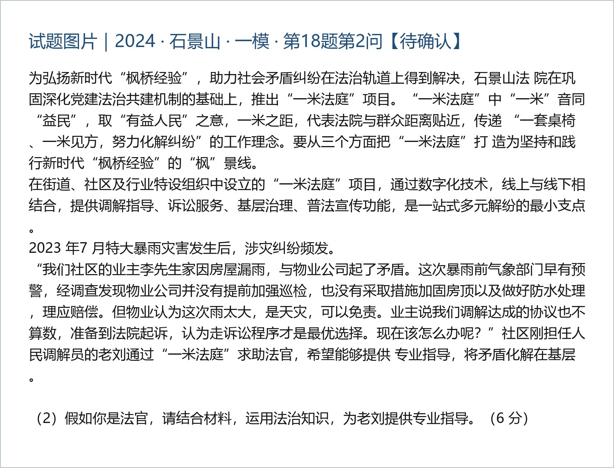

#### 设问
（2）假如你是法官，请结合材料，运用法治知识，为老刘提供专业指导。（6 分）

#### 细则
（2）（6分）“天灾”不等于不可抗力，物业公司“天灾可以免责”的说法不成立。不可抗力指的是不能预见、不能避免且不能克服的现象。本案中，暴雨前气象部门早有预警，物业公司理应预见并提前采取相应措施，避免或减少业主损失的发生，因此不能免责。业主与物业公司双方存在物业服务合同关系，物业公司未全面履行服务义务，属于违约行为，应承担赔偿损失等违约责任。
我国正不断完善有机衔接、相互协调的多元纠纷解决机制，在诉讼前可优先通过非诉讼方式解决纠纷。经人民调解委员会调解达成的协议，双方可以申请司法确认，经过人民法院依法确认有效的调解协议，具有强制执行效力。

#### 细则图
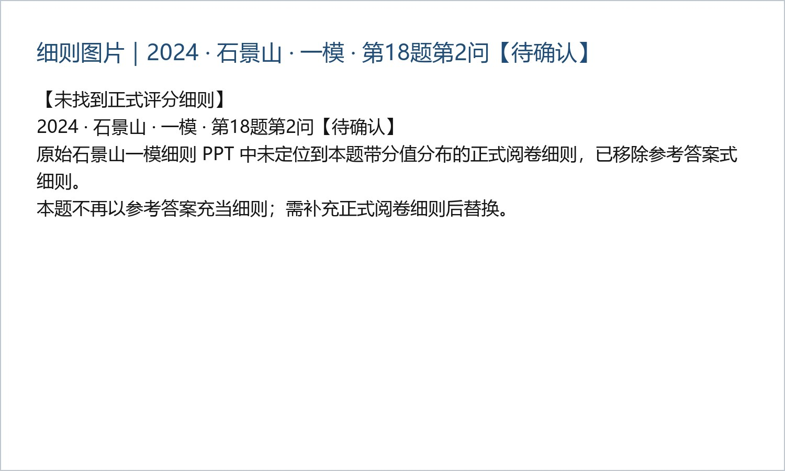

#### 答案落点
- （2）（6分）“天灾”不等于不可抗力，物业公司“天灾可以免责”的说法不成立。
- 不可抗力指的是不能预见、不能避免且不能克服的现象。
- 本案中，暴雨前气象部门早有预警，物业公司理应预见并提前采取相应措施，避免或减少业主损失的发生，因此不能免责。
- 业主与物业公司双方存在物业服务合同关系，物业公司未全面履行服务义务，属于违约行为，应承担赔偿损失等违约责任。
- 我国正不断完善有机衔接、相互协调的多元纠纷解决机制，在诉讼前可优先通过非诉讼方式解决纠纷。
- 经人民调解委员会调解达成的协议，双方可以申请司法确认，经过人民法院依法确认有效的调解协议，具有强制执行效力。

### 2025 · 昌平 · 二模 · 第20题第2问

- 题目来源：2025 · 昌平 · 二模 · 第20题第2问
- 框架归位：A4 合同与诚信｜B2 判责/理由
- 同题组：2025 · 昌平 · 二模 · 第20题第1问；2025 · 昌平 · 二模 · 第20题第2问

#### 材料
案件情况 | 处理结果 | 裁判理由
李某是一名AI绘图软件爱好者，他使用人工智能软件制作了一张图片，并加上“AI 绘画”等标签，发布在自己的社交平台上。网友刘某看到图片后，感觉非常契合自己的文章，便直接拿来作为配图使用，还抹去了平台署名水印。李某认为刘某的行为侵犯了自己的著作权。遂将刘某诉至北京互联网法院。 | 法院支持李某诉讼请求。 | （1）
小王向银行申请开通信用卡，且宣称已阅览申请材料，明晰信用卡相关信息，愿意遵循领用合约及申请表中所列的所有条款。后来小王使用该卡透支消费，却未依照合同约定履行还款义务。银行屡次向小王催告，然而小王迄今仍未还款。为维护自身的合法权益，银行将其诉至法院，恳请依法判决小王偿还信用卡欠款2万元及利息。 | 法院判决小王偿还信用卡欠款本金2万元，并按合同约定支付利息。 | （2）

#### 原题图
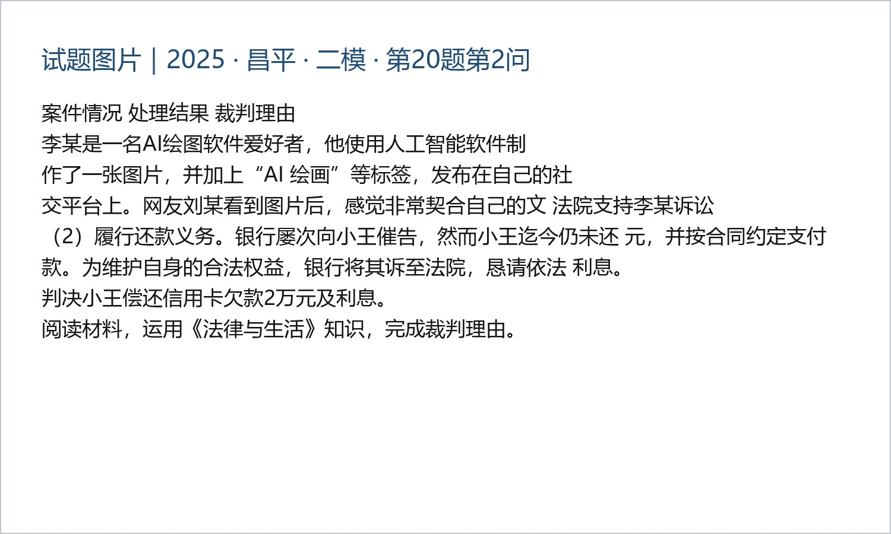

#### 设问
（2）阅读材料，运用《法律与生活》知识，完成裁判理由。（6分）

#### 细则
双方签订的相关手续系双方真实意思表示，内容不违反法律规定，合法有效，对双方均具有约束力。小王使用信用卡透支且经催缴仍不还款的行为构成违约，违背了诚信原则和全面履行原则，应承担违约责任。
评分细则：
●双方签订的相关手续系双方真实意思表示，内容不违反法律规定，合同有效，对双方均具有约束力。（二选一，1分。替代：合同体现了权利与义务相统一/公平原则/协商一致，等）
●小王使用信用卡透支且经催缴仍不还款的行为构成违约。（1分，替代：应承担违约责任）
●违背了诚信原则和全面履行原则，应承担违约责任。（二选一，1分。替代：体现了诚信的社会主义核心价值观/传统美德，但必须出诚信；社会信用机制等。）
（其他答案，言之成理即可得分，但不重复给分。）

#### 细则图
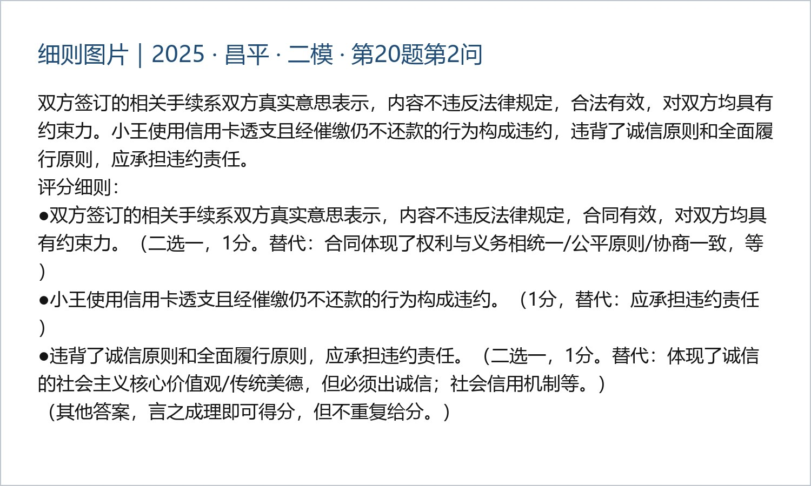

#### 答案落点
- 双方签订的相关手续系双方真实意思表示，内容不违反法律规定，合法有效，对双方均具有约束力。小王使用信用卡透支且经催缴仍不还款的行为构成违约，违背了诚信原则和全面履行原则，应承担违约责任。
评分细则：
●双方签订的相关手续系双方真实意思表示，内容不违反法律规定，合同有效，对双方均具有约束力。（二选一，1分。替代：合同体现了权利与义务相统一/公平原则/协商一致，等）
●小王使用信用卡透支且经催缴仍不还款的行为构成违约。（1分，替代：应承担违约责任）
●违背了诚信原则和全面履行原则，应承担违约责任。（二选一，1分。替代：体现了诚信的社会主义核心价值观/传统美德，但必须出诚信；社会信用机制等。）
（其他答案，言之成理即可得分，但不重复给分。）

### 2025 · 海淀 · 一模 · 第18题

- 题目来源：2025 · 海淀 · 一模 · 第18题
- 框架归位：A4 合同与诚信｜B4 评析认识
- 同题组：本题组仅本分问。

#### 材料
随着居民消费水平的提高，主题乐园越来越受到游客的青睐。某主题乐园推出了年卡服务，游客只需
支付一定费用办理年卡，即可享受主题乐园酒店的折扣优惠，并通过优先通道快速入园游玩项目。游客在
办理时需与该主题乐园签订有关年卡的《条款及细则》格式合同，其中明确规定：“主题乐园年卡不可转
让，年卡及其相应福利仅限持卡人本人使用。若游客违反上述约定，主题乐园有权解除合同。”
小黄在购买年卡后，发现主题乐园酒店对登记入住人员与实际入住人员是否一致的审查存在漏洞，于
是他利用年卡以七折优惠价格订购酒店房间并在网络交易平台公开售卖给他人，通过传递房卡的方式交由
其他游客持卡实际入住，从中多次赚取差价。主题乐园发现后，短信通知小黄，因其违反双方合同约定，
即刻撤销其年卡全部权益。
小黄对此表示不满，向法院提起诉讼，认为格式条款无效，要求解封年卡，恢复相关权益，并要求主
题乐园赔偿其禁卡期间的损失。最终，法院判决驳回小黄的诉讼请求。

#### 设问
运用《法律与生活》知识，谈谈对本案判决的认识。

#### 细则
18．（7分）
小黄与主题乐园签订的格式合同意思表示真实，条款符合公平原则，合同有效。小黄利用审查漏洞不当获利的行为违反合同约定，违背诚信原则。主题乐园可以根据合同约定，采取撤销年卡的方式解除合同。法院判决保护了主题乐园合法权益，有利于营造公平公正市场环境。
【细则】
合同有效（2分）
2分：条款符合公平原则/权利义务相统一，合同有效
1分：格式合同意思表示真实，合同有效
0分：意思表示真实/合同有效

案情分析（3分）
小黄的行为违反合同约定/违约，（1分）违背诚信原则（1分）
主题乐园可以根据合同约定，采取撤销年卡的方式解除合同。（1分）

判决意义（2分）
法院判决保护了主题乐园合法权益
有利于平衡经营者和消费者的关系
有利于营造公平公正市场环境/维护良好的市场秩序
有利于维护社会公平正义
有利于践行诚信的社会主义核心价值观/诚信的道德风尚
（以上任意出现2条，给2分）

#### 答案落点
- 18．（7分）小黄与主题乐园签订的格式合同意思表示真实，条款符合公平原则，合同有效。
- 小黄利用审查漏洞不当获利的行为违反合同约定，违背诚信原则。
- 主题乐园可以根据合同约定，采取撤销年卡的方式解除合同。
- 法院判决保护了主题乐园合法权益，有利于营造公平公正市场环境。
- 【细则】合同有效（2分）2分：条款符合公平原则/权利义务相统一，合同有效1分：格式合同意思表示真实，合同有效0分：意思表示真实/合同有效
- 案情分析（3分）小黄的行为违反合同约定/违约，（1分）违背诚信原则（1分）主题乐园可以根据合同约定，采取撤销年卡的方式解除合同。
- 判决意义（2分）法院判决保护了主题乐园合法权益有利于平衡经营者和消费者的关系有利于营造公平公正市场环境/维护良好的市场秩序有利于维护社会公平正义有利于践行诚信的社会主义核心价值观/诚信的道德风尚（以上任意出现2条，给2分）

### 2025 · 石景山 · 一模 · 第20题

- 题目来源：2025 · 石景山 · 一模 · 第20题
- 框架归位：A4 合同与诚信｜B1 补表/补链
- 同题组：本题组仅本分问。

#### 材料
(8分)
新质生产力鼓励新业态拓展创新。人民法院能动履职、保护创新，为发展新质生产力提供重要保障。下列
是石景山法院以司法护航新质生产力发展的两个案例。
案例一
集成电路产业是信息产业的核心，为新质生产力发展提供重要支撑。原告科技公司与被告电路公司就某集
成电路技术研发项目签订委托合同，约定由被告按相关技术标准在规定时间内完成产品研发交付，原告分
期付酬 16万元。研发过程中，原告支付了两期研发费共 9.6万元，经检验，阶段性产品未达合同要求且研
发进度超期。被告延期交付最终成果后，原告主张被告未能依约提交达标成果，错过上市时机，致原告经
济损失严重，故要求被告返还研发费用并支付违约金。法院经审理，判令被告返还原告服务费、违约金共
计11万余元。
案例二
软件是信息技术关键载体，是新质生产力的代表和数字经济发展的基础。“好省”APP是原告某网络科技公
司旗下的一款电商导购应用，用户可在其中领取主流商城的商品优惠券，故该软件上线后下载量巨大。被
告周某是被诉软件“超好省-省钱助手”APP的开发运营者，该软件晚于原告软件三年上线。原告主张“好
省”软件经其长期宣传已具有影响力，被告软件与原告软件名称和图标相近、内容业务相同，已造成公众
混淆，请求法院判令被告停止不当行为并赔偿损失。法院经审理，判令被告停止侵权并赔偿原告损失共计
3.6万元。

#### 原题图
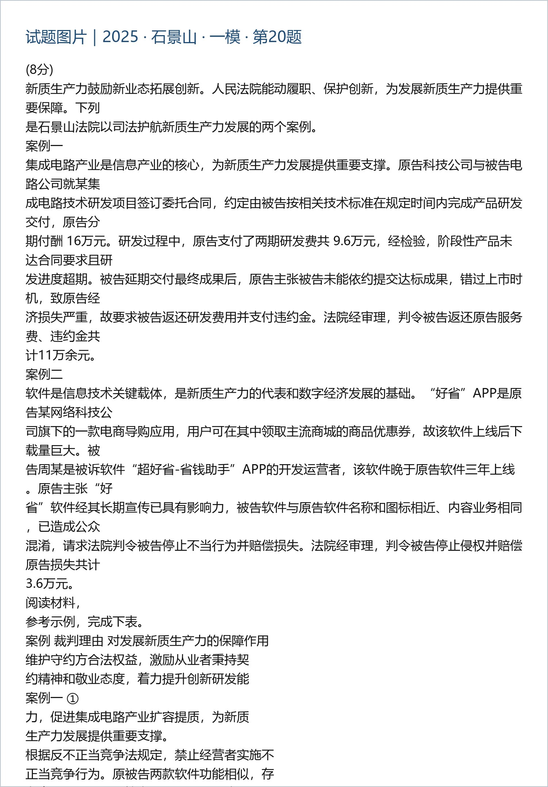

#### 设问
参考示例，完成下表。
案例一：裁判理由为①；对发展新质生产力的保障作用为“维护守约方合法权益，激励从业者秉持契约精神和敬业态度，着力提升创新研发能力，促进集成电路产业扩容提质，为新质生产力发展提供重要支撑。”
案例二：裁判理由为“根据反不正当竞争法规定，禁止经营者实施不正当竞争行为。原被告两款软件功能相似，存在竞争关系。被告擅自使用与原告名称、图标相似的软件，容易使消费者发生混淆误认，构成不正当竞争，应当承担停止侵害、赔偿损失的侵权责任”；对发展新质生产力的保障作用为②。

#### 细则
20.（8分）任务类型：解释与论证（法理依据+事实依据+对发展新质生产力的保障作用）。
法理依据：①根据民法典规定，当事人不履行合同义务或者履行合同义务不符合约定的，守约方可以要求违约方承担违约责任。
采点赋分：对应案例一，学生能够从民法典角度说明，准确分析其中一方面得2分；准确分析两方面得4分。
事实依据：①被告开发时间超过履行期限，阶段性产品未达合同约定标准，构成违约，应当承担违约责任。
案例二：根据反不正当竞争法，被告构成不正当竞争，应当承担停止侵害、赔偿损失的侵权责任。准确回答一点得2分；准确回答两点得4分。答非所问或没有应答得0分。
保障作用：②依法打击不正当竞争行为，维护消费者知情权和选择权，保护知识产权，保护经营者的合法权益，维护公平竞争的市场秩序，营造良好营商环境，为数字经济发展提供法治保障。

#### 细则图
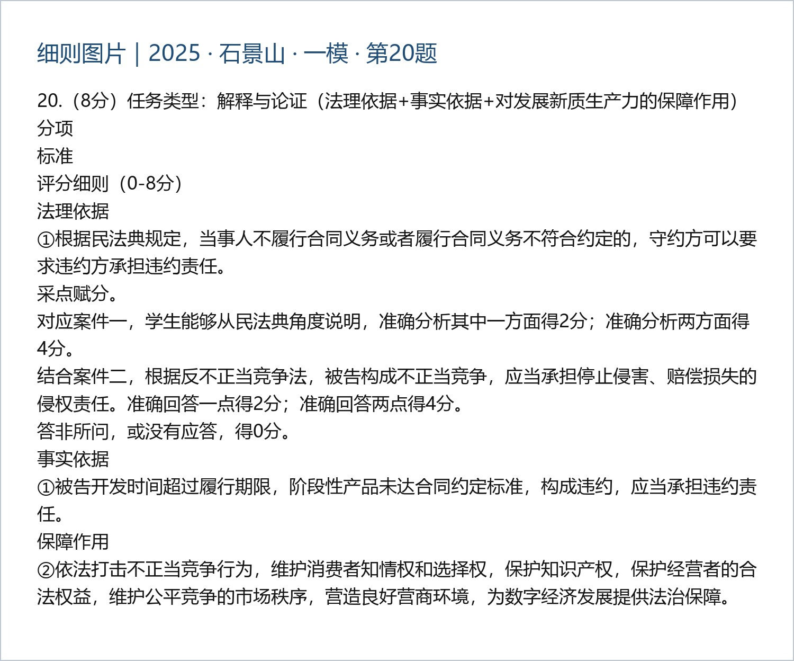

#### 答案落点
- 案例一：当事人不履行合同义务或者履行合同义务不符合约定的，守约方可以要求违约方承担违约责任。
- 被告开发时间超过履行期限，阶段性产品未达合同约定标准，构成违约，应当承担违约责任。
- 案例二：根据反不正当竞争法，被告构成不正当竞争，应当承担停止侵害、赔偿损失的侵权责任。
- 依法打击不正当竞争行为，维护消费者知情权和选择权，保护知识产权，保护经营者的合法权益。
- 维护公平竞争的市场秩序，营造良好营商环境，为数字经济发展提供法治保障。

### 2026 · 东城 · 期末 · 第18题第1问

- 题目来源：2026 · 东城 · 期末 · 第18题第1问
- 框架归位：A4 合同与诚信｜B2 判责/理由
- 同题组：2026 · 东城 · 期末 · 第18题第1问；2026 · 东城 · 期末 · 第18题第2问

#### 材料
无人机起飞如何系好“安全带”?
陈某向店主刘某发送邮件：“急需购买A型号无人机一台。用于重要商业拍摄。”刘某回复：“全新
原装，15000元。”陈某立即转账。刘某误将一台内部结构轻微损伤（外观无明显痕迹）的同型号展示机
寄出。
陈某收货后在首次使用中，该无人机因上述损伤失控坠毁，砸伤陈某手臂。陈某花费医疗费8000
元，并因错过商业拍摄损失收入5000元。陈某要求刘某赔偿，双方协商未果。

#### 原题图
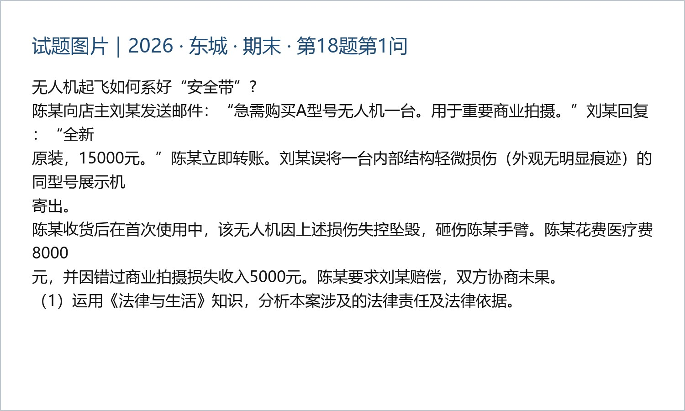

#### 设问
（1）运用《法律与生活》知识，分析本案涉及的法律责任及法律依据。

#### 细则
18.（11分）无人机起飞如何系好"安全带"?
 陈某向店主刘某发送邮件：“急需购买A型号无人机一台，用于重要商业拍摄。”刘某回复：“全新原装，15000元。”陈某立即转账。刘某误将一台内部结构轻微损伤（外观无明显痕迹）的同型号展示机寄出。
 陈某收货后在首次使用中，该无人机因上述损伤失控坠毁，砸伤陈某手臂。陈某花费医疗费8000元，并因错过商业拍摄损失收入5000元。
 陈某要求刘某赔偿，双方协商未果。
 （1）运用《法律与生活》知识，分析本案涉及的法律责任及法律依据。(7分)
 （2）维权成功需要做好充分准备和策略选择。你认为陈某需要做好哪些工作?（4分）
要约
实质性变更，新要约
承诺
主体适格+意思表示真实+形式内容合法→合同有效
【违约逻辑：合同成立+合同有效+存在违约行为 → 承担违约责任 4分】
【侵权逻辑：权利受保护+侵权要件齐备 → 承担侵权责任 3分】
违反全面履行/诚信履行/民法诚信/公平原则
要件/侵犯XX权利 → 侵权责任
要约+承诺→合同成立

第一层：违约
【违约角度：合同成立+合同有效+存在违约行为 → 承担违约责任 共4分】

 陈某与刘某之间通过要约与承诺达成一致意思表示，合同成立/订立，双方主体适格、意思表示真实，合同形式与内容合法，合同有效（分析清楚2分，只说成立且有效1分）
 1.只说合同成立/合同有效，没说合同成立且有效，也可给1分
 2.成立（要约+承诺）/有效（主体适格，意思表示真实，形式内容合法）能分析清楚一个，就可给分析的1分

 因刘某未能全面履行合同义务/违反全面履行原则/诚信履行原则/民法诚信原则/民法公平原则（1分）
 注意：这道题不构成“欺诈”（意思表示不真实）

 其行为构成违约，应承担赔偿损失等违约责任（1分）

第二层：侵权
【侵权角度：侵权要件 → 承担侵权责任 共3分】
 情况一：对刘某（销售者）主张侵权（一般过错侵权）
 分析：事实（行为+损害后果）、因果关系、过错，完整分析要件2分，不完整1分。未分析要件，写侵犯了身体权、健康权 或 消费者知情权、安全消费的权利可得1分。要件分析不完整+侵犯了什么权利 可得2分。结论-构成侵权，应当依法承担侵权责任（1分）。
 情况二：对生产者（不排除刘某是生产者的可能）主张产品责任（无过错侵权）
 分析：事实（行为+损害后果），因果关系（2分）完整分析要件2分，不完整1分。
未分析要件，写侵犯了身体权、健康权 或 消费者知情权、安全消费的权利可得1分。要件分析不完整+侵犯了什么权利 可得2分。结论-构成侵权，应当依法承担侵权责任（1分）。

 注：这道题不涉及过错推定责任，举证责任倒置 ||“无过错推定”是错误表述
 说生产者适用一般过错侵权责任，或销售者适用无过错侵权责任 都是错误

#### 细则图
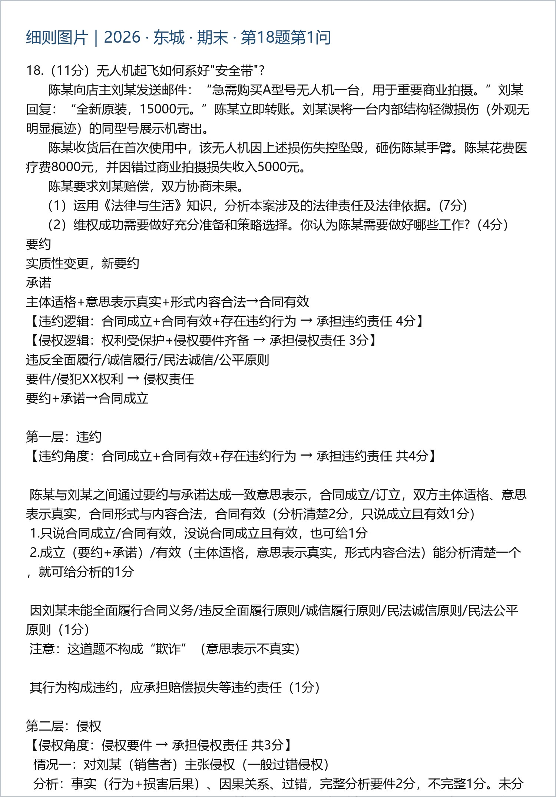
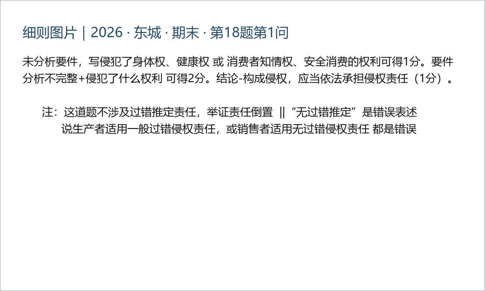

#### 答案落点
- 违约角度：陈某与刘某通过要约与承诺达成一致意思表示，合同成立；双方主体适格、意思表示真实，合同形式与内容合法，合同有效。
- 刘某交付内部结构轻微损伤的展示机，未全面履行合同义务，违反全面履行原则、诚信履行原则或民法诚信原则。
- 刘某行为构成违约，应承担赔偿损失等违约责任。
- 侵权角度：陈某手臂受伤、医疗费8000元和商业拍摄损失等属于损害事实，无人机问题与损害后果之间存在因果关系。
- 若对销售者刘某主张一般过错侵权，应分析行为、损害后果、因果关系和过错；构成侵权的，应依法承担侵权责任。
- 若对生产者主张产品责任，应分析产品缺陷、损害后果和因果关系；产品责任适用无过错侵权责任。
- 本题不构成欺诈，也不涉及过错推定责任或举证责任倒置。

### 2026 · 东城 · 期末 · 第18题第2问

- 题目来源：2026 · 东城 · 期末 · 第18题第2问
- 框架归位：A4 合同与诚信｜B6 维权路径
- 同题组：2026 · 东城 · 期末 · 第18题第1问；2026 · 东城 · 期末 · 第18题第2问

#### 材料
无人机起飞如何系好“安全带”?
陈某向店主刘某发送邮件：“急需购买A型号无人机一台。用于重要商业拍摄。”刘某回复：“全新
原装，15000元。”陈某立即转账。刘某误将一台内部结构轻微损伤（外观无明显痕迹）的同型号展示机
寄出。
陈某收货后在首次使用中，该无人机因上述损伤失控坠毁，砸伤陈某手臂。陈某花费医疗费8000
元，并因错过商业拍摄损失收入5000元。陈某要求刘某赔偿，双方协商未果。

#### 设问
（2）维权成功需要做好充分准备和策略选择。你认为陈某需要做好哪些工作?

#### 细则
18（2）（4分）维权成功需要做好充分准备和策略选择。陈某需要做好以下工作。
评分口径提示：本小问卷面标注为4分；原细则列出三类准备工作，每类按具体性给到2分，实际按有效采点择优累计，总分不超过4分，不理解为6分小问。
①选择具体维权途径（2分）：可选择调解、仲裁或诉讼。调解可包括第三方人民调解、行政调解、诉讼调解；仲裁需要双方达成有效仲裁协议；若不愿调解或调解不成，可考虑诉讼。若决定向人民法院提起诉讼，需准备起诉状、原被告身份信息，熟悉诉讼流程，注意三年诉讼时效等。无解释、不具体只给1分。
②依法收集证据及类型（2分）：固定并提交交易存在的合同、订单证据，如邮件记录、转账记录等电子证据；收集证明无人机问题故障、手臂受伤损害事实、相关经济损失以及因果关系的物证、诊疗材料、费用凭证等。无解释、不具体只给1分。
③明确权利义务，诉求合理（2分）：主动明确相关法律依据，可通过查询法律法规、咨询专业法律人士或利用法律援助等方式，厘清自身权利义务；可主张违约责任或侵权责任，提出退还无人机购置费、赔偿医疗费、误工费、损失费等经济损失的合理诉求；注意不告不理原则。无解释、不具体只给1分。

#### 答案落点
- 评分口径：本小问4分，三类工作均是采分方向，按具体性择优累计，总分不超过4分。
- 选择维权途径：可选择调解、仲裁或诉讼；调解不成可诉讼，仲裁须有有效仲裁协议；若诉讼要准备起诉状、身份信息并注意三年诉讼时效。
- 收集交易证据：邮件、订单、转账记录等能证明合同或交易存在的电子证据。
- 收集损害和因果关系证据：无人机故障、手臂受伤、医疗费、商业拍摄损失及因果关系的相关材料。
- 明确法律依据和权利义务：可查询法律法规、咨询专业人士或申请法律援助。
- 诉求要合理：可主张违约责任或侵权责任，要求退还无人机购置费，赔偿医疗费、误工费、损失费等合理经济损失。
- 注意不告不理原则，诉讼请求要写清楚、能对应事实和证据。

### 2026 · 房山 · 一模 · 第17题第1问

- 题目来源：2026 · 房山 · 一模 · 第17题第1问
- 框架归位：A4 合同与诚信｜B7 短答识别
- 同题组：2026 · 房山 · 一模 · 第17题第1问；2026 · 房山 · 一模 · 第17题第2问

#### 材料
AI 幻觉造成损失谁买单？
梁某查询高校报考的相关信息时，某 AI 模型（系 A 公司研发）为其提供了不准确信息（俗称“AI 幻觉”）。梁某指出错误时，AI 模型不仅坚称信息正确，并主动生成“内容有误赔偿 10 万元”的承诺。梁某认为 AI 模型生成的不准确信息对其构成误导受到侵害，AI 模型也承诺对其进行赔偿，遂起诉要求 A 公司赔偿损失。A 公司声称对话内容由 AI 模型生成，已在界面提醒“AI 生成内容仅供参考”。法院经查原告权益未受到实际损害，参照《生成式人工智能服务管理暂行办法》认定不构成侵权。
生成式人工智能服务管理暂行办法
第四条（一）坚持社会主义核心价值观，不得生成煽动颠覆国家政权、危害国家安全和利益、宣扬恐怖主义以及虚假有害信息等法律、行政法规禁止的内容；
第四条（五）基于服务类型特点，采取有效措施，提升生成式人工智能服务的透明度，提高生成内容的准确性和可靠性。
该案例写入 2026 年最高人民法院工作报告。

#### 原题图
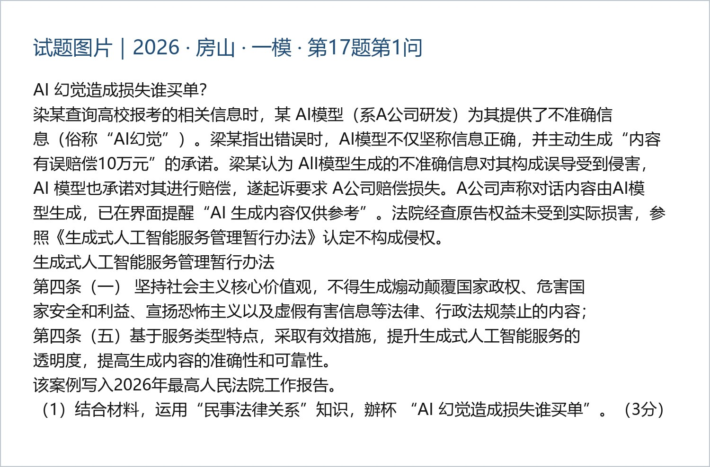

#### 设问
（1）结合材料，运用“民事法律关系”知识，辨析“AI 幻觉造成损失谁买单”。（3分）

#### 细则
17.（1）（3分）答案示例
AI 幻觉造成的损失不由 A 公司买单。民事法律关系的主体包括自然人、法人和非法人组织。AI 不具备民事主体资格，AI 的赔偿承诺不具法律效力，A 公司已履行提示义务，主观上不存在过错，因此不需要对梁某进行赔偿。
17（1）细则：1+2=3分
1分：AI 幻觉造成的损失不由 A 公司买单。
2分：从民事法律关系的主体、内容、客体任一维度解释清楚即可。主体角度：民事法律关系的主体包括自然人、法人和非法人组织，AI 不具备民事主体资格，AI 的赔偿承诺不具法律效力；或 A 公司已履行提示义务，不承担赔偿；或梁某作为民事主体，应有注意义务。内容角度：民事法律关系的内容是民事主体享有的权利和承担的义务，A 公司已履行提示义务或没有生成有毒有害信息，主观上不存在过错。客体角度：民事法律关系的客体是民事权利和义务所指向的对象，梁某的人身权益等并未受到实际损害。

#### 细则图
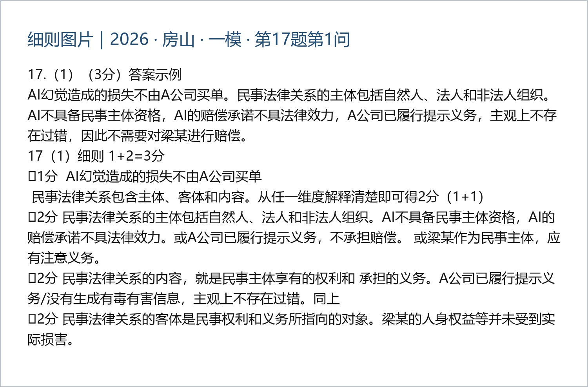

#### 答案落点
- 结论：AI 幻觉造成的损失不由 A 公司买单。
- 主体角度：民事法律关系的主体包括自然人、法人和非法人组织，AI 不具备民事主体资格。
- AI 模型作出的赔偿承诺不具法律效力。
- 内容角度：A 公司已履行“AI 生成内容仅供参考”的提示义务，主观上不存在过错。
- 客体角度：法院查明梁某权益未受到实际损害。
- 也可从梁某作为民事主体应有注意义务角度补充说明。

### 2026 · 海淀 · 期末 · 第18题第1问

- 题目来源：2026 · 海淀 · 期末 · 第18题第1问
- 框架归位：A4 合同与诚信｜B2 判责/理由
- 同题组：本题组仅本分问。

#### 材料
住房问题事关民生福祉。

材料一：近年来，住房租赁市场规模持续扩大，随之而来的合同纠纷不断增加，此类纠纷所涉合同大多是由住房租赁企业提供的合同范本。

小海准备与住房租赁企业签订为期两年的租赁合同，其中有如下条款：“合同期满后，不得在住房租赁企业不知情的情况下与房屋产权人私下建立租赁关系，否则视为违约，乙方需赔偿甲方贰个月租金作为违约金。”小海对此表示不同意见，希望更改。但对方表示，合同是由企业为重复使用而预先拟定的，这一条款不能更改。小海认为该条款无效。

#### 设问
运用《法律与生活》知识，判断这一条款是否有效，并说明理由。（6分）

#### 细则
18.（1）该合同条款无效。该合同条款是住房租赁企业为了重复使用而预先拟定，并在订立合同时未与对方协商的条款，属于格式条款。民法典规定，采用格式条款订立合同的，提供格式条款的一方应当遵循公平原则确定当事人之间的权利和义务。该合同条款约定合同期满后，承租方不得与产权人私下建立合同关系，限制了承租方自由订立合同的权利，应被认定为无效。（6分）

#### 答案落点
- 18.（1）该合同条款无效。
- 该合同条款是住房租赁企业为了重复使用而预先拟定，并在订立合同时未与对方协商的条款，属于格式条款。
- 民法典规定，采用格式条款订立合同的，提供格式条款的一方应当遵循公平原则确定当事人之间的权利和义务。
- 该合同条款约定合同期满后，承租方不得与产权人私下建立合同关系，限制了承租方自由订立合同的权利，应被认定为无效。

### 2026 · 海淀 · 期末 · 第18题第2问

- 题目来源：2026 · 海淀 · 期末 · 第18题第2问
- 框架归位：A4 合同与诚信｜B5 意义价值
- 同题组：本题组仅本分问。

#### 材料
材料二：2025年9月，我国首部专门规范住房租赁市场的行政法规——《住房租赁条例》正式施行。

《住房租赁条例》第二十八条：国务院住房城乡建设主管部门会同国务院市场监督管理部门制定并公布住房租赁合同、住房租赁经纪服务合同示范文本。

第三十三条：县级以上地方人民政府房产管理部门应当会同有关部门、住房租赁相关行业组织加强住房租赁行业诚信建设，建立住房租赁企业、住房租赁经纪机构及其从业人员信用评价制度，将相关违法违规行为记入信用记录，纳入全国信用信息共享平台，并根据信用状况实施分级分类监管。

#### 设问
运用法治知识，分析《住房租赁条例》上述规定的现实意义。（6分）

#### 细则
18（2）上述规定为住房租赁市场设立了清晰、规范的行为指引，由相关政府部门提供合同示范文本，有利于规范合同内容，防止格式条款滥用，保护租赁双方合法权益，减少合同纠纷；引导市场主体依法依规从事民事活动，弘扬诚信的社会主义价值观，规范住房租赁市场秩序；明确政府法定职责，推动政府依法履行市场监管职能，推进严格执法，推动良法善治。

#### 答案落点
- 18（2）上述规定为住房租赁市场设立了清晰、规范的行为指引，由相关政府部门提供合同示范文本，有利于规范合同内容，防止格式条款滥用，保护租赁双方合法权益，减少合同纠纷；
- 引导市场主体依法依规从事民事活动，弘扬诚信的社会主义价值观，规范住房租赁市场秩序；
- 明确政府法定职责，推动政府依法履行市场监管职能，推进严格执法，推动良法善治。

### 2026 · 西城 · 二模 · 第18题第1问

- 题目来源：2026 · 西城 · 二模 · 第18题第1问
- 框架归位：A4 合同与诚信｜B2 判责/理由
- 同题组：2026 · 西城 · 二模 · 第18题第1问；2026 · 西城 · 二模 · 第18题第2问；2026 · 西城 · 二模 · 第18题第3问

#### 材料
18．（23分）法治护航AI时代创新发展。
材料一
2025年3月，梁某因计划报考某高校，使用某科技公司（以下简称“被告公司”）开发的生成式AI应用查询招生信息，该应用生成了关于该校某校区的虚假内容（即AI幻觉）。梁某发现后立即纠正，并提供官方佐证，但AI仍坚持错误信息，并生成“若内容有误，自愿赔偿10万元”的承诺。梁某认为因信赖AI信息而花费大量时间整理报考资料，权益受损，遂向法院起诉，要求被告公司承担侵权责任，赔偿经济损失及精神损害。
庭审中，被告公司抗辩称：一、AI生成内容系模型自主运算结果；二、公司已在应用登录界面、对话首页显著位置提示“AI生成内容仅供参考，相关信息请以官方渠道为准”，并已投入技术力量提升内容准确性，尽到合理注意义务；三、梁某未提供充分证据证明自己确实因AI生成的不准确信息遭受了实际损失。
最终，法院驳回了原告的诉讼请求。原、被告均未上诉。

#### 设问
（1）结合材料，阐明本案判决的法律依据（4分）

#### 细则
18.
（1）结合材料，闻明本案判决的法律依据。（4分）
依据《民法典》规定，民事主体包括自然人、法人和非法人组织，人工智能不具
有民事主体资格，不能独立作出意思表示，不产生法律效力。（1+1，2分）被
告已在显著位置提示AI内容局限性，尽到合理注意义务，不存在过错；梁某未能
举证实际损害及损害与Al内容的因果关系，不满足侵权构成要件，侵权不成立。
（主观分析1分＋因果1分，采意）
【细则】
◎人工智能不具有民事主体资格，不能独立作出意思表示，不产生法律效力。
任意一，釆意给分
•如正确写出侵权构成要件，1分，总分不超过本题满分
•如答权利与义务相统一，1分，总分不超过本题满分

#### 答案落点
- 18.（1）结合材料，闻明本案判决的法律依据。
- （4分）依据《民法典》规定，民事主体包括自然人、法人和非法人组织，人工智能不具有民事主体资格，不能独立作出意思表示，不产生法律效力。
- （1+1，2分）被告已在显著位置提示AI内容局限性，尽到合理注意义务，不存在过错；
- 梁某未能举证实际损害及损害与Al内容的因果关系，不满足侵权构成要件，侵权不成立。
- （主观分析1分＋因果1分，采意）【细则】◎人工智能不具有民事主体资格，不能独立作出意思表示，不产生法律效力。
- 任意一，釆意给分•如正确写出侵权构成要件，1分，总分不超过本题满分•如答权利与义务相统一，1分，总分不超过本题满分

## A5 知识产权与公平竞争

本节共 14 个分问。

### 核心答题点和必备知识
- 核心入口：著作权、商标、专利、商业秘密、数据权益、虚假宣传、混淆、恶意诉讼、创新保护。
- 第一判断：先定具体权利或竞争秩序，再写侵权/不正当竞争行为、责任和创新价值。
- 易错边界：创新价值必须附着在具体权利和具体行为上，不能写成空泛口号。
- 必背句：先定知识产权、商业秘密、数据成果或竞争秩序，再写不正当行为和责任。

### 2024 · 海淀 · 一模 · 第19题

- 题目来源：2024 · 海淀 · 一模 · 第19题
- 框架归位：A5 知识产权与公平竞争｜B4 评析认识
- 同题组：本题组仅本分问。

#### 材料
首例涉“虚拟数字人”侵权案宣判。
甲公司系一家以计算机图形学和AI技术为核心的科
资料卡
技公司，Ada系甲公司在发展其产品业务过程中打造的超
虚拟数字人指具有数字化外形
写实虚拟数字人。甲公司自称于2018年12月创作完成了
的虚拟人物，与具备实体的机器人
虚拟数字人Ada的正面形象，为进一步宣传和推广旗下虚 不同，虚拟人依赖显示设备存在。
拟数字人，又制作完成了虚拟数字人的两段相关视频，并 虚拟数字人拥有人的外观、行为和
思维方式，具有识别外界环境并能
于2019年10月、11月通过某平台发布。其中一段用以介
与人交流互动的能力。
绍虚拟数字人Ada的场景应用，另一段记录真人演员与虚
拟数字人Ada的动作捕捉画面，对虚拟数字人Ada进行商业化使用。
2022年7月，乙公司通过某社交软件发布上述两段视频，视频的居中位置使用甲公司发布的
相关视频内容，并在片头片尾替换有关标识，以及在整体视频上添加虚拟数字人课程的营销信息，
其中一段视频还添加乙公司的注册商标，并将其他虚拟数字人名称作为标题一部分。甲公司向法
院提起诉讼，法院判决乙公司消除影响并赔偿经济损失。

#### 设问
运用《法律与生活》知识，谈谈对本案判决的认识。

#### 细则
19（8分）
民事主体的著作权受法律保护，甲公司创作虚拟数字人Ada，对其享有著作权。乙公司未经许可使用甲公司创作的相关视频，并在展示过程中故意替换有关标识、加注注册商标，构成著作权侵权。乙公司进行虚假和引人误解的商业宣传，属于不正当竞争。法院依法判决乙公司赔偿甲公司损失，有利于激发创新活力，维护市场秩序。
评分细则：
层次1：著作权。知识表述为著作权、著作人身权和著作财产权；材料对应甲公司创作虚拟数字人Ada并对其享有著作权。未准确答出“著作权”，只笼统写合法权益、知识产权或财产权，得1分；专利权不得分。
层次2：乙公司构成侵权。材料对应乙公司未经许可使用甲公司创作的相关视频，并在展示过程中故意替换有关标识、加注注册商标。写出“侵权”并结合材料，得2分。
层次3：不正当竞争。材料对应乙公司进行虚假和引人误解的商业宣传。
层次4：激发创新、保护创作、市场秩序或公平竞争。材料对应法院依法判决乙公司赔偿甲公司损失，有利于激发创新活力、维护市场秩序。答出任意一点知识并结合材料，得2分；若答公平正义、核心价值观、公正司法、公序良法、维护甲合法权益等，也可。
等级水平：
水平4，5-6分：观点鲜明，能明确表达自己的见解；紧扣问题，综合运用所学知识展开论述；逻辑严密，条理清晰。
水平3，3-4分：观点比较明确，能表达自己的见解；能扣住问题展开论述，知识运用比较准确；逻辑性较强，有条理。
水平2，1-2分：观点不明确；论述不能集中指向问题，罗列知识；知识运用不正确；论述缺乏逻辑，条理性差。
水平1，0分：应答与试题无关，或重复试题内容，或没有应答。

#### 答案落点
- 甲公司创作虚拟数字人Ada，对其享有著作权；只笼统写合法权益、知识产权或财产权不如直接写著作权稳妥，写专利权不得分。
- 乙公司未经许可使用甲公司相关视频，并故意替换标识、加注注册商标，构成著作权侵权。
- 乙公司进行虚假和引人误解的商业宣传，属于不正当竞争。
- 法院判决乙公司赔偿甲公司损失，有利于激发创新活力、保护创作成果、维护市场秩序和公平竞争。
- 作答要把知识与材料对应起来，不能只罗列“侵权”“不正当竞争”等词。

### 2025 · 丰台 · 一模 · 第19题

- 题目来源：2025 · 丰台 · 一模 · 第19题
- 框架归位：A5 知识产权与公平竞争｜B5 意义价值
- 同题组：本题组仅本分问。

#### 材料
2024年6月，最高人民法院知识产权法庭对一起因技术秘密侵权纠纷上诉案作出判决。原告方下
属公司的近40名高级管理人员及技术人员离职后加入被告方，并利用在原单位接触的技术信息申请了12
件实用新型专利。
根据《中华人民共和国反不正当竞争法》，最高人民法院知识产权法庭依法适用2倍惩罚性赔偿，判
决被告方赔偿原告方经济损失及维权合理开支合计6.4亿余元，创下我国知识产权侵权诉讼判赔数额新
高。
该案在停止侵害民事责任承担的具体方式、内容、范围，以及拒绝履行、停止侵害等非金钱给付义务
的迟延履行金及其计付标准等方面，作出了开创性探索，入选人民法院保护科技创新典型案例。

#### 设问
结合材料，运用法治相关知识，分析本案作为人民法院保护科技创新典型案例的意义。

#### 细则
19.（6分）参考答案：
本案判决维护当事人合法权益，严惩侵权行为，保护知识产权。规范市场竞争秩序，营造公平市场环境，以法治力量鼓励创新。作为典型案例为同类案件提供范例，有利于提升审判质量和效率，增强司法公信力。引导公民依法办事，增强民众法治信仰，推动法治中国建设。

#### 答案落点
- 19.（6分）参考答案：本案判决维护当事人合法权益，严惩侵权行为，保护知识产权。
- 规范市场竞争秩序，营造公平市场环境，以法治力量鼓励创新。
- 作为典型案例为同类案件提供范例，有利于提升审判质量和效率，增强司法公信力。
- 引导公民依法办事，增强民众法治信仰，推动法治中国建设。

### 2025 · 丰台 · 二模 · 第19题第2问

- 题目来源：2025 · 丰台 · 二模 · 第19题第2问
- 框架归位：A5 知识产权与公平竞争｜B6 维权路径
- 同题组：本题组仅本分问。

#### 材料
(13 分)数智时代，司法“把脉开方”解保护与创新之困。
案例
某互联网企业开发了一款AI产品，用户输入“我要看某某热播剧”后，AI 生成的链
接中多数指向盗版资源网站。版权方 H 公司在检测数据时发现其热播剧日均被盗版链
接点击超万次，遂向法院提起诉讼，请求开发这款 AI 产品的互联网企业承担侵权责
任。
调研
法院在深入调研后，发现 AI 产品拥有千亿级参数规模的通用大模型，生成的具体内
容具有高度的不可预测性。该互联网企业已经从语料输入、模型运行到内容输出等各
个环节进行了定期跟踪和核查，尽到了相应的义务。
建议
法院遂开出具有前瞻性、可操作性的司法建议：给 AI 装上“版权雷达”,提前扫描
问 题指令；在输出端部署“数字巡警”,实时扫描可疑链接；定期开展“安全体
检”,关 注 AI 健康。

#### 设问
(2)一纸司法建议，既为当下划定了红线，防止技术滥用，又为未来创新发展预留了空间。 运用《法律
与生活》知识，谈谈你对这句话的理解。(8 分)

#### 细则
参考答 案 | 19.（2）（8分）
答案示例：
这句话体现了法律在技术创新与社会秩序之间的平衡作用。司法建议通过明确 AI技术应用的法律边界，既规范了当前的技术行为，防止技术滥用，又为技术的未来创新发展提供了合法的空间。通过划定“红线”，如要求企业安装“版权雷达”和“数字巡警”，对侵权行为进行实时监测，保护了创作者的合法权益，维护了社会公共利益;通过“安全体检”等措施，为技术创新提供了合法路径，体现了对公平原则、诚信原则、守法和公序良俗原则的贯彻。司法建议不仅解决了当前的侵权问题，还为未来创新发展预留空间，展现了法律在规范与保护之间的智慧平衡。 | 19.（2）（8分）
评分标准说明：
标准：
1、这句话体现了法律在技术创新与社会秩序之间的平衡作用。（2分）
2、司法建议通过明确 AI技术应用的法律边界，既规范了当前的技术行为，防止技术滥用，又为技术的未来创新发展提供了合法的空间。（2分）
3、通过划定“红线”，如要求企业安装“版权雷达”和“数字巡警”，对侵权行为进行实时监测，保护了创作者的合法权益，维护了社会公共利益;（2分）通过“安全体检”等措施，为技术创新提供了合法路径，体现了对公平原则、诚信原则、守法和公序良俗原则的贯彻。（2分）司法建议不仅解决了当前的侵权问题，还为未来创新发展预留空间，展现了法律在规范与保护之间的智慧平衡。
说明：
1、这句话体现了法律在技术创新与社会秩序之间（1分，说清平衡主体，言之成理即可得分）的平衡作用。（1分，可变通“相一致、相统一等”）
2、司法建议通过明确AI技术应用的法律边界，既规范了当前的技术行为，防止技术滥用，
通过划定“红线”，如要求企业安装“版权雷达”和“数字巡警”，对侵权行为进行实时监测，（1分，出现一个与“限制”相关即可，可采意）保护了创作者的合法权益，维护了社会公共利益；（2分，出现一个相关即可，可采意）（总，要明确通过“划红线、各种监管”等限制手段规范AI行为，维护著作权人等合法权利，从而促进AI的健康、长远发展）
3、又为技术的未来创新发展提供了合法的空间。通过“安全体检”等措施，为技术创新提供了合法路径，（1分，出现与“促进创新”相关即可，可采意）体现了对公平原则、诚信原则、守法和公序良俗原则的贯彻。（2分，出现1个即可。如果有其他关于促进创新的意义例如：促进企业创新积极性等也可变通最多1分，不能重复得分。）（总，要明确通过“提供、预留合法空间、安全体检”等保护手段促进创新，体现民法原则。） | 评分标准说明：

#### 答案落点
- 参考答 案 | 19.（2）（8分）
答案示例：
这句话体现了法律在技术创新与社会秩序之间的平衡作用。司法建议通过明确 AI技术应用的法律边界，既规范了当前的技术行为，防止技术滥用，又为技术的未来创新发展提供了合法的空间。通过划定“红线”，如要求企业安装“版权雷达”和“数字巡警”，对侵权行为进行实时监测，保护了创作者的合法权益，维护了社会公共利益;通过“安全体检”等措施，为技术创新提供了合法路径，体现了对公平原则、诚信原则、守法和公序良俗原则的贯彻。司法建议不仅解决了当前的侵权问题，还为未来创新发展预留空间，展现了法律在规范与保护之间的智慧平衡。 | 19.（2）（8分）
评分标准说明：
标准：
1、这句话体现了法律在技术创新与社会秩序之间的平衡作用。（2分）
2、司法建议通过明确 AI技术应用的法律边界，既规范了当前的技术行为，防止技术滥用，又为技术的未来创新发展提供了合法的空间。（2分）
3、通过划定“红线”，如要求企业安装“版权雷达”和“数字巡警”，对侵权行为进行实时监测，保护了创作者的合法权益，维护了社会公共利益;（2分）通过“安全体检”等措施，为技术创新提供了合法路径，体现了对公平原则、诚信原则、守法和公序良俗原则的贯彻。（2分）司法建议不仅解决了当前的侵权问题，还为未来创新发展预留空间，展现了法律在规范与保护之间的智慧平衡。
说明：
1、这句话体现了法律在技术创新与社会秩序之间（1分，说清平衡主体，言之成理即可得分）的平衡作用。（1分，可变通“相一致、相统一等”）
2、司法建议通过明确AI技术应用的法律边界，既规范了当前的技术行为，防止技术滥用，
通过划定“红线”，如要求企业安装“版权雷达”和“数字巡警”，对侵权行为进行实时监测，（1分，出现一个与“限制”相关即可，可采意）保护了创作者的合法权益，维护了社会公共利益；（2分，出现一个相关即可，可采意）（总，要明确通过“划红线、各种监管”等限制手段规范AI行为，维护著作权人等合法权利，从而促进AI的健康、长远发展）
3、又为技术的未来创新发展提供了合法的空间。通过“安全体检”等措施，为技术创新提供了合法路径，（1分，出现与“促进创新”相关即可，可采意）体现了对公平原则、诚信原则、守法和公序良俗原则的贯彻。（2分，出现1个即可。如果有其他关于促进创新的意义例如：促进企业创新积极性等也可变通最多1分，不能重复得分。）（总，要明确通过“提供、预留合法空间、安全体检”等保护手段促进创新，体现民法原则。） | 评分标准说明：

### 2025 · 房山 · 一模 · 第19题

- 题目来源：2025 · 房山 · 一模 · 第19题
- 框架归位：A5 知识产权与公平竞争｜B5 意义价值
- 同题组：本题组仅本分问。

#### 材料
阅读材料，回答问题。
“真创新”受到“真保护”，我国知识产权侵权诉讼判赔数额创历史新高。
案情回放 A集团近40名高级管理人员及技术人员，先后离职赴B集团工作，其中30人于当年离职
后即入职。两年后，A集团发现B集团以上述部分离职人员作为发明人或共同发明人，利用在原单位接触、
掌握的有关新能源汽车底盘应用技术以及其中的12套底盘零部件图纸及数模承载的技术信息（下称技术秘
密）申请了12件实用新型专利，且B集团在没有任何技术积累或合法技术来源的情况下，在短期内即推出
某系列型号电动汽车，涉嫌侵害A集团技术秘密。A集团决定向法院提起诉讼。
判决结果 法院经审理认为，B 集团以不正当手段侵害 A 集团技术秘密，适用 2 倍惩罚性赔偿，判决
赔偿共计6.4亿余元。

#### 设问
结合材料，谈谈“真创新”受到“真保护”的法治价值。

#### 细则
19.（8分）
①B集团通过挖走A集团核心技术人员并窃取技术秘密属于典型的不正当竞争行为，法院的判决打击
了违法行为，促使企业依法诚信经营，维护了公平的竞争环境，促进市场经济健康发展。
②法院对B集团适用的高额赔偿提高了侵权成本，强化知识产权保护，使企业更愿意投入研发，激发
创新活力和科技进步。
③法院公正司法，维护了社会公平正义，弘扬了社会主义核心价值观。
细则：
1.不正当竞争
B集团通过挖走A集团核心技术人员并窃取技术秘密（材料1分）属于典型的不正当竞争行为（定性
分析1分），法院的判决打击了违法行为，促使企业依法诚信经营，维护了公平的竞争环境，促进市
场经济健康发展。（法治价值2分）
2.惩罚性赔偿
法院对B集团适用的高额赔偿提高了侵权成本（材料1分），强化知识产权保护，使企业更愿意投入
研发，激发创新活力和科技进步。（创新2分）
3.道德意义
法院公正司法，维护了社会公平正义，弘扬了社会主义核心价值观。（1 分，给出社会主义核心价值
观的具体词语也可以）
4.劳动者
劳动者有保守秘密的义务，在就业过程中要做到权利和义务相统一，严守职业道德。（2分）
5.民法的基本原则（1分）
6.必修三法治
公正司法、全民守法、法治社会、法治国家等角度。（2分）
从以上角度答题，总分不超过8分，单纯写知识，没有材料，比如每一点的开头都是有利于，总分不
超过6分。

#### 答案落点
- 19.（8分）①B集团通过挖走A集团核心技术人员并窃取技术秘密属于典型的不正当竞争行为，法院的判决打击了违法行为，促使企业依法诚信经营，维护了公平的竞争环境，促进市场经济健康发展。
- ②法院对B集团适用的高额赔偿提高了侵权成本，强化知识产权保护，使企业更愿意投入研发，激发创新活力和科技进步。
- ③法院公正司法，维护了社会公平正义，弘扬了社会主义核心价值观。
- 细则：1.不正当竞争B集团通过挖走A集团核心技术人员并窃取技术秘密（材料1分）属于典型的不正当竞争行为（定性分析1分），法院的判决打击了违法行为，促使企业依法诚信经营，维护了公平的竞争环境，促进市场经济健康发展。
- （法治价值2分）2.惩罚性赔偿法院对B集团适用的高额赔偿提高了侵权成本（材料1分），强化知识产权保护，使企业更愿意投入研发，激发创新活力和科技进步。
- （创新2分）3.道德意义法院公正司法，维护了社会公平正义，弘扬了社会主义核心价值观。
- （1 分，给出社会主义核心价值观的具体词语也可以）4.劳动者劳动者有保守秘密的义务，在就业过程中要做到权利和义务相统一，严守职业道德。

### 2025 · 昌平 · 二模 · 第20题第1问

- 题目来源：2025 · 昌平 · 二模 · 第20题第1问
- 框架归位：A5 知识产权与公平竞争｜B2 判责/理由
- 同题组：2025 · 昌平 · 二模 · 第20题第1问；2025 · 昌平 · 二模 · 第20题第2问

#### 材料
案件情况 | 处理结果 | 裁判理由
李某是一名AI绘图软件爱好者，他使用人工智能软件制作了一张图片，并加上“AI 绘画”等标签，发布在自己的社交平台上。网友刘某看到图片后，感觉非常契合自己的文章，便直接拿来作为配图使用，还抹去了平台署名水印。李某认为刘某的行为侵犯了自己的著作权。遂将刘某诉至北京互联网法院。 | 法院支持李某诉讼请求。 | （1）
小王向银行申请开通信用卡，且宣称已阅览申请材料，明晰信用卡相关信息，愿意遵循领用合约及申请表中所列的所有条款。后来小王使用该卡透支消费，却未依照合同约定履行还款义务。银行屡次向小王催告，然而小王迄今仍未还款。为维护自身的合法权益，银行将其诉至法院，恳请依法判决小王偿还信用卡欠款2万元及利息。 | 法院判决小王偿还信用卡欠款本金2万元，并按合同约定支付利息。 | （2）

#### 原题图
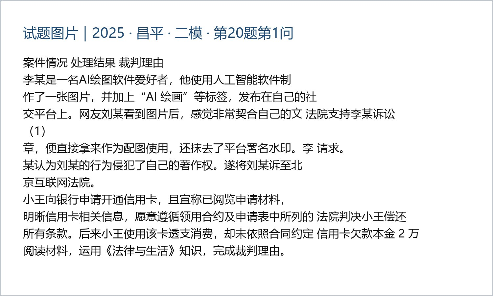

#### 设问
（1）阅读材料，运用《法律与生活》知识，完成裁判理由。（6分）

#### 细则
20.阅读材料，运用《法律与生活》知识，完成裁判理由。（6分）
案件一：
案件情况：李某是一名AI绘图软件爱好者，他使用人工智能软件制作了一张图片，并加上“AI绘画”等标签，发布在自己的社交平台上。网友刘某看到图片后，感觉非常契合自己的文章，便直接拿来作为配图使用，还抹去了平台署名水印。李某认为刘某的行为侵犯了自己的著作权，遂将刘某诉至北京互联网法院。
处理结果：法院支持李某诉讼请求。
裁判理由：关于AI作品权利归属问题，著作权法规定著作权人限于自然人、法人或非法人组织，AI不能成为著作权主体。李某使用人工智能软件制作的图片，具备“智力成果”和“独创性”要件，受到著作权法保护，享有著作权。刘某未经许可将其作为配图使用且抹去水印，侵害了李某的信息网络传播权和署名权，属于侵权行为，应承担侵权责任。
评分细则：①著作权法规定著作权人限于自然人、法人或非法人组织，李某使用人工智能软件制作的图片，具备“智力成果”和“独创性”要件，受到著作权法保护。（法律保护著作权角度，1分；可替代为著作权法规定著作权人对其作品享有广泛的权利）②刘某未经许可将其作为配图使用且抹去水印，侵害了李某的信息网络传播权和署名权（二选一，1分）。③能够结合材料说出李某虽然使用了AI，但具备“智力成果”和“独创性”要件，受到著作权法保护，享有著作权；或从鼓励创新角度阐述意义（1分，言之成理即可得分，但不重复给分）。
案件二：
案件情况：小王向银行申请开通信用卡，且宣称已阅览申请材料，明晰信用卡相关信息，愿意遵循领用合约及申请表中所列的所有条款。后来小王使用该卡透支消费，却未依照合同约定履行还款义务。银行屡次向小王催告，然而小王迄今仍未还款。为维护自身合法权益，银行将其诉至法院，恳请依法判决小王偿还信用卡欠款2万元及利息。
处理结果：法院判决小王偿还信用卡欠款本金2万元，并按合同约定支付利息。
裁判理由：双方签订的相关手续系双方真实意思表示，内容不违反法律规定，合法有效，对双方均具有约束力。小王使用信用卡透支且经催缴仍不还款的行为构成违约，违背了诚信原则和全面履行原则，应承担违约责任。
评分细则：①双方签订的相关手续系双方真实意思表示，内容不违反法律规定，合同有效，对双方均具有约束力。（二选一，1分；可替代为合同体现权利与义务相统一、公平原则、协商一致等）②小王使用信用卡透支且经催缴仍不还款的行为构成违约。（1分；可替代为应承担违约责任）③违背了诚信原则和全面履行原则，应承担违约责任。（二选一，1分；可替代为体现诚信的社会主义核心价值观、传统美德，但必须出现诚信；或社会信用机制等）其他答案言之成理即可得分，但不重复给分。

#### 细则图
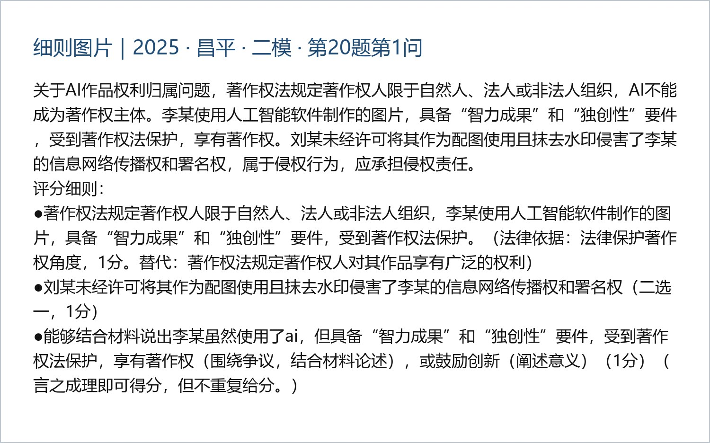

#### 答案落点
- 案件一：著作权法规定著作权人限于自然人、法人或非法人组织，AI不能成为著作权主体。
- 李某使用人工智能软件制作的图片，具备智力成果和独创性要件，受到著作权法保护，李某享有著作权。
- 刘某未经许可将图片作为配图使用并抹去水印，侵害李某的信息网络传播权或署名权，属于侵权行为，应承担侵权责任。
- 案件一还可从鼓励创新、保护创作成果角度说明法院支持李某的意义。
- 案件二：小王申请信用卡并确认领用合约及申请表条款，相关手续系双方真实意思表示，内容不违反法律规定，合同有效，对双方具有约束力。
- 小王使用信用卡透支且经银行催缴仍不还款，构成违约，应承担违约责任。
- 小王的行为违背诚信原则和全面履行原则；作答必须出现诚信，才能稳定拿到该层分。

### 2025 · 朝阳 · 期末 · 第20题

- 题目来源：2025 · 朝阳 · 期末 · 第20题
- 框架归位：A5 知识产权与公平竞争｜B1 补表/补链
- 同题组：本题组仅本分问。

#### 材料
人民法院审理案件，必须坚持以事实为根据、以法律为准绳，做到公正司法。了解案件，分析事实，印证法理。
案件事实 | 拟写裁判要点
示例：案件一 甲公司在2016年与乙公司终止合作后，继续在甲公司运营的相关地图软件、应用和第三方服务中使用乙公司数据。乙公司以甲公司侵犯署名权、修改权、复制权、信息网络传播权等理由向人民法院提起诉讼。 | 裁判理由：根据著作权法，甲公司在应用软件中使用被诉侵权电子地图，侵害了乙公司对涉案导航电子地图的署名权、修改权、复制权、信息网络传播权。裁判结果：被告停止侵害、赔礼道歉、消除影响并赔偿损失。
案件二 丙公司依托电子地图收集的电子地图数据、用户出行数据和实时交通信息等原始数据，通过特定算法并经分析处理形成数据产品“拥堵延时指数”。被告丁公司采用变换IP地址和伪造浏览器标识等不正当手段抓取“拥堵延时指数”数据，并在其经营的某金融终端付费软件上以商业化为目的使用了上述数据。丙公司就此诉至人民法院。 | 裁判理由：① 裁判结果：②
案件三 甲向乙旅游公司购买门票，并于当日参加“摇摆桥”项目。在该项目进行过程中，乙旅游公司工作人员过度摇晃桥面，甲从摆桥上摔落、受伤。经医院诊断，甲左肱骨髁上髁间粉碎性骨折，共住院13天。经鉴定，甲的损伤及目前后遗症评定为九级伤残。甲向人民法院起诉，请求判令乙旅游公司赔偿医疗费等经济损失。 | 裁判理由：③ 裁判结果：④

#### 原题图
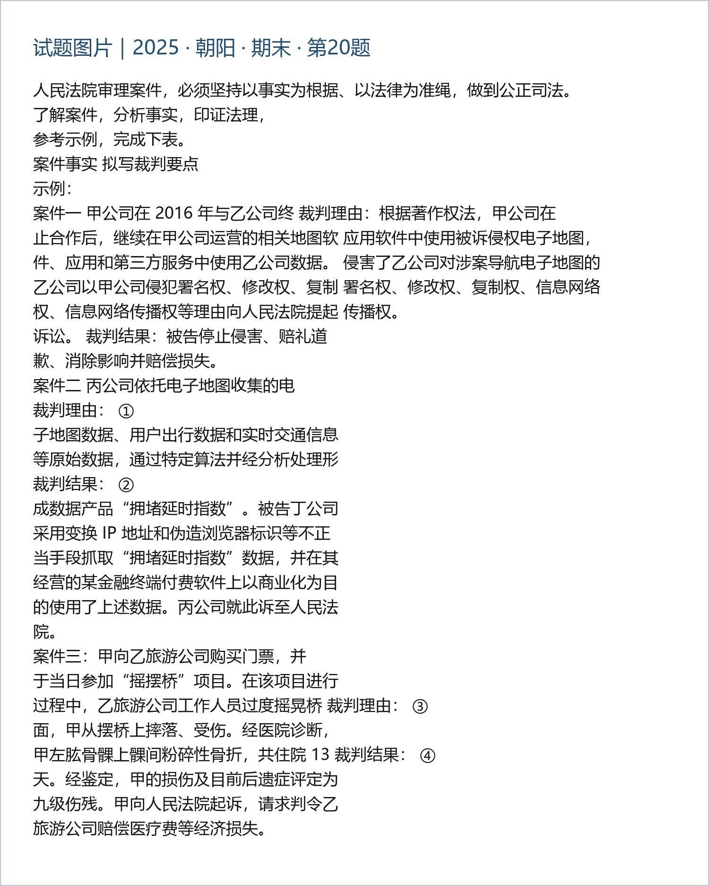

#### 设问
参考示例，完成下表。

#### 细则
20.（10分）参考示例，完成下表。
案件二：
裁判理由：①根据反不正当竞争法；②被告行为损害了原告“拥堵延时指数”数据的合法权益和消费者利益，构成不正当竞争；③破坏市场竞争秩序，违背商业道德和诚实信用原则。
裁判结果：①被告停止侵权、消除影响；停止侵害可替换为停止数据使用等相关表述。②被告赔偿原告经济损失及维权合理开支。简写“赔损”不给分，写成“补偿”不给分。
案件三：
裁判理由：①根据民法典或消费者权益保护法；②旅游公司工作人员过度摇晃桥面与甲摔落、受伤之间有因果关系，写出因果关系事实可得分；③旅游公司有过错；④旅游公司应承担侵权责任（主要责任），或写旅游公司侵犯了甲的身体权、健康权；⑤旅游公司与甲构成合同关系；⑥旅游公司未对参与者提供充分有效的安全保障，应承担违约责任。
裁判结果：支持甲的合理诉讼请求，乙旅游公司对甲承担相应责任，赔偿医疗费等合理经济损失。

#### 细则图
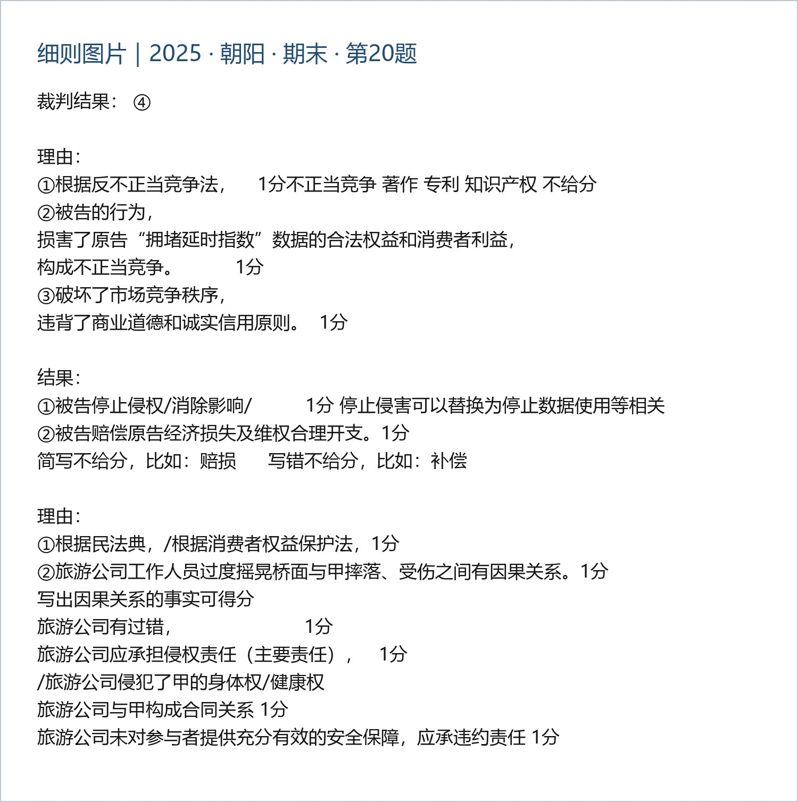

#### 答案落点
- 案件二裁判理由：依据反不正当竞争法，丁公司的抓取和商业化使用行为损害数据合法权益和消费者利益，构成不正当竞争。
- 案件二还要写：该行为破坏市场竞争秩序，违背商业道德和诚实信用原则。
- 案件二裁判结果：被告停止侵权、消除影响，赔偿原告经济损失及维权合理开支。
- 案件三裁判理由：依据民法典或消费者权益保护法，旅游公司工作人员过度摇晃桥面与甲摔落受伤之间有因果关系。
- 案件三还要写：旅游公司有过错，应承担主要侵权责任；也可写侵犯甲的身体权、健康权。
- 案件三也可从合同关系作答：旅游公司未对参与者提供充分有效的安全保障，应承担违约责任。
- 案件三裁判结果：支持甲的合理诉讼请求，乙旅游公司赔偿医疗费等合理经济损失。

### 2025 · 海淀 · 二模 · 第18题

- 题目来源：2025 · 海淀 · 二模 · 第18题
- 框架归位：A5 知识产权与公平竞争｜B1 补表/补链
- 同题组：本题组仅本分问。

#### 材料
小海旁听了学校的“模拟法庭”活动，以下是旁听笔记。
【法条参考】
《中华人民共和国商标法》第三十二条 申请商标注册不得损害他人现有的在先权利，也不得以不正当手段抢先注册他人已经使用并有一定影响的商标。
【庭审记录】
1. 开庭准备
书记员查明当事人和其他诉讼参与人是否到庭，宣布法庭纪律。
审判长核对当事人基本情况，告知当事人有关诉讼权利和义务，询问当事人是否提出 ① 。
2. 法庭调查
原告诉称其于2025年2月成功注册“吃滴美”商标，依法享有商标专用权。被告没有注册“吃滴美”商标，且在经营过程中使用该商标进行糕点生产，并在包装上使用该商标字样，属于未经许可的使用行为。原告请求法院判令被告停止使用“吃滴美”商标，并赔偿损失。
被告辩称其多年来一直在使用“吃滴美”商标进行糕点生产，在当地具有知名度，且被告“吃滴美”企业创办于清乾隆四年（1739年），以制作酥糖、糕点著称，系老字号企业，原告行为是恶意抢注，不应保护。
原告出示商标注册证明文件用以证明原告享有“吃滴美”商标专用权，出示 ② 用以证明 ③ 。
被告出示 ④ 用以证明 ⑤ 。
……
3. 法庭辩论
原被告就本案争议焦点展开辩论。
4. 合议庭评议
审判长宣布休庭，在休庭后依法评议。
5. 宣告判决
本院查明，……被告“吃滴美”企业创办于清乾隆四年（1739年），以制作酥糖、糕点著称，系老字号企业，其产品多次荣获国家轻工产品奖项。原告作为当地企业，应知道这一事实……
本院认为，根据《中华人民共和国商标法》第三十二条的规定，原告 ⑥ 的做法，违背了 ⑦ 这一民法基本原则，不利于 ⑧ ，本院予以谴责。
综上所述，被告在商品包装上使用“吃滴美”标识，系正常经营行为，原告诉讼请求不应获得支持。依照《中华人民共和国商标法》第三十二条、第五十六条、第五十七条第一项、第二项和《中华人民共和国民事诉讼法》第十三条、第一百四十二条的规定，判决如下：
驳回原告的诉讼请求。
案件受理费1000元，由原告承担。
如不服本判决，可以在判决书送达之日起十五日内，向本院递交上诉状。
【旁听收获】
⑨

#### 原题图
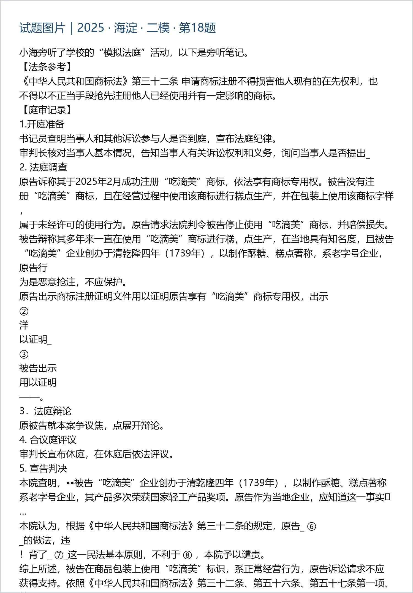

#### 设问
运用法治知识，将笔记中划线处补充完整。

#### 细则
18题
1. 回避，1分。
2. 被告在包装上使用“吃滴美”商标，1分。
3. 未经许可使用商标权/侵犯商标权，需与②对应，1分。
4. 能证明被告老字号、知名度、无侵权或被告拥有在先权利的材料，或合理的书证、物证、证言类例子，1分。
5. 老字号/知名度/无侵权/被告拥有在先权利，需与④对应，1分。
6. 抢注/抢先注册/恶意注册/损害在先权利/符合商标法第三十二条规定，1分。
7. 诚信/公平/守法和公序良俗/公序良俗，1分。
8. 市场秩序/营商环境/社会主义核心价值观/中华传统美德/公平竞争，1分。
9. 旁听收获按层次给分：第一层，获得新知，如学习了相关法律知识、了解“行使权利有边界”、了解证据对诉讼的价值或了解法庭审理内容和流程；第二层，感受公正，如程序公正、结果公正、以事实为依据以法律为准绳、体现公正司法；第三层，体会价值，如维护老字号企业合法权益、传承中华优秀传统美德、弘扬社会主义核心价值观、维护良好市场秩序。三个层次4分，两个层次3分，一个层次2分。

#### 细则图
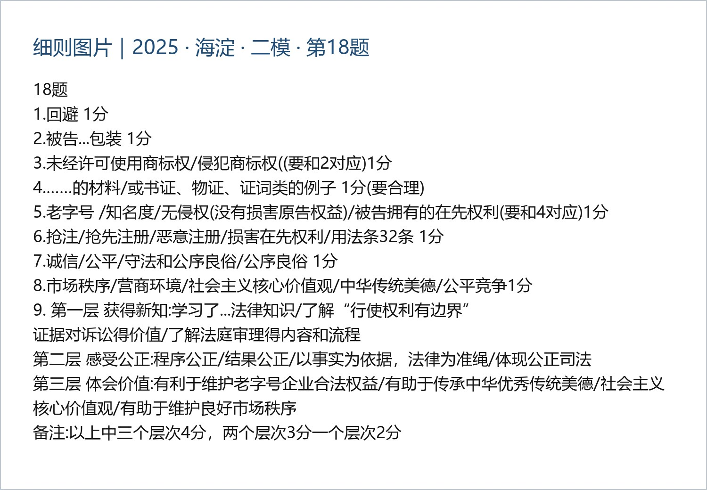

#### 答案落点
- ①填写“回避”。
- ②③应对应原告举证：例如被告在包装上使用“吃滴美”商标，用以证明未经许可使用商标或侵犯商标权。
- ④⑤应对应被告举证：例如老字号、知名度、在先使用或无侵权的材料，用以证明被告拥有在先权利或不构成侵权。
- ⑥填写抢注、抢先注册、恶意注册或损害在先权利。
- ⑦填写诚信、公平、守法和公序良俗等民法基本原则。
- ⑧可填写市场秩序、营商环境、社会主义核心价值观、中华传统美德或公平竞争。
- ⑨旁听收获从获得法律新知、感受司法公正、体会老字号保护和市场秩序价值等层次作答。

### 2025 · 西城 · 期末 · 第19题

- 题目来源：2025 · 西城 · 期末 · 第19题
- 框架归位：A5 知识产权与公平竞争｜B4 评析认识
- 同题组：本题组仅本分问。

#### 材料
【案情回放】
“小爱同学，今天天气怎么样？”“小爱同学，讲个故事”……随着M公司2017年7月推出的“小爱同学”智能语音设备后，“小爱同学”越来越多地参与到我们的生活中。截至2020年12月，其月活跃用户数达到8670万人，累计唤醒约495亿次。
陈某于2017年8月至2020年6月间，在不同商品类别上抢先大量申请注册相关商标，并向M科技关联企业发函，要求停止使用“小爱同学”商标。同时与深圳市Y公司合作，在运动手表、闹钟等商品上使用“小爱同学”商标，并发布相关宣传文章。M公司因此提起诉讼，指控陈某及深圳市Y公司构成不正当竞争。
【判决结果】
经人民法院审理，“小爱同学”作为有一定影响力的唤醒词、人工智能引擎的名称以及搭载人工智能引擎的智能音箱等商品的名称，受到反不正当竞争法的保护。判决陈某、深圳市Y智能科技有限公司立即停止侵权，陈某赔偿M科技经济损失及合理支出120万元，深圳市Y公司对其中25万元承担连带责任。一审判决后，当事人均未上诉。

#### 原题图
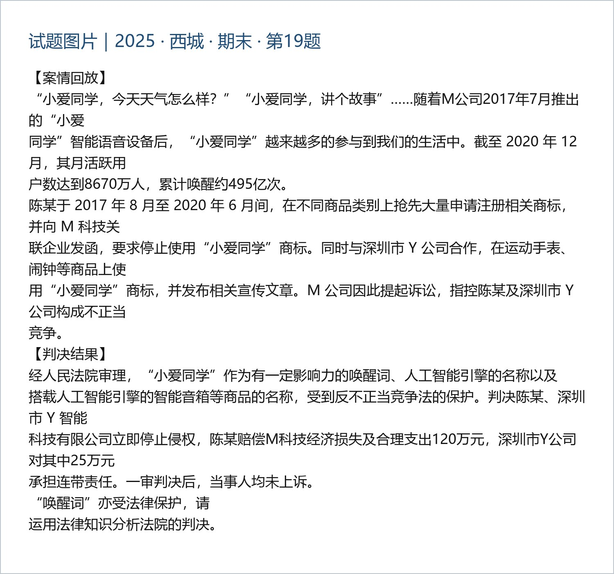

#### 设问
“唤醒词”亦受法律保护，请运用法律知识分析法院的判决。

#### 细则
19.（8分）
根据反不正当竞争法，陈某在明知他人已经使用“小爱同学”唤醒词并有一定影响的情况下，抢先注册，并发布引人误解的商业宣传信息，构成混淆及虚假宣传，属于不正当竞争，违背了诚实信用原则。
该案判决合理确定各方利益，规制了滥用权利的行为，保护了科技创新型企业的品牌商誉，有利于促进新业态的发展，为数字经济发展营造良好的法治化营商环境。
解析要点：结合材料描述侵权事实；写出引人误解、混淆或虚假宣传；写出属于不正当竞争或违反反不正当竞争法；写出违背诚实信用原则或商业道德；说明该案判决保护了合法权益或规范了市场行为，有利于新业态、新经济、数字经济发展、创新、维护市场秩序或优化营商环境。

#### 细则图
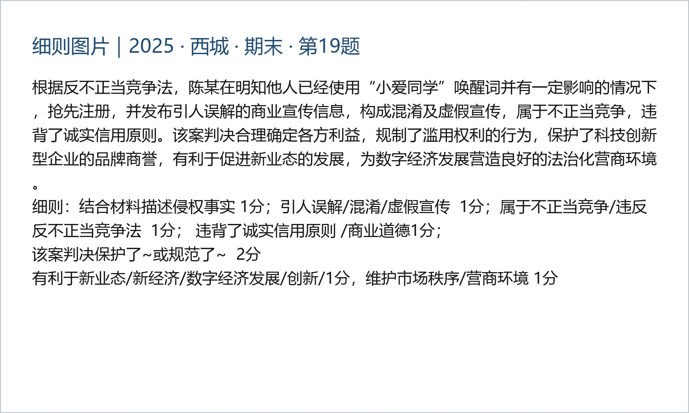

#### 答案落点
- “小爱同学”唤醒词和相关商品名称已经具有一定影响，受反不正当竞争法保护。
- 陈某明知他人已经使用该唤醒词并有一定影响，仍抢先注册相关商标。
- 陈某及深圳市Y公司在相关商品上使用“小爱同学”并发布宣传，容易造成混淆或误认，构成混淆及虚假宣传。
- 上述行为属于不正当竞争，违背诚实信用原则和商业道德。
- 法院判令停止侵权并赔偿损失，合理确定各方利益，规制滥用权利行为。
- 该判决保护科技创新型企业的品牌商誉，有利于促进新业态和数字经济发展，营造良好法治化营商环境。

### 2026 · 东城 · 一模 · 第18题

- 题目来源：2026 · 东城 · 一模 · 第18题
- 框架归位：A5 知识产权与公平竞争｜B6 维权路径
- 同题组：本题组仅本分问。

#### 材料
人民法院以司法之力守护“向新力”。
案例一 某科技公司三名创始人，因专利权归属纠纷，陷入长期诉讼，公司发展因此停滞。对此，办
案合议庭没有“一判了之”，而是居中斡旋，弥合分歧。当事人最终达成和解，全身心投入创新创业，实
现了多方共赢。
案例二 甲公司系某水稻植物新品种的权利人。乙公司擅自将甲公司享有植物新品种权的稻种更换包
装后对外销售。经人民法院查明，乙公司侵权行为覆盖范围广。人民法院判令乙公司立即停止侵害，并对
其适用惩罚性赔偿，赔偿甲公司经济损失300万元。
案例三 丙公司资金运转困难，又得知丁公司处于上市关键期，遂以丁公司生产的机器狗侵犯其专利
权为由，向人民法院提起诉讼，索赔诉求反复变更。人民法院综合考量丙公司起诉时机、诉讼请求反复无
常、缺乏依据等情形，依法驳回其全部诉讼请求，并明确谴责丙公司的恶意诉讼行为。

#### 原题图
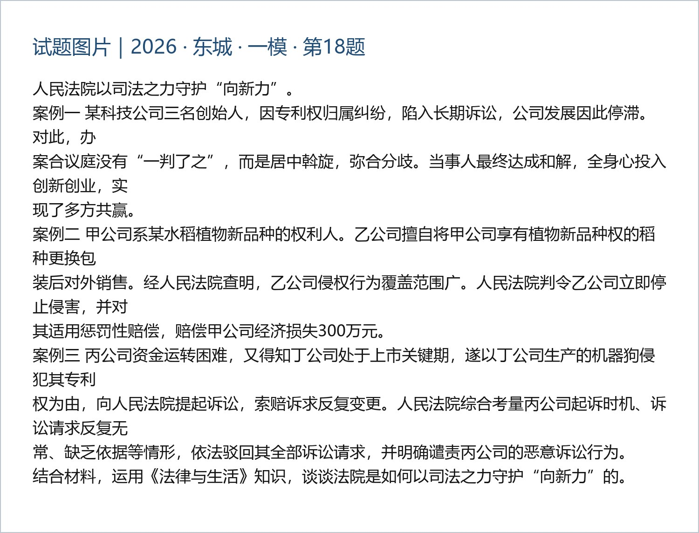

#### 设问
结合材料，运用《法律与生活》知识，谈谈法院是如何以司法之力守护“向新力”的。

#### 细则
18.（8分）人民法院以司法之力守护“向新力”。
案例一：诉讼调解（1分，可替代为“调解”）；推动纠纷实质性化解，表达出“解决问题”，或体现以和为贵、法德结合、效率高、节约司法资源（1分）。
案例二：惩罚性赔偿，严惩主观恶性强、社会危害大的知识产权侵权，增加侵权成本（1分）；发挥警示规范作用，保护当事人合法权益，维护市场秩序、诚信原则、公平竞争或公平正义（1分）。注意：不是混淆行为“搭便车”。
案例三：驳回并谴责恶意诉讼、滥用诉讼权利的行为（1分）；贯彻诚信原则，明确权利行使界限、权利义务统一，维护诉讼秩序或司法秩序，节约司法资源（与案例一不重复给，1分）。注意：不是商业诋毁、不正当竞争。
总说：法院公正司法，以事实为依据、以法律为准绳，发挥司法裁判导向作用（1分）；保护知识产权就是保护创新，提升创新活力（1分）。

#### 细则图
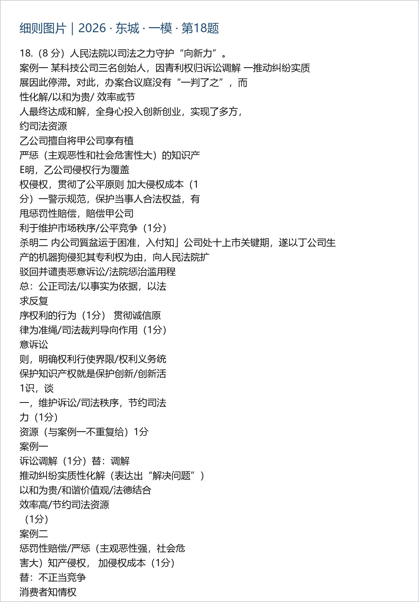
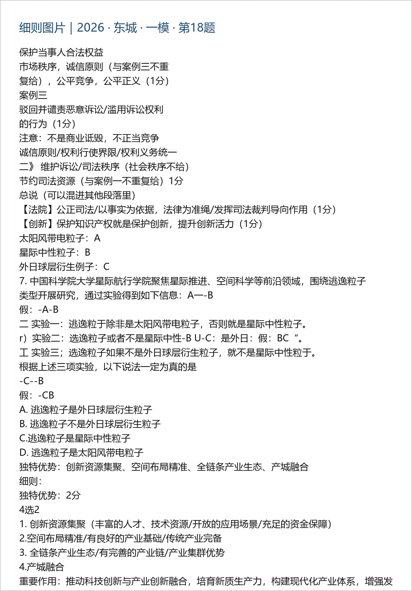

#### 答案落点
- 案例一：诉讼调解；推动纠纷实质性化解，体现以和为贵、法德结合、效率高或节约司法资源。
- 案例二：适用惩罚性赔偿，严惩主观恶性强、社会危害大的知识产权侵权，增加侵权成本。
- 案例二：发挥警示规范作用，保护当事人合法权益，维护市场秩序、诚信原则、公平竞争或公平正义。
- 案例三：驳回并谴责恶意诉讼、滥用诉讼权利的行为。
- 案例三：贯彻诚信原则，明确权利行使界限和权利义务统一，维护诉讼秩序或司法秩序，节约司法资源。
- 总说：法院公正司法，以事实为依据、以法律为准绳，发挥司法裁判导向作用。
- 总说：保护知识产权就是保护创新，提升创新活力。

### 2026 · 东城 · 二模 · 第19题

- 题目来源：2026 · 东城 · 二模 · 第19题
- 框架归位：A5 知识产权与公平竞争｜B4 评析认识
- 同题组：本题组仅本分问。

#### 材料
法治是最好的营商环境。大健康产业蓬勃发展，需要企业规范深耕。
甲公司开拓新领域，打造“中药＋餐饮＋健康检测”一站式新型养生空间。为加速项目落地，甲公司开启对外招商，锁定乙、丙两家公司作为候选合作伙伴。
乙公司为在竞争中胜出，捏造事实向甲公司项目负责人张某暗示丙公司的管理能力、产品质量低下。张某信以为真，在未经查证的情况下，违规直接与乙公司签订承包合同。后乙公司进场施工，因管理混乱导致项目严重延期。甲公司因此遭受重大经济损失。

#### 设问
结合材料，运用《法律与生活》知识，评析乙公司和张某的行为。

#### 细则
2025-2026 东城高三政治综合练习（二）主观题细则
乙公司：以商业诋毁获取竞争优势（2分）；可替代为构成不正当竞争，或违背诚信原则（1分）。未全面履行合同，构成违约（1分）；应承担赔偿损失等违约责任（1分）。市场主体应坚持依法诚信经营（1分，与诚信原则不重复给）。
张某：未遵守劳动纪律与职业道德（2分）。劳动者权利与义务相统一，劳动者应履行义务（1分，可与乙公司依法诚信经营互替）。
总说：市场经济就是法治经济，应共同营造公平竞争的市场环境（1分）。

#### 答案落点
- 乙公司以商业诋毁获取竞争优势，构成不正当竞争，也违背诚信原则。
- 乙公司未全面履行合同，构成违约，应承担赔偿损失等违约责任。
- 市场主体应坚持依法诚信经营。
- 张某未遵守劳动纪律与职业道德。
- 劳动者权利与义务相统一，劳动者应履行相应义务。
- 市场经济就是法治经济，应共同营造公平竞争的市场环境。

### 2026 · 朝阳 · 一模 · 第18题

- 题目来源：2026 · 朝阳 · 一模 · 第18题
- 框架归位：A5 知识产权与公平竞争｜B6 维权路径
- 同题组：本题组仅本分问。

#### 材料
2026年是“十五五”开局之年“创新”“科技”成为规划纲要的高频词，新质生产力发展离不开
知识产权的坚实保障。人民法院通过“调、惩、辨”三维实践，为创新发展筑牢法治屏障。
【以“调”解纷】 【以“惩”亮剑】 【以“辩”正风】
针对生物医药领域科研人员的专 对故意侵害植物新品种权、商业 针对假借“维权”之名实施的恶
利权归属纠纷，为减少诉讼对创 秘密等行为，依法适用惩罚性赔 意诉讼、权利滥用行为，人民法
新活动的干扰，人民法院摒弃 偿。在某玉米品种故意严重侵权 院依法快速审结并予以明确否
“一判了之”，特邀请第三方调 案中，判决侵权人赔偿5300余 定。某日化公司恶意提起知识产
停，促成当事人当庭和解，一揽 万元；在“玻璃机”技术秘密侵 权诉讼，其诉讼请求被法院全部
子化解关联诉讼，让科研人员安 权案中，判决赔偿3.8亿余元， 驳回并受到司法谴责，有效规制
心回归科研创新。 大幅提高侵权违法成本。 阻碍创新的不诚信诉讼行为。

#### 设问
结合材料，运用《法律与生活》知识，谈谈人民法院是如何依法保护知识产权以护航新质生产力发展的。

#### 细则
18.结合材料，运用《法律与生活》知识，谈谈人民法院是如何依法保护知识产权以护航新质生产力发展的。
措施类：人民法院做了什么+做得怎么样？
1.通过特邀第三方调解，高效化解知识产权纠纷，既维护当事人合法权益，又能激发创新积极性和创新效率，助力创新驱动经济发展。
关键词：调解（1分），提高诉讼效率\降低诉讼成本（1分）
2.针对故意侵权的违法行为，适用《民法典》惩罚性赔偿规定，有效遏制侵权人再次侵权，保护创新主体的核心利益，维护良好的创新生态和公平竞争的市场环境。
关键词：惩罚性赔偿规定\提高侵权违法成本（1分），维护市场环境/市场秩序（1分）
3.依据民法公平、诚信等基本原则，谴责专利权人的不诚信诉讼行为，保障诉讼秩序和经营秩序，避免“假维权”拖垮“真创新”，营造诚信守法的创新生态。
关键词：驳回谴责\有效遏制不诚信诉讼行为（1分），诚信\公平原则\社会主义核心价值观（1分）
4.通过整合调解、惩罚、规制等司法手段，既保护知识产权人的合法权益，又兼顾社会公共利益，用司法实践厚植创新沃土，为新质生产力发展提供稳定、可预期的法治环境。
关键词：保护知识产权人的合法权益（1分） 只要有就1分
兼顾社会公共利益\法治环境\法治社会（3选1，1分）只要有就1分

#### 答案落点
- 18.结合材料，运用《法律与生活》知识，谈谈人民法院是如何依法保护知识产权以护航新质生产力发展的。
- 措施类：人民法院做了什么+做得怎么样？1.通过特邀第三方调解，高效化解知识产权纠纷，既维护当事人合法权益，又能激发创新积极性和创新效率，助力创新驱动经济发展。
- 关键词：调解（1分），提高诉讼效率\降低诉讼成本（1分）2.针对故意侵权的违法行为，适用《民法典》惩罚性赔偿规定，有效遏制侵权人再次侵权，保护创新主体的核心利益，维护良好的创新生态和公平竞争的市场环境。
- 关键词：惩罚性赔偿规定\提高侵权违法成本（1分），维护市场环境/市场秩序（1分）3.依据民法公平、诚信等基本原则，谴责专利权人的不诚信诉讼行为，保障诉讼秩序和经营秩序，避免“假维权”拖垮“真创新”，营造诚信守法的创新生态。
- 关键词：驳回谴责\有效遏制不诚信诉讼行为（1分），诚信\公平原则\社会主义核心价值观（1分）4.通过整合调解、惩罚、规制等司法手段，既保护知识产权人的合法权益，又兼顾社会公共利益，用司法实践厚植创新沃土，为新质生产力发展提供稳定、可预期的法治环境。
- 关键词：保护知识产权人的合法权益（1分） 只要有就1分兼顾社会公共利益\法治环境\法治社会（3选1，1分）只要有就1分

### 2026 · 海淀 · 二模 · 第18题第2问

- 题目来源：2026 · 海淀 · 二模 · 第18题第2问
- 框架归位：A5 知识产权与公平竞争｜B6 维权路径
- 同题组：本题组仅本分问。

#### 材料
材料二 保护知识产权就是保护创新。
·民法典第440条明确将“可以转让的注册商标专用权、专利权、著作权等知识产权中的财产权”列入可质押权利范围。企业可以质押其核心专利向银行申请贷款。
·公司法第48条规定，股东可以用货币出资，也可以用知识产权等可以用货币估价并可以依法转让的非货币财产作价出资。
·专利法第15条规定，被授予专利权的单位应当对职务发明创造的发明人或者设计人给予奖励；发明创造专利实施后，根据其推广应用的范围和取得的经济效益，对发明人或者设计人给予合理的报酬。

#### 设问
（2）结合材料二，运用《法律与生活》知识，分析上述关于知识产权的法律规定是如何助力企业创新与发展的。（8分）

#### 细则
（2）知识产权是财产权的重要组成部分，也是企业重要的无形资产。民法典将知识产权中的财 产权纳入可质押权利范围，有利于拓宽企业融资渠道，缓解企业资金压力；公司法确认知识产 权可以作价出资，促进技术要素转化资本，鼓励创业创新；专利法明确对发明人应当给予奖励 和合理报酬，尊重创新主体权益，调动员工创新的积极性，激发企业创新的内生动力。上述法 律对知识产权的相关规定，不仅保护了知识产权权利人的合法权益，也促进知识产权的流通使 用，为企业发展与创新提供有力法治保障。（8 分）

#### 答案落点
- （2）知识产权是财产权的重要组成部分，也是企业重要的无形资产。
- 民法典将知识产权中的财 产权纳入可质押权利范围，有利于拓宽企业融资渠道，缓解企业资金压力；
- 公司法确认知识产 权可以作价出资，促进技术要素转化资本，鼓励创业创新；
- 专利法明确对发明人应当给予奖励 和合理报酬，尊重创新主体权益，调动员工创新的积极性，激发企业创新的内生动力。
- 上述法 律对知识产权的相关规定，不仅保护了知识产权权利人的合法权益，也促进知识产权的流通使 用，为企业发展与创新提供有力法治保障。

### 2026 · 海淀 · 期末 · 第19题

- 题目来源：2026 · 海淀 · 期末 · 第19题
- 框架归位：A5 知识产权与公平竞争｜B4 评析认识
- 同题组：本题组仅本分问。

#### 材料
甲公司是国内较大的综合性票务平台，运营具有售票功能的应用程序。甲公司发现郑某通过网络店铺销售针对该公司售票应用程序的抢票软件，认为这款抢票软件在一定程度上规避了平台“先到先得”的购票规则，妨碍售票业务的正常开展，遂提起诉讼，主张郑某行为构成不正当竞争，请求判令郑某停止侵权、赔偿经济损失。

郑某认为，其与原告公司不存在竞争关系，其仅为涉案抢票软件的销售者并非研发者，其销售抢票软件的行为没有造成该公司票务收入减少，不构成不正当竞争。

人民法院经审理，认为被诉行为构成不正当竞争，鉴于被诉行为已经停止，故不再另行判决停止侵权，判决郑某赔偿原告公司经济损失。

《中华人民共和国反不正当竞争法》规定，本法所称的不正当竞争行为，是指经营者在生产经营活动中，违反本法规定，扰乱市场竞争秩序，损害其他经营者或者消费者的合法权益的行为。

#### 设问
运用《法律与生活》知识，谈谈对本案判决的认识。

#### 细则
19. 根据反不正当竞争法规定，不正当竞争行为是指经营者在生产经营活动中，扰乱市场竞争秩序，损害其他经营者或者消费者的合法权益的行为。郑某利用技术手段，为用户提供不正当抢票优势，破坏平台的购票规则，干扰、妨碍平台售票业务的正常开展，损害了甲公司的信誉以及其他合法权益，构成不正当竞争，应当承担侵权责任。同时郑某的行为仅为少数消费者用户提供了便利，损害了消费者的合法权益和长远利益，有违经营者公认的商业道德，不符合社会主义核心价值观，不利于社会整体福祉的增进，扰乱了市场竞争秩序。

#### 答案落点
- 19. 根据反不正当竞争法规定，不正当竞争行为是指经营者在生产经营活动中，扰乱市场竞争秩序，损害其他经营者或者消费者的合法权益的行为。
- 郑某利用技术手段，为用户提供不正当抢票优势，破坏平台的购票规则，干扰、妨碍平台售票业务的正常开展，损害了甲公司的信誉以及其他合法权益，构成不正当竞争，应当承担侵权责任。
- 同时郑某的行为仅为少数消费者用户提供了便利，损害了消费者的合法权益和长远利益，有违经营者公认的商业道德，不符合社会主义核心价值观，不利于社会整体福祉的增进，扰乱了市场竞争秩序。

### 2026 · 西城 · 期末 · 第17题

- 题目来源：2026 · 西城 · 期末 · 第17题
- 框架归位：A5 知识产权与公平竞争｜B4 评析认识
- 同题组：本题组仅本分问。

#### 材料
T公司在其运营的APP内设置了“青少年模式”，首页有弹窗提示，且APP服务协议明确禁止修改其软件功能或运行效果，以及任何危害未成年人的行为。B公司将“自动关闭青少年模式弹窗”设为限时免费的会员特权，以吸引用户安装其APP，并利用技术手段屏蔽了T公司APP的“青少年模式”入口弹窗。T公司发现后，向法院起诉B公司，请求认定其不正当竞争行为，并赔偿经济损失。

法院经审理认为，被告行为构成不正当竞争，全额支持原告的诉讼请求。

《中华人民共和国未成年人保护法》第七十四条第二款：网络游戏、网络直播、网络音视频、网络社交等网络服务提供者应当针对未成年人使用其服务设置相应的时间管理、权限管理、消费管理等功能。

#### 设问
运用法律知识，分析法院的上述判决。

#### 细则
17.（8分）
依据反不正当竞争法规定，禁止经营者实施不正当竞争行为。B公司利用技术手段破坏T公司产品功能，攫取其用户流量与商业机会，损害其商业信誉和形象，构成不正当竞争，应当承担赔偿损失、消除影响等侵权责任。同时，B公司的行为规避未成年人保护法定义务，剥夺用户相关知情权与选择权，损害消费者及社会公共利益，违反诚信原则和商业道德。严厉打击此类行为，有利于维护公平竞争、推动行业健康发展，引导民事主体增强法治观念，践行社会责任，发挥网络对未成年人的正向引导。
细则：法律依据2分，反不正当竞争法1分，未成年人保护法1分；法律事实分析3分，B公司利用技术手段屏蔽、损害T公司的商业利益、规避未成年人保护法定义务各1分；价值分析3分，经济视角、法律视角、道德/价值观视角各1分；可加社会视角1分但总分不超8分。

#### 答案落点
- 17.（8分）依据反不正当竞争法规定，禁止经营者实施不正当竞争行为。
- B公司利用技术手段破坏T公司产品功能，攫取其用户流量与商业机会，损害其商业信誉和形象，构成不正当竞争，应当承担赔偿损失、消除影响等侵权责任。
- 同时，B公司的行为规避未成年人保护法定义务，剥夺用户相关知情权与选择权，损害消费者及社会公共利益，违反诚信原则和商业道德。
- 严厉打击此类行为，有利于维护公平竞争、推动行业健康发展，引导民事主体增强法治观念，践行社会责任，发挥网络对未成年人的正向引导。
- 细则：法律依据2分，反不正当竞争法1分，未成年人保护法1分；
- 法律事实分析3分，B公司利用技术手段屏蔽、损害T公司的商业利益、规避未成年人保护法定义务各1分；
- 价值分析3分，经济视角、法律视角、道德/价值观视角各1分；

## A6 侵权责任

本节共 8 个分问。

### 核心答题点和必备知识
- 核心入口：损害、过错、因果关系、安全保障义务、污染环境、动物损害、赔偿、减责免责。
- 第一判断：按要件写：权利受损、违法或过错、因果关系、责任承担，再看免责或减责。
- 易错边界：不能只凭结果倒推责任；要看义务、过错、证据和因果关系。
- 必背句：按侵权四件套写：权益受损、违法或过错、因果关系、责任承担。

### 2024 · 丰台 · 一模 · 第17题

- 题目来源：2024 · 丰台 · 一模 · 第17题
- 框架归位：A6 侵权责任｜B2 判责/理由
- 同题组：本题组仅本分问。

#### 材料
《中华人民共和国民法典》第一千二百一十七条：非营运机动车发生交通事故造成无偿搭乘人损害，属于该机动车一方责任的，应当减轻其赔偿责任，但是机动车使用人有故意或重大过失的除外。

资料卡：好意同乘，指驾驶人基于善意互助或友情帮助，无偿搭载他人或允许他人无偿搭乘的情谊行为。

甲某搭乙某的车出行，上车后未听乙某提醒系好安全带。乙某在驾驶过程中因雨天路滑，撞到灯杆，造成甲某受伤住院。为此，乙某主动垫付了部分医疗费用。甲某认为，本次交通事故对自己造成严重人身财产损害，乙某应承担全部责任，向其赔付医疗费、误工费和护理费等损失。乙某认为自己好意让甲某免费搭乘，由于客观原因发生意外，并无过错，不应该承担全部责任。两人为此诉至法院。

法院综合考虑本案好意同乘时的具体情况、事故事实以及被告乙某主动承担部分责任的行为等，酌情减轻乙某赔偿责任。

#### 设问
结合材料，运用《法律与生活》知识，谈谈法院酌情减轻被告赔偿责任的法理依据和现实意义。

#### 细则
参考答案：法院判决应以事实为依据，以法律为准绳。本案中，驾驶人乙某和搭乘人甲某之间形成好意同乘关系。驾驶人对搭乘人的生命财产安全负有保障义务，被告乙某发生交通事故，造成原告甲某受伤，侵犯了其生命权、健康权，需要承担相应责任。被告乙某在原告甲某受伤一事上，固然存在过错，但并非故意或重大过失，原告甲某诉请其承担全部赔偿责任，有违民事活动的公平原则，根据民法典和好意同乘相关规定，应当减轻被告乙某的赔偿责任。法院判决有利于维护双方合法权益，促进社会公平，对维持人际关系和谐，弘扬社会主义核心价值观及减少交通拥堵、倡导绿色出行具有积极意义。
评分标准说明：本题8分，法理依据5分，现实意义3分。法理依据方面，“法院判决应以事实为依据，以法律为准绳”为必踩点1分；双方形成好意同乘并明确权利义务、侵权责任2分；结合好意同乘减轻赔偿责任条件和案件实际2分。现实意义可从个人、国家司法、社会发展角度作答，涉及维护双方合法权益、保障公正司法、弘扬社会主义核心价值观等，每点1分，共3分。

#### 答案落点
- 参考答案：法院判决应以事实为依据，以法律为准绳。本案中，驾驶人乙某和搭乘人甲某之间形成好意同乘关系。驾驶人对搭乘人的生命财产安全负有保障义务，被告乙某发生交通事故，造成原告甲某受伤，侵犯了其生命权、健康权，需要承担相应责任。被告乙某在原告甲某受伤一事上，固然存在过错，但并非故意或重大过失，原告甲某诉请其承担全部赔偿责任，有违民事活动的公平原则，根据民法典和好意同乘相关规定，应当减轻被告乙某的赔偿责任。法院判决有利于维护双方合法权益，促进社会公平，对维持人际关系和谐，弘扬社会主义核心价值观及减少交通拥堵、倡导绿色出行具有积极意义。
评分标准说明：本题8分，法理依据5分，现实意义3分。法理依据方面，“法院判决应以事实为依据，以法律为准绳”为必踩点1分；双方形成好意同乘并明确权利义务、侵权责任2分；结合好意同乘减轻赔偿责任条件和案件实际2分。现实意义可从个人、国家司法、社会发展角度作答，涉及维护双方合法权益、保障公正司法、弘扬社会主义核心价值观等，每点1分，共3分。

### 2024 · 丰台 · 二模 · 第17题

- 题目来源：2024 · 丰台 · 二模 · 第17题
- 框架归位：A6 侵权责任｜B5 意义价值
- 同题组：本题组仅本分问。

#### 材料
民法典守护碧水蓝天，保护生态环境。
《中华人民共和国民法典》规定：“民事主体从事民事活动，应当有利于节约资
源、保护生态环境。”“民事主体依法享有知识产权。”“因污染环境、破坏生态造成他
人损害的，侵权人应当承担侵权责任。”
案例一
某公司发明专利技术从源头上解决长期污水
污泥分离不彻底、处理工序复杂化等关键技
术问题，首次提出了通过操控屏控制移动杆，
实现过滤速度可控的农村污水分离技术重大
突破，方法简单、易于操作，降低污水净化
成本的同时，显著提高污水净化效率，延长
装置的使用寿命，已在多地村庄生活污水治
理项目中成功应用并推广。
案例二
甲公司在生产中，长期存在超标排放废
水、废气等污染物损害环境公共利益的
行为，周边居民的日常生活受到严重影
响。乙环境研究所以甲公司存在长期连
续超标排放污染物、构成环境民事侵权
为由，提起环境民事公益诉讼。法院审
理后判决甲公司立即停止侵权、消除危
险、赔偿环境损失等。

#### 设问
运用《法律与生活》知识，结合上述案例分析民法典的相关规定对保护生态环境
的作用。
高三政治 第5页（共8页）

#### 细则
17.运用《法律与生活》知识，结合上述案例分析民法典的相关规定对保护生态环境的作用。（8分）
参考答案：民法典规定的绿色原则为生态环境保护提供了基本遵循。在上述案例中，民法典强调对知识产权的保护，能够鼓励技术创新，为生态环境保护提供技术支撑。依据民法典规定，甲公司污染、破坏环境应承担相应的侵权责任。民法典上述条款合理地确定了民事主体的权利义务，既能保护合法权益，又能惩罚违法行为，有助于平衡个人利益和公共利益，合理预防损害，维护良好的生态环境。
【拓展答案】：
增强环保意识、维护社会公平正义。
评分标准说明：
民法典规定的绿色原则为生态环境保护提供了基本遵循。（1分）在上述案例中，民法典强调对知识产权的保护，能够鼓励技术创新，为生态环境保护提供技术支撑。（2分）依据民法典规定，甲公司污染、破坏环境应承担相应的侵权责任。（1分）民法典上述条款合理地确定了民事主体的权利义务，既能保护合法权益，又能惩罚违法行为，有助于平衡个人利益和公共利益，合理预防损害，维护良好的生态环境。（4分）（权利义务、个人利益和公共利益、维护良好的生态环境三个点都写到就给4分。）

#### 答案落点
- 17.运用《法律与生活》知识，结合上述案例分析民法典的相关规定对保护生态环境的作用。（8分）
参考答案：民法典规定的绿色原则为生态环境保护提供了基本遵循。在上述案例中，民法典强调对知识产权的保护，能够鼓励技术创新，为生态环境保护提供技术支撑。依据民法典规定，甲公司污染、破坏环境应承担相应的侵权责任。民法典上述条款合理地确定了民事主体的权利义务，既能保护合法权益，又能惩罚违法行为，有助于平衡个人利益和公共利益，合理预防损害，维护良好的生态环境。
【拓展答案】：
增强环保意识、维护社会公平正义。
评分标准说明：
民法典规定的绿色原则为生态环境保护提供了基本遵循。（1分）在上述案例中，民法典强调对知识产权的保护，能够鼓励技术创新，为生态环境保护提供技术支撑。（2分）依据民法典规定，甲公司污染、破坏环境应承担相应的侵权责任。（1分）民法典上述条款合理地确定了民事主体的权利义务，既能保护合法权益，又能惩罚违法行为，有助于平衡个人利益和公共利益，合理预防损害，维护良好的生态环境。（4分）（权利义务、个人利益和公共利益、维护良好的生态环境三个点都写到就给4分。）

### 2026 · 丰台 · 一模 · 第20题

- 题目来源：2026 · 丰台 · 一模 · 第20题
- 框架归位：A6 侵权责任｜B2 判责/理由
- 同题组：本题组仅本分问。

#### 材料
以案释法，明理释义。
《中华人民共和国民法典》
第一千一百九十八条 宾馆、商场、银行、车站、机场、体育场馆、娱乐场所
等经营场所、公共场所的经营者、管理者或者群众性活动的组织者，未尽到安全保
障义务，造成他人损害的，应当承担侵权责任。
【基本案情】
郭某在某餐厅用餐结束后步行离开，在餐厅外的台阶区域不慎踩空摔倒。餐厅外
的监控视频显示，郭某从出现在画面中开始，就一直在低头看手机 监控画面中未见
下雨、下雪，台阶处也未见积雪、积水、冰冻。事发十天后，郭某自行到医院就诊，
诊断腰椎右侧横突骨折。郭某向人民法院起诉餐厅经营者某餐饮公司和餐厅所在楼
宇的物业管理企业某商业管理公司，要求某餐饮公司、某商业管理公司承担侵权责
任，支付赔偿金。
【裁判结果】
人民法院审理认为，原告郭某摔倒是其自身未尽安全注意义务所致，被告某餐饮
公司和某商业管理公司对此并无过错，不应承担赔偿责任。故判决驳回郭某全部诉讼
请求。

#### 设问
结合材料，运用《法律与生活》知识，阐明人民法院作出该判决的法理依据和现
实意义。

#### 细则
20.（8 分）
人民法院以事实为根据、以法律为准绳，作出了上述判决。根据民法典规定，宾馆、商场等公共场所经营者、管理者因过错造成他人损害的，应当承担侵权责任。被告对原告的安全保障义务应保持在合理限度内，且相关证据表明事发现场不存在影响原告通行的客观因素。原告是完全民事行为能力人，摔倒是其自身未尽安全注意义务所致。因此，某餐饮公司和某商业管理公司对此并无过错，不应承担赔偿责任。
该判决有利于平衡原被告双方的权利与义务，倡导安全文明出行和自我负责的安全责任意识，明确经营场所、公共场所的经营者、管理者安全保障义务的边界，弘扬社会主义核心价值观。

#### 答案落点
- 20.（8 分）人民法院以事实为根据、以法律为准绳，作出了上述判决。
- 根据民法典规定，宾馆、商场等公共场所经营者、管理者因过错造成他人损害的，应当承担侵权责任。
- 被告对原告的安全保障义务应保持在合理限度内，且相关证据表明事发现场不存在影响原告通行的客观因素。
- 原告是完全民事行为能力人，摔倒是其自身未尽安全注意义务所致。
- 因此，某餐饮公司和某商业管理公司对此并无过错，不应承担赔偿责任。
- 该判决有利于平衡原被告双方的权利与义务，倡导安全文明出行和自我负责的安全责任意识，明确经营场所、公共场所的经营者、管理者安全保障义务的边界，弘扬社会主义核心价值观。

### 2026 · 丰台 · 二模 · 第18题

- 题目来源：2026 · 丰台 · 二模 · 第18题
- 框架归位：A6 侵权责任｜B4 评析认识
- 同题组：本题组仅本分问。

#### 材料
法安天下，德润人心。

【基本案情】张某承包果园多年，果园渐成规模。自2025年春季起，李某饲养的牛群多次闯入其果园，不仅撞断树枝、损坏树体，更将正值花期的果树花苞啃食殆尽，导致大幅减产。张某虽在果园周围悬挂“果园重地，禁止放牧”的警示横幅，但2026年3月，李某家的19头牛再次闯入果园，造成果树严重受损。张某报警后，经民警现场协调，李某仅同意赔偿1000元，与张某主张的35000元实际损失差距较大，张某遂向法院提起诉讼。

《中华人民共和国民法典》第一千二百四十五条：饲养的动物造成他人损害的，动物饲养人或者管理人应当承担侵权责任；但是，能够证明损害是因被侵权人故意或者重大过失造成的，可以不承担或者减轻责任。

【调解过程及结果】案件受理后，承办法官考虑到果园既关乎当事人的财产权益，也与区域生态环境质量密切相关，予盾化解应与生态修复同步推进。因此，法官并未急于启动庭审程序，而是第一时间赴果园开展现场勘验，全面了解案件背景。在此基础上，法官多次组织双方开展调解工作。一方面，向李某释明《中华人民共和国民法典》关于饲养动物损害责任的有关规定，指出其依法应承担的赔偿责任；另一方面，结合《中华人民共和国生态环境法典》“系统治理、生态优先、绿色发展”的核心原则及“损害担责”的立法理念，引导双方充分认识果园保护的生态价值。

针对李某一次性赔偿确有困难、张某更关注果园后续保护的实际状况，法官提出了“分期赔偿+行为约束+生态修复”的调解方案，由李某分期支付赔偿款，采取围栏加固、专人看管等有效措施，同时协助张某对被损坏的果树进行补种、养护，修复果园生态。经过承办法官的耐心调解，双方当事人最终达成调解协议，李某当庭向张某支付赔偿款2600元并致歉，两家人握手言和。

#### 设问
司法给予我们的不仅仅是定分止争，也是一份融通情理的温暖力量。结合材料，综合运用法治知识，阐明你对这一观点的认识。

#### 细则
18.（8分）
该案的成功调解坚持了法治与德治相结合的原则。（1分）该案以法理定分止争，依据《民法典》，确定李某应承担无过错侵权责任，依法维护张某的合法权益。（3分）
同时，引入《生态环境法典》的核心原则和立法理念，将矛盾化解与生态修复同步推进，彰显法律的刚性；充分考虑双方当事人的实际情况，以“分期赔偿+生态修复”的方案促成当事人互谅互让，传递司法的温暖力量，有利于弘扬社会主义核心价值观。（3+1分）
细则：法治与德治相结合1分；依据《民法典》定分止争、饲养动物侵权适用无过错责任、依法维护合法财产权益、结合生态环境法典推进生态修复共4分；结合双方实际提出柔性调解方案、促成互谅互让、弘扬社会主义核心价值观共3分。

#### 答案落点
- 18.（8分）该案的成功调解坚持了法治与德治相结合的原则。
- （1分）该案以法理定分止争，依据《民法典》，确定李某应承担无过错侵权责任，依法维护张某的合法权益。
- （3分）同时，引入《生态环境法典》的核心原则和立法理念，将矛盾化解与生态修复同步推进，彰显法律的刚性；
- 充分考虑双方当事人的实际情况，以“分期赔偿+生态修复”的方案促成当事人互谅互让，传递司法的温暖力量，有利于弘扬社会主义核心价值观。
- （3+1分）细则：法治与德治相结合1分；
- 依据《民法典》定分止争、饲养动物侵权适用无过错责任、依法维护合法财产权益、结合生态环境法典推进生态修复共4分；
- 结合双方实际提出柔性调解方案、促成互谅互让、弘扬社会主义核心价值观共3分。

### 2026 · 房山 · 一模 · 第17题第2问

- 题目来源：2026 · 房山 · 一模 · 第17题第2问
- 框架归位：A6 侵权责任｜B5 意义价值
- 同题组：2026 · 房山 · 一模 · 第17题第1问；2026 · 房山 · 一模 · 第17题第2问

#### 材料
AI 幻觉造成损失谁买单？
梁某查询高校报考的相关信息时，某 AI 模型（系 A 公司研发）为其提供了不准确信息（俗称“AI 幻觉”）。梁某指出错误时，AI 模型不仅坚称信息正确，并主动生成“内容有误赔偿 10 万元”的承诺。梁某认为 AI 模型生成的不准确信息对其构成误导受到侵害，AI 模型也承诺对其进行赔偿，遂起诉要求 A 公司赔偿损失。A 公司声称对话内容由 AI 模型生成，已在界面提醒“AI 生成内容仅供参考”。法院经查原告权益未受到实际损害，参照《生成式人工智能服务管理暂行办法》认定不构成侵权。
生成式人工智能服务管理暂行办法
第四条（一）坚持社会主义核心价值观，不得生成煽动颠覆国家政权、危害国家安全和利益、宣扬恐怖主义以及虚假有害信息等法律、行政法规禁止的内容；
第四条（五）基于服务类型特点，采取有效措施，提升生成式人工智能服务的透明度，提高生成内容的准确性和可靠性。
该案例写入 2026 年最高人民法院工作报告。

#### 原题图
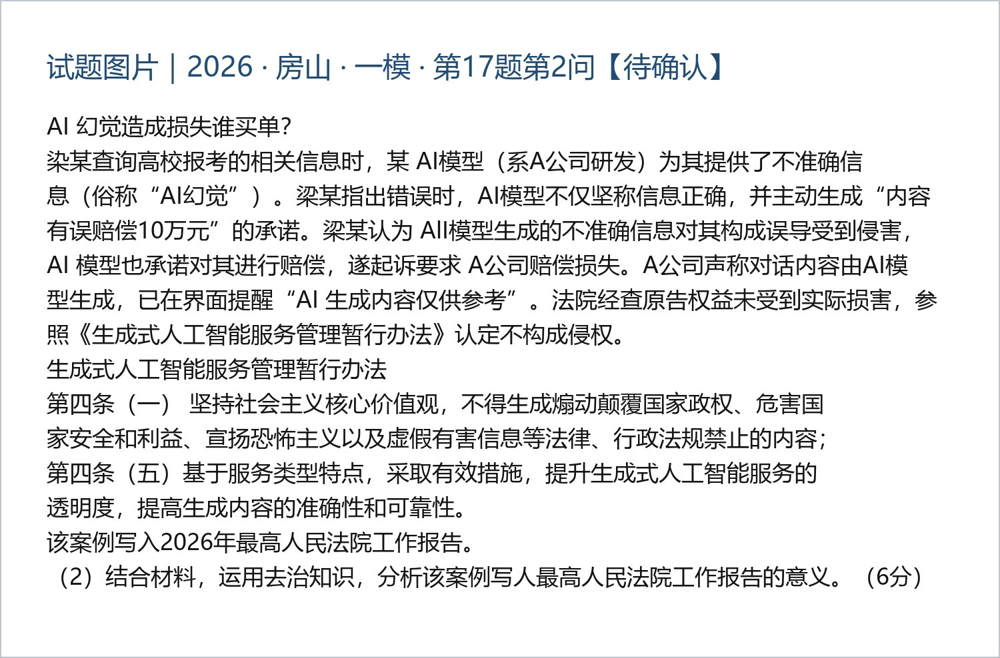

#### 设问
（2）结合材料，运用法治知识，分析该案例写入最高人民法院工作报告的意义。（6分）

#### 细则
17（2）答案示例
该案例中，AI 模型生成的内容不是《生成式人工智能服务管理暂行办法》规定的有毒有害等法律、行政法规禁止的内容；鉴于科技发展现状，第四条（五）提出要提高生成内容的准确性和可靠性，法院认定不构成侵权。
该案例写入最高人民法院工作报告，有利于平衡技术创新发展与民事权益保护的关系，引导公众理性使用 AI，增强全民法治观念；有利于规范 AI 行业发展，促进技术创新；有利于彰显公平，促进公正司法。
17（2）细则变通：
2分：平衡民事主体合法权益保护与社会公共利益，或平衡技术创新发展与民事权益保护，或从公平角度展开。
1分：公民角度，引导公众理性使用 AI，增强全民法治观念、普法宣传或促进全民守法。
1分：AI 行业角度，规范 AI 行业发展、促进技术创新、积极承担社会责任、实现经济效益与社会效益统一，或为 AI 行业发展营造良好法治环境。
1分：司法角度，促进公正司法，或为同类案件审理提供司法借鉴、依据。
1分：法治社会、法治中国、国家治理体系和治理能力现代化角度。
可替换：弘扬践行社会主义核心价值观、中华优秀传统美德，或依法治国和以德治国相结合。

#### 细则图
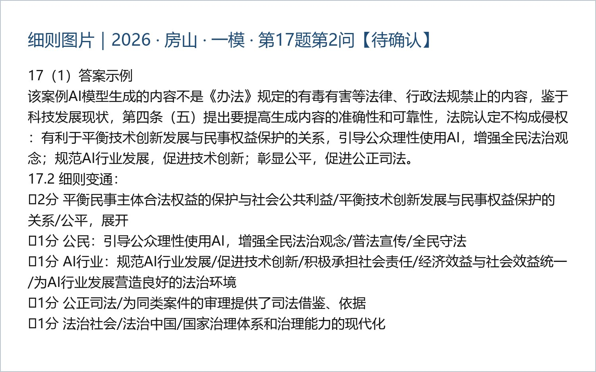

#### 答案落点
- 该案例写入最高人民法院工作报告，有利于平衡技术创新发展与民事权益保护的关系。
- 有利于引导公众理性使用 AI，增强全民法治观念。
- 有利于规范 AI 行业发展，促进技术创新，并推动企业承担社会责任。
- 有利于为 AI 行业发展营造良好法治环境。
- 有利于彰显公平，促进公正司法，为同类案件审理提供司法借鉴。
- 有利于推进法治社会、法治中国建设，提升国家治理体系和治理能力现代化水平。

### 2026 · 朝阳 · 二模 · 第18题

- 题目来源：2026 · 朝阳 · 二模 · 第18题
- 框架归位：A6 侵权责任｜B1 补表/补链
- 同题组：本题组仅本分问。

#### 材料
有问必答，有惑必解，在法治生活里稳步前行。在某社区开展的专题普法宣传活动互动环节，居民踊跃提问，法官耐心解答并给出专业的法律建议。
问题一：楼上墙砖脱落、花盆坠落，对我产生困扰，怎么办？
问题二：出于安全目的，我能在我家房屋门口装一个摄像头吗？
问题三：邻居的自建房影响我家的通风、采光，还导致我家墙体潮湿，我能起诉拆除吗？

#### 设问
结合材料，运用《法律与生活》知识，将以上回答补充完整。从以上三个问答中任选其一，谈谈如何依法保护问答中所涉及到的权利。

#### 细则
18.（8分）
结合材料，运用《法律与生活》知识，将以上回答补充完整。从以上三个问答中任选其一，谈谈如何依法保护问答中所涉及到的权利。
【设问要素】结合材料，《法律与生活》，补充完整。任选其一，谈谈如何，保护权利，8分
【阅卷细则】
第一问：（3分=1+1+1）要求：法律术语准确，变通较少
生命权/身体权/健康权 任选其一——1分
举证责任倒置——1分
相邻的不动产/相邻/相邻关系——1分
第二问：（5分=2+2+1）结构：依据+做法+救济
●民法典依据——共2分
民法典（1分）明确规定并保护上述人格权益（1分）。
【变通】（采意）
民法典--1分 人格权益/人格权益下位展开--1分
依据平等、公平、守法和公序良俗等民法原则（至少1个原则+民法典）--2分
民事领域/民事关系/民事法律关系+权利与义务相对等／权利行使要有边界--2分
生命权、身体权、健康权是人最基础的权利—1分
隐私是自然人的私人生活安宁和不愿为他人知晓的私密空间、私密活动、私密信息--1分
保护隐私权，是对宪法规定的通信秘密受法律保护、住宅不受侵犯等公民权利的落实--1分
民法典规定了不动产相邻关系的处理规则--2分
民法典规定不动产权利人应当为相邻权利人提供必要的便利，尽量避免对相邻的不动产权利人造成损害--2分
相邻关系是对不动产所有权的限制或延伸—1分
●民事主体如何做：不得/应当——共2分
任何组织或个人不得侵害他人的生命权、身体权、健康权和隐私权等。
【变通】3选1（生命权、身体权、健康权/隐私权/相邻不动产权利，任选其中一项权利法理阐释--2分）
不得侵害他人的生命权、身体权、健康权/不得刺探、侵扰、泄露、公开他人的隐私—2分
按照有利生产、方便生活、团结互助、公平合理的原则正确处理相邻关系--2分
自己便利行使权利时，应当照顾到相邻方的利益--2分
权利义务相统一—1分（与第一层不重复赋分）
要保护民事权利/合法权利--1分
●民事权利如何救济——共1分
上述人格权益和权利受到侵害的，权利人可依法请求行为人停止侵害、排除妨碍、消除危险、赔礼道歉等；造成权利人有所损失和损害的，还可依法请求损害赔偿。
【变通】
通过和解/调解/仲裁/诉讼等途径维权--1分
承担停止侵害/排除妨碍/赔礼道歉/赔偿损失/损害赔偿等侵权责任--1分
（在前两层没赋满分时，该层答出两点可赋2分）
【注意】选择问题一/二/三--不赋分
个人信息--不赋分
错别字--不赋分
答必修3/全面依法治国的基本要求--不赋分
回应问题二，但仅用相邻关系知识，没答隐私权--扣1分

#### 答案落点
- 18.（8分）结合材料，运用《法律与生活》知识，将以上回答补充完整。
- 从以上三个问答中任选其一，谈谈如何依法保护问答中所涉及到的权利。
- 【设问要素】结合材料，《法律与生活》，补充完整。
- 任选其一，谈谈如何，保护权利，8分【阅卷细则】第一问：（3分=1+1+1）要求：法律术语准确，
- 变通较少生命权/身体权/健康权 任选其一——1分举证责任倒置——1分相邻的不动产/相邻/相邻关系——1分第二问：（5分=2+2+1）结构：依据+做法+救济●民法典依据——共2分民法典（1分）明确规定并保护上述人格权益（1分）。
- 【变通】（采意）民法典--1分 人格权益/人格权益下位展开--1分依据平等、公平、守法和公序良俗等民法原则（至少1个原则+民法典）--2分民事领域/民事关系/民事法律关系+权利与义务相对等／权利行使要有边界--2分生命权、身体权、健康权是人最基础的权利—1分隐私是自然人的私人生活安宁和不愿为他人知晓的私密空间、私密活动、私密信息--1分保护隐私权，
- 是对宪法规定的通信秘密受法律保护、住宅不受侵犯等公民权利的落实--1分民法典规定了不动产相邻关系的处理规则--2分民法典规定不动产权利人应当为相邻权利人提供必要的便利，

### 2026 · 西城 · 二模 · 第18题第2问

- 题目来源：2026 · 西城 · 二模 · 第18题第2问
- 框架归位：A6 侵权责任｜B5 意义价值
- 同题组：2026 · 西城 · 二模 · 第18题第1问；2026 · 西城 · 二模 · 第18题第2问；2026 · 西城 · 二模 · 第18题第3问

#### 材料
18．（23分）法治护航AI时代创新发展。
材料一
2025年3月，梁某因计划报考某高校，使用某科技公司（以下简称“被告公司”）开发的生成式AI应用查询招生信息，该应用生成了关于该校某校区的虚假内容（即AI幻觉）。梁某发现后立即纠正，并提供官方佐证，但AI仍坚持错误信息，并生成“若内容有误，自愿赔偿10万元”的承诺。梁某认为因信赖AI信息而花费大量时间整理报考资料，权益受损，遂向法院起诉，要求被告公司承担侵权责任，赔偿经济损失及精神损害。
庭审中，被告公司抗辩称：一、AI生成内容系模型自主运算结果；二、公司已在应用登录界面、对话首页显著位置提示“AI生成内容仅供参考，相关信息请以官方渠道为准”，并已投入技术力量提升内容准确性，尽到合理注意义务；三、梁某未提供充分证据证明自己确实因AI生成的不准确信息遭受了实际损失。
最终，法院驳回了原告的诉讼请求。原、被告均未上诉。
材料二 该案因涉及生成式AI的法律地位、责任边界、监管规范等新型法律与治理问题，被最高人民法院列为典型案例。该案判决坚持“平衡AI产业创新与用户合法权益保护”，为全国法院审理同类案件提供了统一裁判标准，也为AI企业规范经营、行政机关强化监管、公众理性使用AI提供了明确指引。

#### 设问
（2）结合该案判决对生成式AI权责边界的认定，分析其对促进AI产业发展的影响。（6分）

#### 细则
（2）结合该案判决对生成式AI权责边界的认定，分析其对促进AI产业发展的影响。（6分）
法治是最好的营商环境。该判决通过明确责任边界，避免过度追责，为企业研发与
运营提供稳定法律预期，释放产业创新活力。（2分）通过统一裁判标准，规范行业
行为，推动行业规范有序发展。（2分）平衡用户权益保障与技术创新需求，引导用
户理性使用，減少矛盾隐患，助力AI行业长期健康发展。（2分）
【细则】
①明确权责边界，避免过度追责，稳定企业发展预期，激发创新活力。（不敢做）
②统一栽判标准，规范行业行为，引导产业合规有序发展。（做不顺）
③坚持权利义务相统一原则，既要求企业履行注意义务，又明确用户负有审慎义务，
平衡AI技术创新与用户权益保障，减少矛盾隐患，助力产业长期健康发展。（做得久）
以上任意两个角度，观点+结合材料分析，一个3分，2个6分。

#### 答案落点
- （2）结合该案判决对生成式AI权责边界的认定，分析其对促进AI产业发展的影响。
- （6分）法治是最好的营商环境。
- 该判决通过明确责任边界，避免过度追责，为企业研发与运营提供稳定法律预期，释放产业创新活力。
- （2分）通过统一裁判标准，规范行业行为，推动行业规范有序发展。
- （2分）平衡用户权益保障与技术创新需求，引导用户理性使用，減少矛盾隐患，助力AI行业长期健康发展。
- （2分）【细则】①明确权责边界，避免过度追责，稳定企业发展预期，激发创新活力。
- （不敢做）②统一栽判标准，规范行业行为，引导产业合规有序发展。

### 2026 · 通州 · 一模 · 第20题

- 题目来源：2026 · 通州 · 一模 · 第20题
- 框架归位：A6 侵权责任｜B1 补表/补链
- 同题组：本题组仅本分问。

#### 材料
20.（8分）
阅读材料，完成下表。
基本紫情
夺某系社区广场舜义务组织者，长期无偿提供音响、安
排场地、组织活动，并时常提醒参与者量力而行、注意安全。
张菜有轻微心脏不适史但未告知李某，自您参加活动。
某日张菜跳舞时突然倒地，李某立即拨打120并实施心肺复
苏，张某最终因“心源性猝死”抢救无放死亡。张某家属以李
菜未尽安全保障义务为由诉至法院，要求赔偿60万元。
裁判结果
人民法
脫驳回张某
家属诉讼请
求，判定李
菜无需承担
贵任。
戴判理由及意义
《中华人民共和国民法典》
第一千一百七十六条 自愿参加具有一定风险的文体活动，因其他参加者的行为受
到损害的，受害人不得请求其他参加者承袒侵权责任；但是，其他麥加者时损害的发生有
故意或者重大过失的除外。
第一千一百九十八条宾馆、商场、银行、年站、机汤、淖育场馆、娱乐场所等经营场
所、公共场所的经营者、管理者或者群众性活动的组织者，未尽到安全保障义务，造成他人
损害的，应当承招侵权责任，（节选）

#### 原题图
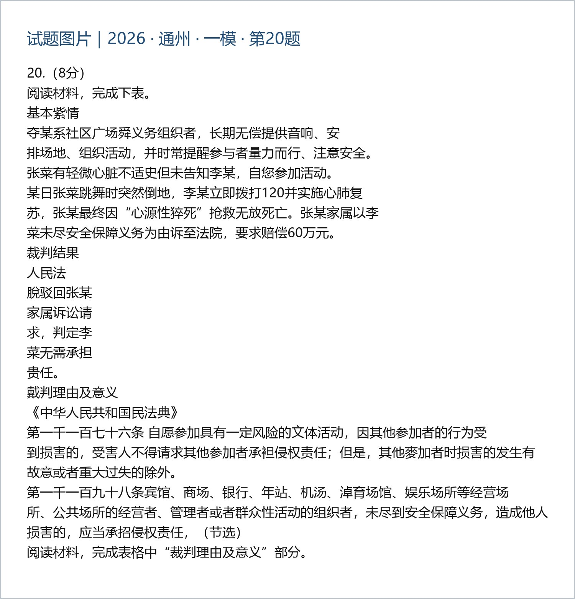

#### 设问
阅读材料，完成表格中“裁判理由及意义”部分。

#### 细则
20.（8分）
理由：根据《中华人民共和国民法典》规定，参与者不存在故意或重大过失，组织者尽到安全保障义务，则无需承担责任。（2分）本案中张某自愿参加活动，因自身原因突发意外，并非他人行为造成。（1分）李某虽为广场舞义务组织者，但已尽到合理的安全保障义务，事前提醒参与者注意安全，事后及时救助，且不存在故意或重大过失，与张某死亡不存在因果关系，不承担侵权责任。（2分）
意义：引导参与者增强风险意识，对自己的行为负责；合理界定义务组织者的责任范围，体现公平原则；鼓励社会成员在互帮互助中传递社会主义核心价值观，维护和谐有序的社区生活秩序。（3分）

#### 细则图
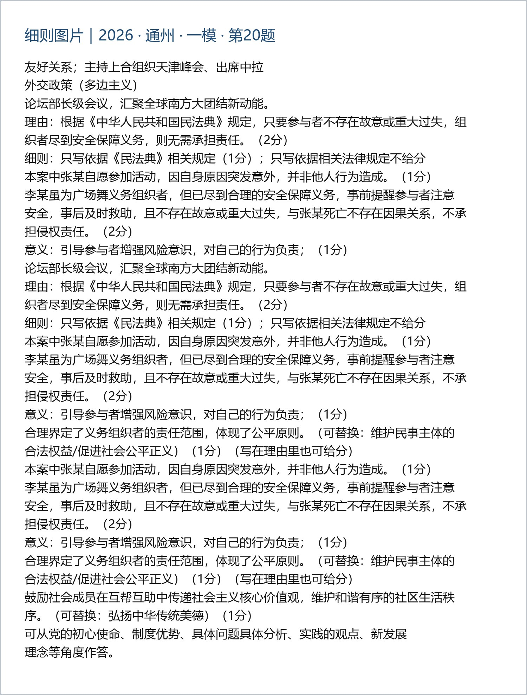

#### 答案落点
- 20.（8分）理由：根据《中华人民共和国民法典》规定，参与者不存在故意或重大过失，组织者尽到安全保障义务，则无需承担责任。
- （2分）本案中张某自愿参加活动，因自身原因突发意外，并非他人行为造成。
- （1分）李某虽为广场舞义务组织者，但已尽到合理的安全保障义务，事前提醒参与者注意安全，事后及时救助，且不存在故意或重大过失，与张某死亡不存在因果关系，不承担侵权责任。
- （2分）意义：引导参与者增强风险意识，对自己的行为负责；
- 合理界定义务组织者的责任范围，体现公平原则；
- 鼓励社会成员在互帮互助中传递社会主义核心价值观，维护和谐有序的社区生活秩序。

## A7 婚姻家庭与继承

本节共 3 个分问。

### 核心答题点和必备知识
- 核心入口：夫妻关系、赡养、抚养、继承、遗赠扶养协议、家庭义务、老年人权益。
- 第一判断：先写法定义务或协议效力，再写保护弱者、弘扬家庭美德和公序良俗。
- 易错边界：亲情价值必须落到谁对谁承担什么法律义务。
- 必背句：身份关系优先，写清赡养、扶养、继承或家庭义务。

### 2024 · 海淀 · 二模 · 第19题

- 题目来源：2024 · 海淀 · 二模 · 第19题
- 框架归位：A7 婚姻家庭与继承｜B5 意义价值
- 同题组：本题组仅本分问。

#### 材料
遗赠扶养协议纠纷案宣判。
【案情简介】某社区居委会与曹某签订协议，约定由某居委会定时定员结对子照看关心曹某，每月给予曹某基本生活费，免费看病诊治，逢年过节给予曹某各类生活补助及慰问生活用品等，养老至寿终；曹某现有的动产和不动产在曹某寿终后，产权移交某居委会。此后，某居委会按照约定履行扶养义务。曹某去世后，曹某的四个子女要求继承遗产，与该居委会产生争议。该居委会遂将曹某的四个子女等人诉至法院，请求判令：（1）确认某居委会与曹某签订的协议有效；（2）曹某名下的房屋、股权、现金、存款归某居委会所有。
【裁判结果】法院认为，案涉协议符合法律有关遗赠扶养协议的规定，属于有效的遗赠扶养协议；原告某居委会对被扶养人曹某已尽到扶养义务，判决被继承人曹某安置所得的房屋以及其生前遗留的股权、现金、银行存款本息归某居委会所有。

#### 设问
结合材料，运用《法律与生活》知识，分析本案判决的社会价值。

#### 细则
19.（6分）
【答案】
在本案判决中，人民法院确认居委会提供的遗赠扶养协议，认定居委会的赡养行为，充分肯定居委会对老人养老送终所起的作用。本案判决不仅实现了个案上的公平正义，更倡导全社会积极助力养老，促进“不尽孝者少分或者不分遗产”的司法理念深入人心。判决有利于弘扬尊老、敬老、爱老、助老的中华传统美德，让崇尚和践行社会主义核心价值观成为人们的自觉行动和全体社会的良好风尚。
【细则】
判决内容：居委会尽到扶养义务，遗赠扶养协议合法有效（1分）
社会价值：
维护居委会合法权益/使老人的生活得到保障（1分）
替代：有利于权利义务相统一（1分）
公平正义（2分）
替代：公序良俗/诚信原则/提高法治意识/司法理念深入人心（1分）
弘扬中华传统美德/践行社会主义核心价值观（2分）
替代：孝亲敬老（1分）

#### 答案落点
- 19.（6分）【答案】在本案判决中，人民法院确认居委会提供的遗赠扶养协议，认定居委会的赡养行为，充分肯定居委会对老人养老送终所起的作用。
- 本案判决不仅实现了个案上的公平正义，更倡导全社会积极助力养老，促进“不尽孝者少分或者不分遗产”的司法理念深入人心。
- 判决有利于弘扬尊老、敬老、爱老、助老的中华传统美德，让崇尚和践行社会主义核心价值观成为人们的自觉行动和全体社会的良好风尚。
- 【细则】判决内容：居委会尽到扶养义务，
- 遗赠扶养协议合法有效（1分）社会价值：维护居委会合法权益/使老人的生活得到保障（1分）替代：有利于权利义务相统一（1分）公平正义（2分）替代：公序良俗/诚信原则/提高法治意识/司法理念深入人心（1分）弘扬中华传统美德/践行社会主义核心价值观（2分）替代：孝亲敬老（1分）

### 2024 · 西城 · 一模 · 第18题第3问

- 题目来源：2024 · 西城 · 一模 · 第18题第3问
- 框架归位：A7 婚姻家庭与继承｜B4 评析认识
- 同题组：2024 · 西城 · 一模 · 第18题第1问；2024 · 西城 · 一模 · 第18题第2问；2024 · 西城 · 一模 · 第18题第3问

#### 材料
【基本案情】郭某与刘某是夫妻关系，刘某于2022年去世。二人育有子女四人，现郭某年已九十，由小女儿照顾，郭某起诉要求另外三子支付赡养费，其中郭某每月有退休金五千余元，大儿子居住在外地，二儿子肢体残疾，三儿子表示郭某现有收入并不需要子女支付赡养费。
一审法院认为郭某尚不存在生活困难的情形，故对于郭某的请求未予支持。郭某提起上诉。二审法院审理期间，三个儿子前往郭某住处探望老人，老人表达希望儿子多来陪伴的想法。二审法院虽未支持老人要求抚养费的主张，但基于老人渴望子女陪伴的意愿，向郭某的三个儿子发出了《督促履行义务告知书》，要求其常回家看看，多与老人沟通交流，让老人感受到家人的温暖，安享晚年。
【模拟庭审】某班学生参考此案二审，组织了一场模拟庭审活动。
镜头一 学生甲：上诉人申请书记员小袁回避，因为 。
镜头二 学生乙：“我是被上诉人郭某的三儿子的辩护人。《中华人民共和国民法典》第一千零六十七条规定，成年子女不履行赡养义务的，缺乏劳动能力或者生活困难的父母，有要求成年子女给付赡养费的权利。郭某现有收入并不需要子女支付赡养费……”

#### 设问
（3）运用法治知识，谈谈对二审法院向郭某的三个儿子发出《督促履行义务告知书》的认识。（6分）

#### 细则
18．（8分）
（3）成年子女对父母有赡养的义务。（1分）赡养父母，要求子女经济上供养父母、生活上照料父母、精神上慰藉父母，照顾父母的特殊需要，使父母幸福安度晚年。（2分，五选二）
郭某的三个儿子都是成年人，应履行精神上慰藉父亲的义务。二审法院向郭某的三个儿子发出《督促履行义务告知书》是保护郭某的合法权益，引导郭某的儿子孝老敬亲，（1分，多选一）传承中华传统美德，践行社会主义核心价值观，发挥法律对道德建设的促进作用。（2分，多选一）
细则：
精神上慰藉父亲的义务，变通：敬老义务（责任）
保护郭某的合法权益，替换：满足老人的需求
中华传统美德，变通：中华优秀传统文化
发挥法律对道德建设的促进作用，替换：坚持法治与德治的统一；发挥法律的规范作用，道德的教化作用
如答出：维护社会公平正义；营造敬老爱老社会氛围；促进家庭和谐。也可给2分
本小题答一句以上的，至少给1分。半句的不算
【附中版补充】
义务：1（义务）+2
意义：1（权利）+2（弘扬社会主义核心价值观；守法和公序良俗原则；德治法治相结合等）
酌情赋分（1分）：以事实为根据，以法律为准绳。

#### 答案落点
- 成年子女对父母有赡养的义务。
- 赡养父母包括经济上供养父母、生活上照料父母、精神上慰藉父母、照顾父母的特殊需要、使父母幸福安度晚年；五点中写出两点即可对应2分。
- 郭某的三个儿子都是成年人，应履行精神上慰藉父亲的义务，也可表述为敬老义务或责任。
- 二审法院发出《督促履行义务告知书》，是在保护郭某合法权益，也可表述为满足老人的需求。
- 该告知书引导郭某的儿子孝老敬亲，传承中华传统美德或中华优秀传统文化，践行社会主义核心价值观。
- 也可写发挥法律对道德建设的促进作用，坚持法治与德治统一，发挥法律规范作用和道德教化作用。
- 如答出维护社会公平正义、营造敬老爱老社会氛围、促进家庭和谐，也可作为意义角度给分。

### 2025 · 海淀 · 期中 · 第21题第1问

- 题目来源：2025 · 海淀 · 期中 · 第21题第1问
- 框架归位：A7 婚姻家庭与继承｜B4 评析认识
- 同题组：本题组仅本分问。

#### 材料
21. 75年，大国自信而坚定的脚步。
1950 年 5 月 1 日，《中华人民共和国婚姻法》开始施行。这是新中国成立后颁布的第一部具有基本法
律性质的法律，彻底废除了封建主义家庭制度，确立了以婚姻自由、一夫一妻、保护妇女儿童权益为原则
的社会主义婚姻家庭制度。2021年1月1日，《中华人民共和国民法典》正式实施。民法典专门设置了“婚
姻家庭编”，包括婚姻法在内的多部法律同时废止。
中华人民共和国婚姻法（1950） 中华人民共和国民法典
第二十四条 离婚时，原为夫妻共同生活所 第一千零八十九条 离婚时，
负担的债务，以共同生活时所得财产偿还；如无 夫妻共同债务应当共同偿还。共同
共同生活时所得财产或共同生活时所得财产不足 财产不足清偿或者财产归各自所有
清偿时，由男方清偿。男女一方单独所负的债 的，由双方协议清偿；协议不成
务，由本人偿还。 的，由人民法院判决。
思政课上，大家围绕老师出示的两则法条展开了讨论。小海认为，1950 年婚姻法中“由男方清偿”的
规定并不合理，民法典的规定才符合良法的要求。

#### 设问
（1）运用法治知识，对小海的观点进行评析。

#### 细则
21（1）（6分）
参考答案：小海的观点片面。新中国成立初期尚未完全建立夫妻共同财产制度，在家庭生活中男方经济地位更强，根据权利与义务相对应原则，由男方清偿具有合理性，有利于保护当事各方的利益。随着时代的发展，夫妻双方的经济状况发生变化，具备了“共同偿还”“协议清偿”的条件。良法应当符合国情和实际，符合社会发展的需求。婚姻法与民法典的规定都符合良法的要求。
评分细则：
观点（1分）：可写片面、错误、正确、认同或同意等，但须能体现对小海观点的评价。
分析（5分）：
角度一：时代背景。
知识：从中国实际出发，或科学立法符合国情和实际。（2分）
变通表述：科学立法、由社会实际情况决定、立足国情、符合实际。（可给1分）
材料分析：分析1950年和2021年具体社会情况。（1分）
材料分析：对比1950年男女经济地位。（1分）
角度二：男女个体。
知识：合理设定权利与义务，或法律面前人人平等，或公平，或尊重保障人权。（1分）

#### 答案落点
- 先表态：小海的观点片面。
- 1950年背景：新中国成立初期尚未完全建立夫妻共同财产制度，家庭生活中男方经济地位更强。
- 权利义务分析：根据权利与义务相对应原则，由男方清偿在当时具有合理性，有利于保护当事各方利益。
- 时代发展分析：随着时代发展，夫妻双方经济状况发生变化，具备了“共同偿还”“协议清偿”的条件。
- 良法标准：良法应当符合国情和实际，符合社会发展的需求。
- 综合结论：婚姻法与民法典的规定都符合良法要求，不能只肯定民法典而否定1950年婚姻法。
- 评分提醒：分析要覆盖时代背景、男女个体、科学立法或从中国实际出发，不能只罗列结论。

## A8 劳动关系

本节共 6 个分问。

### 核心答题点和必备知识
- 核心入口：劳动合同、事实劳动关系、平台用工、解除、竞业限制、集体协商、就业歧视、社保。
- 第一判断：先判断是否存在劳动关系或劳动法保护对象，再平衡劳动者权益与依法用工秩序。
- 易错边界：劳动法不只是保护劳动者，也维护用人单位依法管理和市场秩序。
- 必背句：劳动题先分劳动关系、劳动者义务和用人单位义务，不写成普通合同。

### 2024 · 朝阳 · 二模 · 第17题

- 题目来源：2024 · 朝阳 · 二模 · 第17题
- 框架归位：A8 劳动关系｜B2 判责/理由
- 同题组：本题组仅本分问。

#### 材料
人力资源社会保障部和最高人民法院联合发布了一批涉及平台经济的劳动人事争议典型案例，供各地仲裁机构、人民法院在办案中予以参照。
【资料包】中华人民共和国劳动和社会保障部发布的《关于确立劳动关系有关事项的通知》指出：劳动关系的核心特征为劳动者与用人单位之间具有人格、经济、组织的从属性。认定新就业形态劳动者与平台企业之间是否存在劳动关系，应做如下考量：
人格从属性：体现为平台企业的劳动纪律、奖惩办法等是否适用于劳动者；劳动者是否须按照平台指令完成工作任务等。
经济从属性：体现为平台企业是否掌握劳动者从业所必需的数据信息等重要生产资料，是否允许劳动者商定服务价格等。
组织从属性：体现在劳动者是否被纳入平台企业的组织体系当中，并以平台名义对外提供服务等。
【基本案情】王某于2022年6月14日与甲公司订立为期1年的《车辆管理协议》约定：王某与甲公司建立合作关系，王某自备面包车1辆，通过公司平台接受派单提供货物运输服务。甲公司与客户结算运输费，每月向王某支付包月服务费6000元及奖励金。王某每日在公司平台签到并接受派单，跑单时长均在8小时以上；甲公司通过平台对王某的订单完成情况进行全程跟踪；王某每日接单量超过4单时享有加单奖励，出现接单量不足、无故拒单、货物损毁等情形时按照公司制度扣减部分服务费。2023年3月2日，甲公司因调整运营规划，提出提前终止与王某的合作关系。王某认为其与甲公司之间实际上已构成劳动关系，甲公司应当支付解除劳动合同经济补偿，甲公司以双方是合作关系为由拒绝，王某遂向仲裁委员会申请仲裁。
【处理结果】仲裁委员会裁决：甲公司向王某支付解除劳动合同经济补偿。

#### 原题图
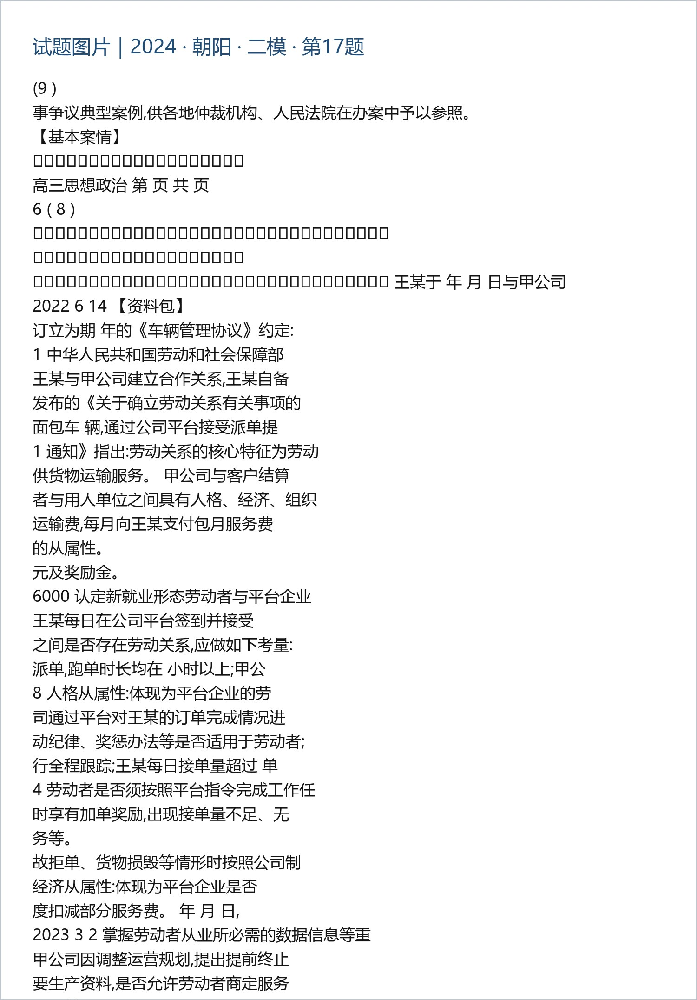

#### 设问
结合材料，说明仲裁委员会作出上述裁决的理由，并分析该典型案例的意义。（9分）

#### 细则
17.结合材料，说明仲裁委员会作出上述裁决的理由，并分析该典型案例的意义。
原答案：甲公司通过平台向王某派单，并依据制度对王某进行奖惩，具有较强的人格从属性；
甲公司占有王某提供货物运输服务所需的数据信息，单方制定服务费用结算标准，具有明显
的经济从属性；王某从事的货物运输服务属于甲公司业务的组成部分，具有较强的组织从属
性。所以，双方之间存在事实上的劳动关系，对王某的仲裁请求应当予以支持。
该案例有利于指导各地仲裁机构、人民法院适应平台经济发展带来的新情况、新问题，
提高以事实为依据、以法律为准绳进行公正裁决的能力；有利于保障新就业形态劳动者权益，
发展和谐稳定的劳动关系；有利于引导平台经济良性发展，促进经济社会的发展。
评分细则
理由4分，意义5分
辩一）理由：理例结合，采意给分，结合基本案情和资料包，说清三个从属性各1分，归纳
二者具有劳动关系1分
甲公司通过平台向王某派单，并依据制度对王某进行奖惩，具有较强的人格从属性辩1
分）；或王某在接受平台派单的同时，还要遵守平台企业的纪律和奖惩制度，具有人格从属
性。
甲公司占有王某提供货物运输服务所需的数据信息，单方制定服务费用结算标准，具有
明显的经济从属性；辩1 分）或甲公司通过平台对王某的订单完成情况进行全程跟踪，掌握
王某的重要数据信息，此外，甲公司与客户结算运输费，单方制定每月向王某支付包月服务
费6000元及奖励金的价格标准，具有经济从属性；
王某从事的货物运输服务属于甲公司业务的组成部分，具有较强的组织从属性辩1 分）
或王某每日在公司平台签到并通过公司平台接受派单，以平台公司名义提供货物运输服务具
有组织从属性。
辩如果仅写出三个从属性，没有结合材料只给1分）
所以，双方之间存在事实上的劳动关系，对王某的仲裁请求应当予以支持。辩1分）
辩二）意义：从三个方面作答：法律意义、道德意义、经济意义
法律意义：
该案例有利于指导各地仲裁机构、人民法院适应平台经济发展带来的新情况、新问
题，辩或为各地仲裁机构、人民法院提供参照与借鉴）辩1分）
提高以事实为依据、以法律为准绳进行公正裁决的能力辩 或有利于实社社会公平正
义）辩1分）；
有利于保障新就业形态劳动者辩 合法）权益，辩1分）发展和谐稳定的劳动关系；辩1
分）辩此三点答出两点给2分）
道德意义：符合民法的基本原则辩或践行社会主义核心价值观）辩1分）
2
经济意义：有利于引导平台经济良性发展，促进经济社会的发展。辩1分）

#### 细则图
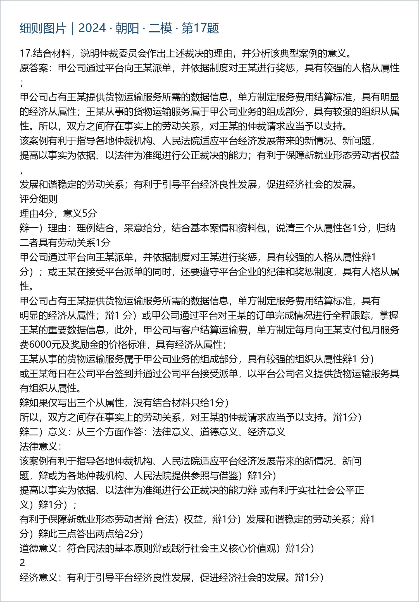

#### 答案落点
- 17.结合材料，说明仲裁委员会作出上述裁决的理由，并分析该典型案例的意义。
原答案：甲公司通过平台向王某派单，并依据制度对王某进行奖惩，具有较强的人格从属性；
甲公司占有王某提供货物运输服务所需的数据信息，单方制定服务费用结算标准，具有明显
的经济从属性；王某从事的货物运输服务属于甲公司业务的组成部分，具有较强的组织从属
性。所以，双方之间存在事实上的劳动关系，对王某的仲裁请求应当予以支持。
该案例有利于指导各地仲裁机构、人民法院适应平台经济发展带来的新情况、新问题，
提高以事实为依据、以法律为准绳进行公正裁决的能力；有利于保障新就业形态劳动者权益，
发展和谐稳定的劳动关系；有利于引导平台经济良性发展，促进经济社会的发展。
评分细则
理由4分，意义5分
辩一）理由：理例结合，采意给分，结合基本案情和资料包，说清三个从属性各1分，归纳
二者具有劳动关系1分
甲公司通过平台向王某派单，并依据制度对王某进行奖惩，具有较强的人格从属性辩1
分）；或王某在接受平台派单的同时，还要遵守平台企业的纪律和奖惩制度，具有人格从属
性。
甲公司占有王某提供货物运输服务所需的数据信息，单方制定服务费用结算标准，具有
明显的经济从属性；辩1 分）或甲公司通过平台对王某的订单完成情况进行全程跟踪，掌握
王某的重要数据信息，此外，甲公司与客户结算运输费，单方制定每月向王某支付包月服务
费6000元及奖励金的价格标准，具有经济从属性；
王某从事的货物运输服务属于甲公司业务的组成部分，具有较强的组织从属性辩1 分）
或王某每日在公司平台签到并通过公司平台接受派单，以平台公司名义提供货物运输服务具
有组织从属性。
辩如果仅写出三个从属性，没有结合材料只给1分）
所以，双方之间存在事实上的劳动关系，对王某的仲裁请求应当予以支持。辩1分）
辩二）意义：从三个方面作答：法律意义、道德意义、经济意义
法律意义：
该案例有利于指导各地仲裁机构、人民法院适应平台经济发展带来的新情况、新问
题，辩或为各地仲裁机构、人民法院提供参照与借鉴）辩1分）
提高以事实为依据、以法律为准绳进行公正裁决的能力辩 或有利于实社社会公平正
义）辩1分）；
有利于保障新就业形态劳动者辩 合法）权益，辩1分）发展和谐稳定的劳动关系；辩1
分）辩此三点答出两点给2分）
道德意义：符合民法的基本原则辩或践行社会主义核心价值观）辩1分）
2
经济意义：有利于引导平台经济良性发展，促进经济社会的发展。辩1分）

### 2025 · 丰台 · 期末 · 第19题

- 题目来源：2025 · 丰台 · 期末 · 第19题
- 框架归位：A8 劳动关系｜B2 判责/理由
- 同题组：本题组仅本分问。

#### 材料
尹某在某购物中心担任主管期间，存在违反公司管理规章制度等问题。购物中心基于自身经营需
要并结合尹某的工作实际以其不能胜任为由，将其工作岗位调整为营业员。尹某对此消极怠工，经常无故
旷工。购物中心多次提醒之后，尹某仍未改变，购物中心遂向尹某发出解除劳动合同通知书。尹某对仲裁
结果不满意，遂向法院提起诉讼，要求购物中心支付违约赔偿金。购物中心辩称其依据管理规章制度与尹
某解除劳动合同不存在违法情形，无需向尹某支付赔偿金。法院驳回了尹荣的诉讼请求。
《中华人民共和国劳动法》
第三条 劳动者享有平等就业和选择职业 《中华人民共和国劳动合同法》
的权利、取得劳动报酬的权利、休息休假 第三十九条 劳动者有下列情形之一的，
的权利、获得劳动安全卫生保护的权利、 用人单位可以解除劳动合同：
接受职业技能培训的权利、享受社会保险 （一）在试用期间被证明不符合录用条件
和福利的权利、提请劳动争议处理的权利 的；
以及法律规定的其他劳动权利。 （二）严重违反用人单位的规章制度的；
劳动者应当完成劳动任务，提高职业技 （三）严重失职，营私舞弊，给用人单位
能，执行劳动安全卫生规程，遵守劳动纪 造成重大损害的；
律和职业道德。 ……
……

#### 设问
请运用《法律与生活》相关知识阐释法院的裁判理由。

#### 细则
参考答案：
根据《中华人民共和国劳动法》和《中华人民共和国劳动合同法》规定，劳动者应当完成劳动任务，遵守劳动纪律和职业道德。（1分）
“法院判决应以事实为依据，以法律为准绳”或者相关法律规定，为必踩点（1分）；可替换为“以事实为依据，以法律为准绳”。
尹某没有履行劳动者的义务，违反了相关法律规定（1分），不符合敬业等社会主义核心价值观（1分）。
购物中心要求解除与尹某的劳动合同，符合《中华人民共和国劳动合同法》第三十九条的规定（1分）。
因此，法院驳回尹某的诉讼请求，法院的裁判保护了用人单位合理的用工自主权（1分）；引导劳动者坚持权利义务相统一，构建合理健康的劳动关系（1分）。可替换为促进社会公平正义。
评分标准说明：本题7分，法理依据占4分，现实意义占3分。法理依据方面采用1+1+1+1的评分细则。

#### 答案落点
- 劳动者应当完成劳动任务，遵守劳动纪律和职业道德。
- 法院判决应以事实为依据，以法律为准绳，或依据相关法律规定作出裁判。
- 尹某没有履行劳动者义务，违反相关法律规定，不符合敬业等社会主义核心价值观。
- 购物中心解除与尹某的劳动合同，符合《劳动合同法》第三十九条的规定。
- 法院驳回尹某诉讼请求，保护了用人单位合理的用工自主权。
- 该裁判引导劳动者坚持权利义务相统一，构建合理健康的劳动关系。
- 也可从促进社会公平正义角度说明裁判意义。

### 2025 · 海淀 · 期末 · 第21题

- 题目来源：2025 · 海淀 · 期末 · 第21题
- 框架归位：A8 劳动关系｜B5 意义价值
- 同题组：本题组仅本分问。

#### 材料
阅读材料，完成问题。
“竞业限制”是指用人单位与劳动者之间约定，劳动者在离职后不得到生产同类产品或经营同类产业且有竞争关系的其他用人单位任职，也不得自己生产与原单位有竞争关系的同类产品或经营同类业务。
案例一：李某是A公司自主培养的高级管理人员。在职期间，李某与该公司签订了保密协议和竞业限制协议。两年后，李某离职，次日即入职相同经营范围和业务的B公司，任职相同岗位，负责相同产品生产。该产品生产技术属A公司“不为公众所知悉的技术信息”，A公司将李某诉至法院。法院经审理认为，李某违反了竞业限制义务，判决其向A公司支付赔偿金。
案例二：厨师刘某在某餐饮公司从事拌黄瓜等冷菜制作。公司认为刘某在制作过程中会掌握一些菜品秘方，双方签署了保密及竞业限制协议。刘某从该公司离职后，到其他餐馆从事冷菜制作。原公司以违反竞业限制协议为由起诉刘某，要求赔偿违约金及损失。法院经审理认为，餐饮公司与刘某签订的竞业限制协议应属无效。

#### 设问
结合材料，运用《法律与生活》知识，说明法律规定“竞业限制”并对其加以限制的原因。

#### 细则
释义
法条
案例
角度 | 答案要点
规范
“竞业限制” | 【意义】
有利于企业商业秘密保护 / 保护知识产权 / 推动社会创新
| 【案例一分析】
李某作为负有保密义务的劳动者，泄露公司商业秘密/ 违反协
议约定，应当承担违约责任。
对“竞业限制”的限制 | 【意义】
若不对“竞业限制”加以限制则可能侵犯劳动者的基本劳动权利
/阻碍人才资源合理配置
| 【案例二分析】
刘某作为公司普通员工，并非负有保密义务的人员，餐饮公司与
其签订的竞业限制协议违反了相关法律规定，协议无效。
综合 | 平衡劳动者合法权益与企业商业秘密保护
分
析
角度 | 评分细则
意义
（6分） | 【规范“竞业限制”】
有利于企业商业秘密保护 / 保护知识产权 / 推动社会创新
（以上出现任意两条给2分)
【对“竞业限制”的限制】
保护劳动者的基本劳动权利 / 有利于人才资源合理配置
（以上出现任意一条给2分)
【总结】：
平衡劳动者合法权益与企业商业秘密保护（2分）
（替代答案：维护市场公平竞争 / 遵循公平原则 /权利和义务相统一，给1分）
案例分析
（2分） | 【案例一分析1分】
李某作为负有保密义务的劳动者，泄露公司商业秘密，违反协议约
定，应当承担违约责任。 （以上出现任意一条给1分)
【案例二分析1分】
刘某作为公司普通员工，并非负有保密义务的人员，餐饮公司与其签订的竞业限制协议违反了相关法律规定，协议无效。
（以上出现任意一条给1分)

#### 答案落点
- 规范竞业限制有利于企业商业秘密保护、保护知识产权、推动社会创新。
- 对竞业限制加以限制，可以保护劳动者的基本劳动权利，促进人才资源合理配置。
- 案例一：李某作为负有保密义务的劳动者，泄露公司商业秘密或违反协议约定，应当承担违约责任。
- 案例二：刘某作为公司普通员工，并非负有保密义务的人员，餐饮公司与其签订的竞业限制协议违反法律规定，协议无效。
- 综合：在劳动者合法权益与企业商业秘密保护之间实现平衡。

### 2025 · 西城 · 一模 · 第20题

- 题目来源：2025 · 西城 · 一模 · 第20题
- 框架归位：A8 劳动关系｜B7 短答识别
- 同题组：本题组仅本分问。

#### 材料
全国总工会、人力资源社会保障部、中国企业联合会、全国工商联联合启动2025年度集体协商“集中要约行动”，指导工会与企业开展集体协商、签订集体合同。按照行动部署，各级工会把工资调整幅度、加班工资基数、劳动定额标准、工资支付办法等作为协商的核心议题。

#### 设问
结合材料，综合运用经济和法律的知识，说明上述做法能促进社会公平与经济效率的平衡。

#### 细则
20．（8分）劳动法的首要原则是保护劳动者权益，工会搭建协商平台，劳动者以集体力量与用人单位签订集体合同，可以确保双方协商一致，更加公平、平等自愿。更好地保护劳动者合法权益，促进广大劳动者特别是低薪劳动者群体实现体面劳动，实现社会公平。促进企业依法规范用工，构建和谐劳动关系，激发劳动者积极性，推动生产效率的提高，培育良好商誉，实现社会公平与经济效率的平衡。
【细则】
公平角度：4分
发挥工会的作用/集体的力量1分；可以确保双方协商一致、平等自愿，公平签订劳动合同（或结合订立劳动合同基本原则说明）1分；更好地保护劳动者合法权益（或获得劳动报酬的权利）1分；促进体面劳动（尊重劳动/保护苦脏险累且工资水平不高的劳动者等/分配公平）1分。
效率角度：4分
促进企业依法规范用工（合理用工）1分；激发劳动者积极性/保障收入1分；建立和谐劳动关系1分；推动生产效率的提高/培育良好商誉/企业信誉形象1分。

#### 答案落点
- 20．（8分）劳动法的首要原则是保护劳动者权益，工会搭建协商平台，劳动者以集体力量与用人单位签订集体合同，可以确保双方协商一致，更加公平、平等自愿。
- 更好地保护劳动者合法权益，促进广大劳动者特别是低薪劳动者群体实现体面劳动，实现社会公平。
- 促进企业依法规范用工，构建和谐劳动关系，激发劳动者积极性，推动生产效率的提高，培育良好商誉，实现社会公平与经济效率的平衡。
- 【细则】公平角度：4分发挥工会的作用/集体的力量1分；
- 可以确保双方协商一致、平等自愿，公平签订劳动合同（或结合订立劳动合同基本原则说明）1分；
- 更好地保护劳动者合法权益（或获得劳动报酬的权利）1分；
- 促进体面劳动（尊重劳动/保护苦脏险累且工资水平不高的劳动者等/分配公平）1分。

### 2025 · 门头沟 · 一模 · 第20题

- 题目来源：2025 · 门头沟 · 一模 · 第20题
- 框架归位：A8 劳动关系｜B1 补表/补链
- 同题组：本题组仅本分问。

#### 材料
“以事实为根据，以法律为准绳”是我国司法活动的基本原则，核心是通过客观事实认真严格依
照法律规定作出裁判，确保司法公正性与权威性。
案件事实 裁判要点
裁判结果：支持A公司的诉讼请求，B公司、C公
司应停止侵害，删除相关内容并赔偿A公司经济损失。
案例一 A享有“我不是胖虎”系列美
裁判理由：根据《中华人民共和国著作权法》的规
术作品的复制权、改编权、信息网络传播权
定，著作权人对其作品享有广泛的权利。他人未经著作
等著作财产性权利。B公司、C公司未经许
权人许可使用著作权人的作品，就可能构成侵权。B公
可，在其经营的微博账号中发布了与A公司
司、C公司未经许可，擅自将被诉侵权图片作为微博图
“我不是胖虎”类似电脑壁纸“橘猫”。A
片发布，使公众可以在其个人选定的时间和地点获得作
公司向法院起诉B公司、C公司，要求其承
品，均侵害了A公司的著作权。
担侵权责任。
现实意义：该判决充分保障了著作权人的合法权
益，规范了企业行为。
案例二 孙某在2022年4月应聘甲公
司，所投简历写明：2015年7月至2022年3
月期间有4段工作经历。后孙某入职甲公 裁判结果①
司，同日双方签订了劳动合同，并约定了试 裁判理由②
用期。入职后经甲公司查证，孙某在2015年 现实意义③
毕业后的7年时间，曾在17家公司任职，甲
公司以孙某未如实提供工作经历为由，在试
用期将其辞退。孙某向法院起诉，请求法院
判决甲公司支付违法解除劳动关系赔偿金。

#### 原题图
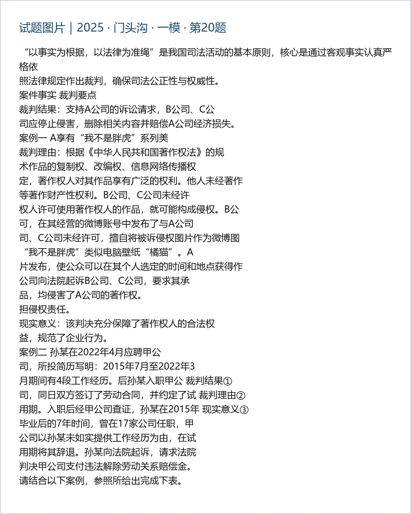

#### 设问
请结合以下案例，参照所给出完成下表。

#### 细则
20（1）裁判结果：驳回或不支持孙某诉讼请求（1分），甲公司无需支付赔偿金（1分）。
20（2）裁判理由共4分：
①法律规定1分，写出订立劳动合同应遵循诚实信用原则即可得1分；或根据《劳动合同法》，以欺诈手段订立的劳动合同无效或者部分无效。
②孙某违反诚实信用原则、违反劳动者基本职业道德或侵犯甲公司知情权（1分）。
③甲公司在违背真实意思的情况下与孙某签订合同，或劳动合同无效（1分）。
④甲公司提出解除劳动关系符合法律规定，解除劳动关系并无不妥或行为无过错（1分）。
20（3）现实意义共3分：
①维护用人单位合法权益（1分）。
②约束劳动者行为，有利于劳动者遵守职业道德（1分）。
③有利于和谐劳动关系的构建，有利于弘扬诚信的社会主义核心价值观，或维护社会公平正义（1分）。

#### 细则图
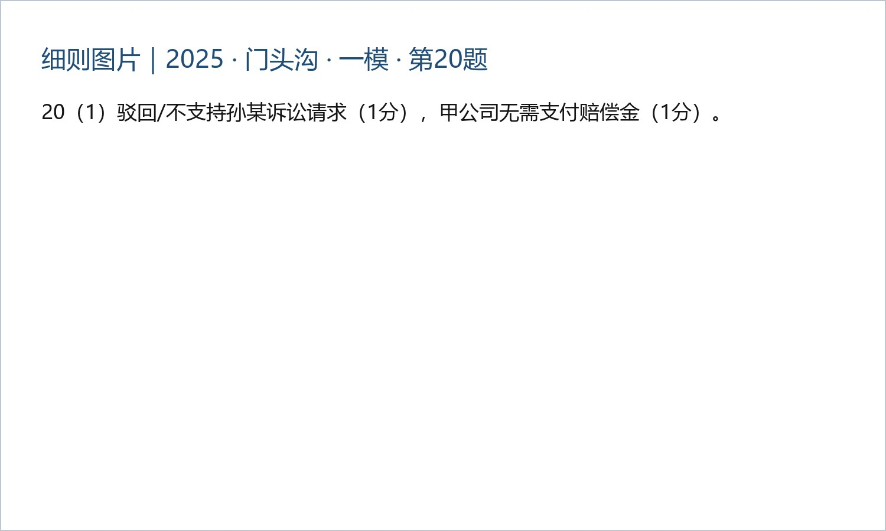

#### 答案落点
- 裁判结果：驳回或不支持孙某诉讼请求，甲公司无需支付违法解除劳动关系赔偿金。
- 订立劳动合同应遵循诚实信用原则；或以欺诈手段订立的劳动合同无效或者部分无效。
- 孙某隐瞒多段工作经历，违反诚实信用原则、劳动者基本职业道德或侵犯甲公司知情权。
- 甲公司在违背真实意思的情况下与孙某签订合同，劳动合同可认定无效或部分无效。
- 甲公司在试用期解除劳动关系符合法律规定，解除行为并无不妥或无过错。
- 该裁判有利于维护用人单位合法权益，约束劳动者行为，构建和谐劳动关系，弘扬诚信价值。

### 2026 · 顺义 · 一模 · 第18题

- 题目来源：2026 · 顺义 · 一模 · 第18题
- 框架归位：A8 劳动关系｜B3 诉求支持
- 同题组：本题组仅本分问。

#### 材料
材料一：女大学生闫某通过网络平台向某公司投递了求职简历。简历中，包含有姓名、性别、出生年月、户口所在地等个人基本信息，某公司以“仅招男性”的招聘条件拒绝对其进行面试。闫某向法院提起诉讼，请求判令该公司赔礼道歉、支付精神抚慰金以及承担诉讼相关费用。

材料二：张某原系A公司总经理。双方签订竞业限制协议，约定张某在劳动关系存续期间及两年的竞业限制期间，不得实施违反竞业限制的相关行为。张某离职后，其妻成为B公司的投资人，经营业务与A公司存在竞争关系，且B公司的关联公司为张某缴纳社会保险金。A公司认为张某违反竞业限制约定，应返还竞业经济补偿并承担违约责任。经劳动人事争议仲裁委员会裁决，张某向A公司支付违约金。张某不服，起诉至法院，请求判决无需支付违约金。

资料卡：“竞业限制”是指用人单位与劳动者之间约定，劳动者在离职后不得到生产同类产品或经营同类产业且有竞争关系的其他用人单位任职，也不得自己生产与原单位有竞争关系的同类产品或经营同类业务。

《中华人民共和国劳动合同法》第二十三条：对负有保密义务的劳动者，用人单位可以在劳动合同或者保密协议中与劳动者约定竞业限制条款，并约定在解除或者终止劳动合同后，在竞业限制期限内按月给予劳动者经济补偿。劳动者违反竞业限制约定的，应当按照约定向用人单位支付违约金。

#### 设问
结合材料，运用《法律与生活》知识，闫某和张某的诉求能否得到法院的支持，并说明理由。

#### 细则
闫某能获得法院支持。劳动者享有平等就业和选择职业的权利，不因民族、种族、性别、宗教信仰等不同而受歧视。该公司因性别对求职者进行差别对待，属于就业歧视，违反公平、平等原则，损害了闫某平等获得就业机会的权益。
张某不能获得法院支持。根据竞业限制协议，张某应按照约定履行竞业限制义务。张某之妻作为B公司投资人，其投资行为发生在张某从A公司离职后，而且在经营业务上与A公司存在竞争关系，属于竞业限制单位。张某与配偶在婚姻关系存续期间的生产、经营所得属于夫妻共同财产，具有利益一致性。共同价值：引导劳动者坚持权利义务相统一，在维护自身劳动权益的同时也要承担相应义务，平衡劳动者和用人单位利益，构建和谐劳动关系。

#### 答案落点
- 闫某能获得法院支持。
- 劳动者享有平等就业和选择职业的权利，不因民族、种族、性别、宗教信仰等不同而受歧视。
- 该公司因性别对求职者进行差别对待，属于就业歧视，违反公平、平等原则，损害了闫某平等获得就业机会的权益。
- 张某不能获得法院支持。
- 根据竞业限制协议，张某应按照约定履行竞业限制义务。
- 张某之妻作为B公司投资人，其投资行为发生在张某从A公司离职后，而且在经营业务上与A公司存在竞争关系，属于竞业限制单位。
- 张某与配偶在婚姻关系存续期间的生产、经营所得属于夫妻共同财产，具有利益一致性。

## A9 消费者权益

本节共 6 个分问。

### 核心答题点和必备知识
- 核心入口：经营者、消费者、网购、食品安全、欺诈、知情权、公平交易、惩罚性赔偿、放心消费。
- 第一判断：先确认消费者与经营者关系，再写知情权、公平交易权、安全权和市场秩序。
- 易错边界：惩罚性赔偿要看法院支持的是哪一笔请求、哪一种交易。
- 必背句：生活消费题先看知情、公平、安全和欺诈，不硬套惩罚性赔偿。

### 2024 · 西城 · 二模 · 第16题

- 题目来源：2024 · 西城 · 二模 · 第16题
- 框架归位：A9 消费者权益｜B5 意义价值
- 同题组：本题组仅本分问。

#### 材料
市民甲在某食品科技有限公司开设的网店中购买了30盒“黄芪薏米饼干”，付款516元。签收后，甲发现这些饼干不符合食品安全标准，随后又在两个月内三次购买同样的饼干，总数达200盒。四次总计付款4176元。甲以产品中添加有黄芪粉，违反了有关规定为由，起诉请求经营者退还价款4176元，支付相当于价款十倍的赔偿金41760元。
审理法院认为，某食品科技有限公司违反我国关于食品安全的相关规定，属于生产经营不符合食品安全标准食品的行为，应依法承担责任。市民甲首单购买的30盒“黄芪薏米饼干”未超出合理生活消费需要，对其就该部分饼干提出的惩罚性赔偿请求应予支持。但是，甲在收到首单饼干并确认饼干不符合食品安全标准后，又在两个多月时间内多次向同一商家大量加购同款饼干，加购数量共计200盒，总重量高达18.4千克。综合考量案涉饼干的保质期、普通消费者通常的生活消费习惯等因素，甲的加购行为超出正常的生活消费所需，对其就加购饼干提出的惩罚性赔偿请求不应支持，故判决支持甲就首单购买饼干提出的惩罚性赔偿请求。

#### 设问
结合材料，运用《法律与生活》的知识，分析人民法院判决的意义。

#### 细则
16．（8分）
经营者应依法、诚信经营，保护消费者的合法权益。（2分，多选一）人民法院支持市民甲就首单购买行为适用食品安全法中的惩罚性赔偿请求，以此打击违法生产经营行为，维护了消费者的合法权益。（1分，材料分析）
民事主体行使民事权利时不能超过正当的界限，并且不得滥用民事权利损害国家利益、社会公共利益或者他人合法权益。（2分，二选一）市民甲的加购行为超出了正常的生活消费需要，人民法院对甲就加购行为提出的惩罚性赔偿请求不予支持，有利于引导消费者诚信、理性维权。（1分，材料分析）
人民法院的判决，体现了保证食品安全和维护生产经营秩序两种价值取向的平衡，有利于服务和保障经济社会高质量发展。（2分，多选一）
细则：
依法经营，替换：守法经营、不侵害消费者权益（利益）、侵害消费者权益是错误的
“民事主体行使民事权利时不能超过正当的界限，并且不得滥用民事权利损害国家利益、社会公共利益或者他人合法权益”，变通：坚持权利和义务的统一
理性维权，变通：依法维权
保护消费者的合法权益，变通：消费者享有安全消费的权利、消费者享有知情权
生产经营秩序，变通：市场秩序
最后一段，变通：体现了民法公平、诚信、守法和公序良俗的基本原则（明确写出诚信是原则，区别于“经营者诚信”）、弘扬了社会主义核心价值观

#### 答案落点
- 16．（8分）经营者应依法、诚信经营，保护消费者的合法权益。
- （2分，多选一）人民法院支持市民甲就首单购买行为适用食品安全法中的惩罚性赔偿请求，以此打击违法生产经营行为，维护了消费者的合法权益。
- （1分，材料分析）民事主体行使民事权利时不能超过正当的界限，并且不得滥用民事权利损害国家利益、社会公共利益或者他人合法权益。
- （2分，二选一）市民甲的加购行为超出了正常的生活消费需要，人民法院对甲就加购行为提出的惩罚性赔偿请求不予支持，有利于引导消费者诚信、理性维权。
- （1分，材料分析）人民法院的判决，体现了保证食品安全和维护生产经营秩序两种价值取向的平衡，有利于服务和保障经济社会高质量发展。
- （2分，多选一）细则：依法经营，替换：守法经营、不侵害消费者权益（利益）、侵害消费者权益是错误的“民事主体行使民事权利时不能超过正当的界限，并且不得滥用民事权利损害国家利益、社会公共利益或者他人合法权益”，变通：坚持权利和义务的统一理性维权，变通：依法维权保护消费者的合法权益，
- 变通：消费者享有安全消费的权利、消费者享有知情权生产经营秩序，变通：市场秩序最后一段，变通：体现了民法公平、诚信、守法和公序良俗的基本原则（明确写出诚信是原则，区别于“经营者诚信”）、弘扬了社会主义核心价值观

### 2025 · 延庆 · 一模 · 第19题

- 题目来源：2025 · 延庆 · 一模 · 第19题
- 框架归位：A9 消费者权益｜B6 维权路径
- 同题组：本题组仅本分问。

#### 材料
网络经济持续健康发展，需要法治护航。
案情：杨某在贾某经营的网店下单DIY模具类商品4件，售价78元，杨某签收后对商品不满意，在
未与贾某协商一致的情况下，直接点击了“仅退款”并退款成功。贾某要求杨某退回商品，杨某表示已经
将商品扔掉，无法退回。
贾某认为双方应当先确定货物是否存在质量问题，是否符合“仅退款”标准。杨某退款后应当退还货
物，虽然商品实际售价仅78元，但杨某恶意“仅退款”的做法让自己遭受了商品损失和邮费损失。杨某
则认为商品质量不合格，达不到预期效果，自己才选择“仅退款”，且贾某未及时回复，所以才将商品扔
掉。后贾某将杨某诉至法院。
（注：“仅退款”是电商平台推出的售后服务内容，该服务允许消费者在特定条件下直接获得退款，
而无需将商品退还给卖家。“仅退款”服务带来了消费者权益的最大化，也有效降低了消费者的售后维权
成本。）

#### 设问
如果你是法官，需要对这个案件进行调解，请运用《法律与生活》知识，说明你会如何进行调解并说
明理由。

#### 细则
（7分）
本案标的较小，本着以和为贵的原则，适用调解。（1分）
调解理由：消费者维护自己的合法权益应当遵循诚实信用原则，不能损害他人利益和社会经济秩序。（2分）
杨某在收到网购商品后，以存在质量问题为由申请退款，且收到了退回的货款，杨某与贾某之间的买卖合同已经解除，应依法退还贾某的货物。（2分）
杨某主张贾某出售的商品质量不合格，达不到预期效果，但又称其已将商品扔掉，缺乏证据意识，这一主张依法不予支持。如杨某确已无法将商品退回，应当向商家支付商品价款及诉讼费用。（2分）
从商家角度看，经营者要诚信经营；如商品确实存在质量问题，则不应追究消费者责任。
细则：“以和为贵”或社会主义核心价值观1分；诚信原则1分，分析材料1分；合同解除1分，材料分析1分；证据意识1分，材料分析1分；如学生未答出证据意识而是从商家角度分析，可酌情给分。

#### 答案落点
- 本案标的较小，本着以和为贵的原则，适用调解。
- 消费者维护自己的合法权益应当遵循诚实信用原则，不能损害他人利益和社会经济秩序。
- 杨某已收到退回货款，杨某与贾某之间的买卖合同已经解除，应依法退还贾某的货物。
- 杨某主张商品质量不合格但已将商品扔掉，缺乏证据意识，该主张依法不予支持。
- 如杨某确已无法退回商品，应向商家支付商品价款及诉讼费用。
- 从商家角度看，经营者要诚信经营；如商品确实存在质量问题，则不应追究消费者责任。

### 2025 · 朝阳 · 一模 · 第19题

- 题目来源：2025 · 朝阳 · 一模 · 第19题
- 框架归位：A9 消费者权益｜B3 诉求支持
- 同题组：本题组仅本分问。

#### 材料
司法护航，营造在线文旅消费法治环境。
某市互联网法院召开涉在线文化旅游消费案件审理情况新闻发布会，介绍涉在线文化旅游消费案件的
审理情况，发布典型案例。以下为其中一例：
王某通过 A 机票代销平台公司（以下简称“A 公司”）购买青岛至宁波的机票，页面显示总价 350 元
（含基建燃油费70元），优惠40元后实付310元。事后，王某在航空公司官网查验发现，机票实际总价为
300 元。经查，A 公司在向王某销售机票的过程中通过技术手段擅自搭售了 10 元的外卖红包，王某在购买
界面并不能清楚地知悉费用的支出细节，也无法拒绝支付10元的额外费用。
王某遂向该市互联网法院提起诉讼，要求 A 公司退还其支付的票款 310 元，并予以三倍赔偿。该法院
的判决支持了王某的诉讼请求。
《中华人民共和国消费者权益保护法》（节选）
第五十五条 经营者提供商品或者服务有欺诈行为的，应当按照消费者的要求增加赔偿其
受到的损失，增加赔偿的金额为消费者购买商品的价款或者接受服务的费用的三倍；增加赔偿
的金额不足五百元的，为五百元。法律另有规定的，依照其规定。

#### 设问
结合材料，运用《法律与生活》知识，说明人民法院支持王某的诉讼请求的理由。

#### 细则
19.（8分）
结合材料，运用《法律与生活》知识，说明人民法院支持王某的诉讼请求的理由。
阅卷前制定的参考答案：
①原告支付机票款，已经出票，合同成立。（1分）
②合同成立不等于生效。（1分）
③某机票代销平台主观上具备欺诈故意，客观上实施了欺诈行为，以立减优惠的形式诱骗消费者购买了高价机票，使王某在违背意思表示的情况下订立合同，因此，根据民法典规定，王某请求人民法院撤销合同。（2分）
④根据消费者权益保护法，因A公司提供服务有欺诈行为，因此，法院应当支持王某要求三倍赔偿的诉讼请求。（2分）
⑤判决维护了消费者的合法权益，规范了在线文旅行业平台经济企业的行为，持续优化网络消费环境，引导电商主体规范经营，明确权利行使边界和责任范围，促进数字经济持续健康发展。（2分）
评分细则、答案变通说明：
①原告通过A公司平台购买机票，双方有要约、承诺或合同成立。（1分）
②A公司擅自搭售10元外卖红包，王某在购买界面不能清楚地知悉费用支出细节，也无法拒绝支付10元额外费用。（1分）材料3个条件必须写全才得分。
A公司的合同欺诈导致王某在违背真实意思表示的情况下订立合同。（1分）
合同无效或可撤销。（1分）
③根据消费者权益保护法。（1分）必须有“消费者”法律字样，只写“保护法”等不给分。
A公司提供服务时有欺诈行为，或侵犯了消费者知情权、公平交易权、自主选择权。（1分）
法院应支持退还票款310元和三倍赔偿的诉讼请求。
④支持王某的诉讼请求，有助于维护消费者合法权益，引导电商企业规范经营，有利于规范企业诚信经营，规范网络消费市场秩序，持续优化网络消费环境，促进数字经济持续健康发展，也可写维护司法权威、维护社会公平正义、弘扬社会主义核心价值观。（2分）

#### 答案落点
- 合同基础：王某通过A公司平台购买机票，双方有要约、承诺，合同成立；但合同成立不等于当然有效。
- 欺诈事实：A公司擅自搭售10元外卖红包，王某不能清楚知悉费用支出细节，也无法拒绝支付10元额外费用。
- 民法典路径：A公司的欺诈导致王某在违背真实意思表示的情况下订立合同，合同可撤销或相应内容不应被支持。
- 消费者法路径：根据消费者权益保护法，A公司提供服务时有欺诈行为，或侵犯消费者知情权、公平交易权、自主选择权。
- 诉求结论：法院应支持退还票款310元和三倍赔偿的诉讼请求。
- 价值意义：维护消费者合法权益，引导电商企业规范经营，规范网络消费市场秩序。
- 还可写持续优化网络消费环境、促进数字经济健康发展、维护司法权威和社会公平正义。

### 2025 · 海淀 · 期末 · 第20题

- 题目来源：2025 · 海淀 · 期末 · 第20题
- 框架归位：A9 消费者权益｜B1 补表/补链
- 同题组：本题组仅本分问。

#### 材料
阅读材料，完成问题。
最高人民法院围绕民法典实施过程中社会广泛关注、审判实践中亟需解决的重大争议问题，制定了《最高人民法院关于适用<中华人民共和国民法典>侵权责任编的解释（一）》（以下简称《解释》）。
下表列出了《解释》部分条款。

表格条款补充：
《解释》条款一：缺陷产品造成产品自身损害的，属于产品责任赔偿范围，消费者可以依法请求生产者承担赔偿责任。
《解释》条款二：禁止饲养的烈性犬等危险动物造成他人损害的，动物饲养人或者管理人应承担无过错侵权责任，没有任何免责事由和减责事由。

#### 原题图
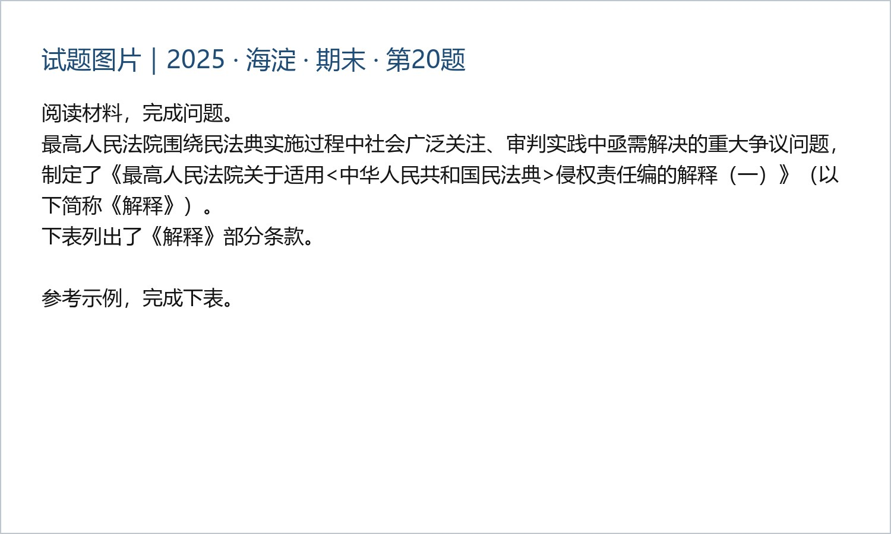

#### 设问
参考示例，完成下表。

#### 细则
20题
“最严格的无过错责任”立法精神：环境保护、食品安全、药品管理等领域，旨在强化某一领域管理，提高违法成本，确保公共利益，保护人民生命健康和财产安全。
参考答案：权利义务+利益考量（责权分配）。
①生产者产品责任是无过错侵权责任，行为人只要损害了他人的民事权益，不论其有无过错，均应承担侵权责任。《解释》从保护消费者角度作出解释，明确缺陷产品造成的产品自身损害属于产品责任赔偿范围，切实维护消费者合法权益。
②禁止饲养的烈性犬等危险动物造成他人损害的，动物饲养人或者管理人应承担无过错侵权责任，没有任何免责事由和减责事由。《解释》阐明民法典“最严格的无过错责任”立法精神，强化动物饲养人、管理人责任意识，维护动物饲养管理秩序，保障人民群众生命财产安全。
评分细则：①法理部分：无过错侵权责任+法理解释（2分）；或消费者权利（安全消费权）并展开解释（2分）；意义部分：双方任意角度（1分）。②法理部分：无过错侵权责任+法理解释（2分）；意义部分：双方任意角度（1分）。在法理解释正确的基础上，无过错出现一次即可满分；如果通篇没有无过错侵权，不能得满分；无过错不重复扣分；法理用错，主要是烈性犬案例用了过错推定，法理部分不给分。

#### 细则图
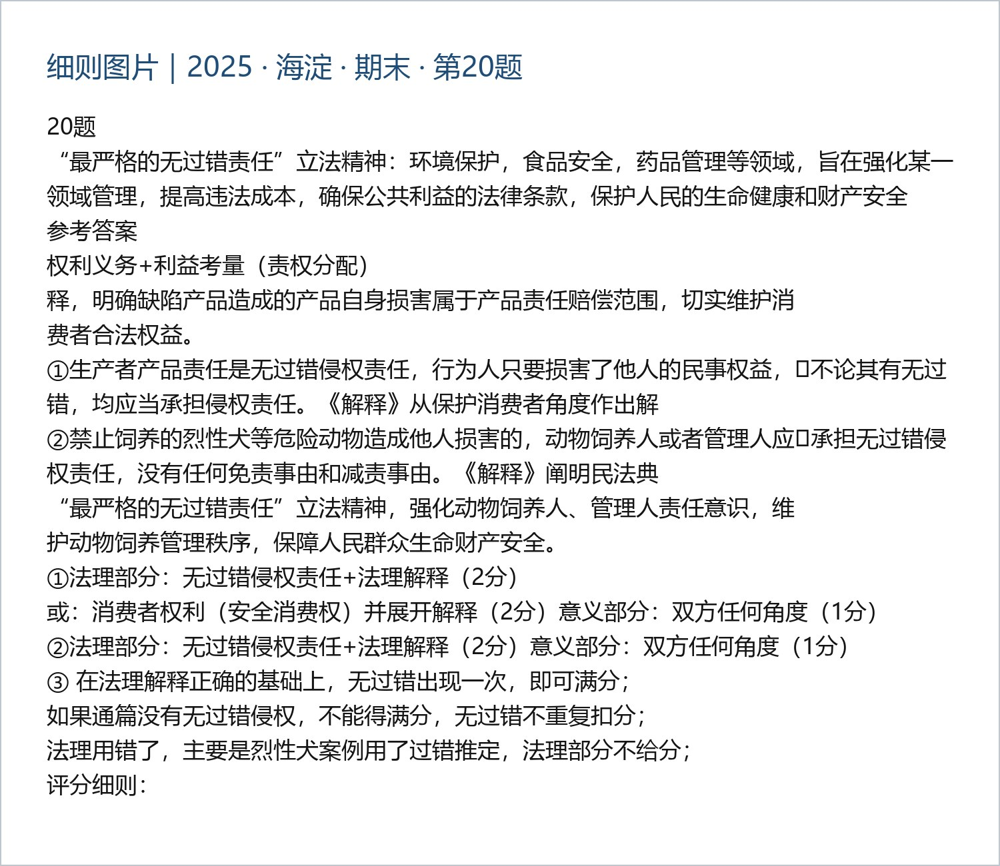

#### 答案落点
- 生产者产品责任是无过错侵权责任，行为人只要损害了他人的民事权益，不论其有无过错，均应承担侵权责任。
- 缺陷产品造成的产品自身损害属于产品责任赔偿范围，切实维护消费者合法权益。
- 禁止饲养的烈性犬等危险动物造成他人损害的，动物饲养人或者管理人应承担无过错侵权责任。
- 该无过错责任没有任何免责事由和减责事由。
- 《解释》阐明民法典“最严格的无过错责任”立法精神，强化动物饲养人、管理人责任意识。
- 维护动物饲养管理秩序，保障人民群众生命财产安全。

### 2026 · 朝阳 · 期末 · 第18题第1问

- 题目来源：2026 · 朝阳 · 期末 · 第18题第1问
- 框架归位：A9 消费者权益｜B2 判责/理由
- 同题组：本题组仅本分问。

#### 材料
网络消费为人们日常生活提供较大便利，已成为人们消费的重要方式。
材料一【基本案情】
张某系某网络店铺的经营者。在一次直播营销中，该店铺的主播人员将大叶紫檀木制
作的手串宣称沟正宗小叶紫檀材质制作，并承诺“保真”“假一赔十”。侯某观看该直播后购
买手串1件，支付价款1千元。侯某收到手串后发现不是小叶紫檀材质，遂诉至法院，请求
判令张某赔偿十倍价款1万元。
【裁判结果】
审理法院认为，主播人员在直播营销中宣称所售手串系小叶紫檀，并明确承诺“保真”
“假一赔十”，上述承诺构成店铺与侯某买卖合同的内容，该合同对张某具有约束力。张某交
付给侯某的手串材质并非小叶紫檀，而是属于大叶紫檀，这不符合合同约定，而木质首饰的
原材料对其价值具有重要影响。“假一赔十”的承诺虽高于法定赔偿标准，但张某应当履行。
法院最终判决：张某赔偿侯某1万元。

#### 设问
（1）结合上述案例，运用《法律与生活》知识，说明法院判决的依据。（7分）

#### 细则
18 （1）结合上述案例，运用《法律与生活》知识，说明法院判决的依据（7分）
整体作答思路：合同订立-合同有效-合同履行-合同违约-违约责任承担方式-法院判决意义
1分
1分 1分1分
丨分
2分
具体：
1.合同依法成立（1分）：主播称手串为小叶紫檀并作出“假一賠十”的承诺，属于要约，内容明确具体且具
有订立合同的意思表示：侯某观看直播后购买手串并支付价款，属于承诺，承诺生效后，双方的买卖合同
成立。
2.合同合法生效（1分）：张某与侯某均具有相应的民事行为能力，订立合同的意思表示真实，合同内容不
违反法律、行政法规的强制性规定，不违背公序良俗，合同依法生效：“假一赔十“的承诺成为合同内容，对
张某具有法律约束力。
3.张某未按照未全面、诚信原则履行合同义务，（1分，两个原则二选一，或者替换为违反民法诚信原则）
4.张某构成违约且需承担违约责任（2分）：
根据民法典，张某交付的手串为大叶紫檀，与合同约定的小叶紫檀材质不符，构成违约：（1分）“假一赔十*
是双方约定的违约责任条款，虽高于法定赔偿标准，但属于当事人意思自治，张某应依约履行赔偿义务。《1
分，需结合材料）
3.4 点可以替换答案为：经营者行为构成虚假宜传，（1分）犯了消费者的知情权、求偿权、公平交易权等
内容，（1 分）要技照合同约定，赔偿损失。（1分，本部分共3分）
4.判决的法律意义（2分）：该判决制裁了消费欺诈行为，保护了消费者的合法权益，有利于替造良好的网
络消费环境，提升消费者的消费安全感与信心。（4个维度，选2个，一个消费者、经营者二选一，一个是
消费环境、公平正义二选一）

#### 答案落点
- 18 （1）结合上述案例，运用《法律与生活》知识，说明法院判决的依据（7分）整体作答思路：合同订立-合同有效-合同履行-合同违约-违约责任承担方式-法院判决意义1分1分 1分1分丨分2分具体：1.合同依法成立（1分）：主播称手串为小叶紫檀并作出“假一賠十”的承诺，属于要约，
- 内容明确具体且具有订立合同的意思表示：侯某观看直播后购买手串并支付价款，属于承诺，承诺生效后，双方的买卖合同成立。
- 2.合同合法生效（1分）：张某与侯某均具有相应的民事行为能力，订立合同的意思表示真实，合同内容不违反法律、行政法规的强制性规定，不违背公序良俗，合同依法生效：“假一赔十“的承诺成为合同内容，对张某具有法律约束力。
- 3.张某未按照未全面、诚信原则履行合同义务，（1分，两个原则二选一，或者替换为违反民法诚信原则）4.张某构成违约且需承担违约责任（2分）：根据民法典，张某交付的手串为大叶紫檀，与合同约定的小叶紫檀材质不符，构成违约：（1分）“假一赔十*是双方约定的违约责任条款，虽高于法定赔偿标准，
- 但属于当事人意思自治，张某应依约履行赔偿义务。
- 《1分，需结合材料）3.4 点可以替换答案为：经营者行为构成虚假宜传，（1分）犯了消费者的知情权、求偿权、公平交易权等内容，（1 分）要技照合同约定，赔偿损失。
- （1分，本部分共3分）4.判决的法律意义（2分）：该判决制裁了消费欺诈行为，保护了消费者的合法权益，有利于替造良好的网络消费环境，提升消费者的消费安全感与信心。

### 2026 · 海淀 · 一模 · 第18题第3问

- 题目来源：2026 · 海淀 · 一模 · 第18题第3问
- 框架归位：A9 消费者权益｜B1 补表/补链
- 同题组：本题组仅本分问。

#### 材料
材料二 聚焦新领域，人民法院以高质量司法维护消费者合法权益，营造放心消费环境。下
列是人民法院受理的两个案件：
【案件1】张某等人因不满商家的“剧本杀”游戏服务，上网发布差评，随后商家在社交平台
发布张某等人的游戏包厢监控视频录像片段、网络聊天信息等。张某等人起诉要求商家停止侵权、
赔礼道歉及赔偿精神损失等。
【案件2】赵某在网络平台宣传某理疗产品具有“治疗糖尿病并发症” 等功效。孙某看到后至
赵某经营的理疗店体验，并购买了10个疗程的理疗项目。4个疗程后并无效果，孙某与赵某协商
退款未果，遂向法院提起诉讼，要求其返还已支付的费用并承担三倍价款的惩罚性赔偿责任。法
院支持了原告诉讼请求。

#### 原题图
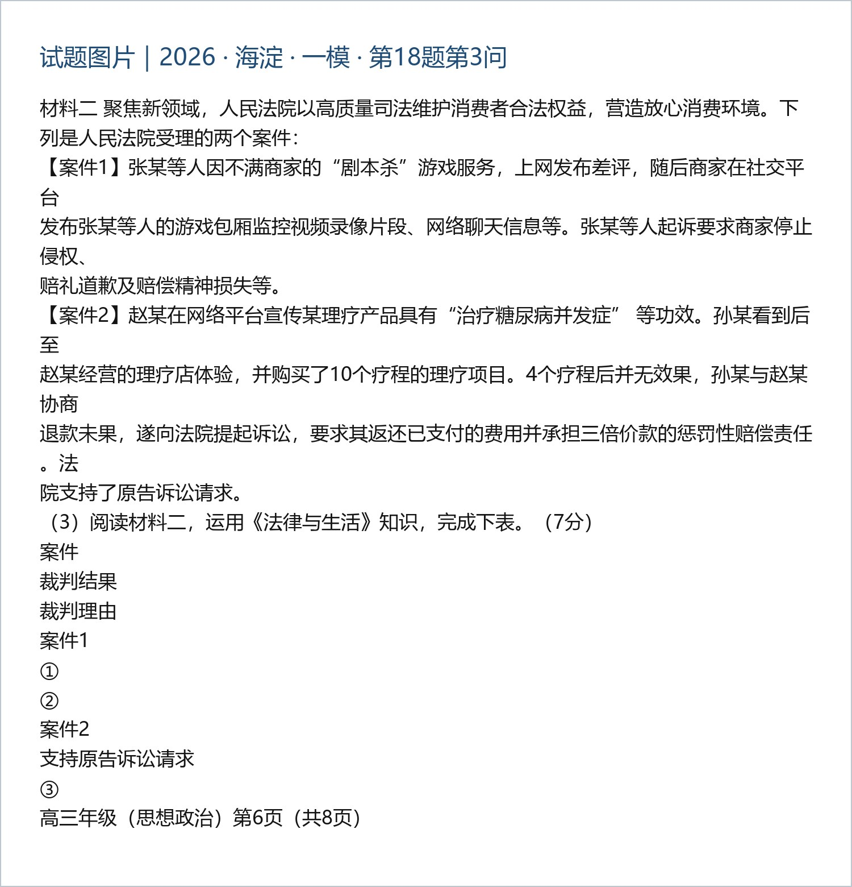

#### 设问
（3）阅读材料二，运用《法律与生活》知识，完成下表。（7分）
案件
裁判结果
裁判理由
案件1
①
②
案件2
支持原告诉讼请求
③
高三年级（思想政治）第6页（共8页）

#### 细则
（3）①支持原告诉讼请求。 (1分）
②根据民法典规定，任何组织或者个人不得以刺探、侵扰、泄露、公开等方式侵害他人的隐私权。
消费者在经营者提供的包间内的活动具有私密性，商家在社交平台公开张某等人包厢内监控录像片
段、网络聊天信息等，构成对消费者隐私权的侵害，应当承担停止侵权、赔礼道歉等侵权责任。商
家的行为侵犯了消费者合法权益。（3分）
③经营者应当保护消费者的知情权。根据消费者权益保护法规定，经营者向消费者提供有关商品或
者服务的质量、性能、用途、有效期限等信息，应当真实、全面，不得作虚假或者引人误解的宣传。
赵某虚假宣传其有“治疗糖尿病并发症”等功效，夸大功效，诱导消费，构成欺诈，应当退款并承
担惩罚性赔偿责任。赵某行为不符合诚信等社会主义核心价值观。（3分）

#### 细则图
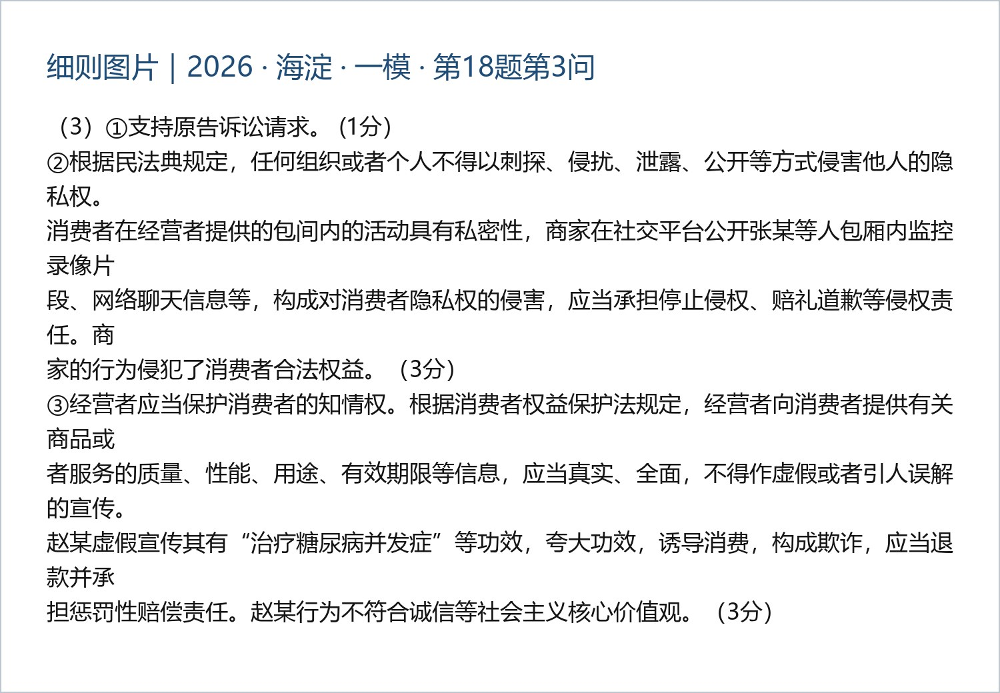

#### 答案落点
- （3）①支持原告诉讼请求。
- (1分）②根据民法典规定，任何组织或者个人不得以刺探、侵扰、泄露、公开等方式侵害他人的隐私权。
- 消费者在经营者提供的包间内的活动具有私密性，商家在社交平台公开张某等人包厢内监控录像片段、网络聊天信息等，构成对消费者隐私权的侵害，应当承担停止侵权、赔礼道歉等侵权责任。
- 商家的行为侵犯了消费者合法权益。
- （3分）③经营者应当保护消费者的知情权。
- 根据消费者权益保护法规定，经营者向消费者提供有关商品或者服务的质量、性能、用途、有效期限等信息，应当真实、全面，不得作虚假或者引人误解的宣传。
- 赵某虚假宣传其有“治疗糖尿病并发症”等功效，夸大功效，诱导消费，构成欺诈，应当退款并承担惩罚性赔偿责任。

## A10 纠纷解决程序

本节共 7 个分问。

### 核心答题点和必备知识
- 核心入口：调解、仲裁、诉讼、证据、举证、起诉状、回避、诉讼代理、公益诉讼、执行监督、司法确认。
- 第一判断：先写适用的程序和证据要求，再写依法、公正、高效、多元化解纠纷。
- 易错边界：只有题干真正问路径、证据或程序时，程序才是主入口；否则它只是答题动作。
- 必背句：只有真正问证据、程序、调解、仲裁、诉讼、起诉状时，A10 才作主入口。

### 2024 · 西城 · 一模 · 第18题第1问

- 题目来源：2024 · 西城 · 一模 · 第18题第1问
- 框架归位：A10 纠纷解决程序｜B1 补表/补链
- 同题组：2024 · 西城 · 一模 · 第18题第1问；2024 · 西城 · 一模 · 第18题第2问；2024 · 西城 · 一模 · 第18题第3问

#### 材料
【基本案情】郭某与刘某是夫妻关系，刘某于2022年去世。二人育有子女四人，现郭某年已九十，由小女儿照顾，郭某起诉要求另外三子支付赡养费，其中郭某每月有退休金五千余元，大儿子居住在外地，二儿子肢体残疾，三儿子表示郭某现有收入并不需要子女支付赡养费。
一审法院认为郭某尚不存在生活困难的情形，故对于郭某的请求未予支持。郭某提起上诉。二审法院审理期间，三个儿子前往郭某住处探望老人，老人表达希望儿子多来陪伴的想法。二审法院虽未支持老人要求抚养费的主张，但基于老人渴望子女陪伴的意愿，向郭某的三个儿子发出了《督促履行义务告知书》，要求其常回家看看，多与老人沟通交流，让老人感受到家人的温暖，安享晚年。
【模拟庭审】某班学生参考此案二审，组织了一场模拟庭审活动。
镜头一 学生甲：上诉人申请书记员小袁回避，因为 。
镜头二 学生乙：“我是被上诉人郭某的三儿子的辩护人。《中华人民共和国民法典》第一千零六十七条规定，成年子女不履行赡养义务的，缺乏劳动能力或者生活困难的父母，有要求成年子女给付赡养费的权利。郭某现有收入并不需要子女支付赡养费……”

#### 设问
（1）在镜头一的横线上填写申请回避的适当理由。（1分）

#### 细则
18．（8分）
（1）依据诉讼法规定的回避制度，当书记员有下列情形之一的，当事人有权申请其回避：是本案当事人或者当事人、诉讼代理人近亲属的；与本案有利害关系的；与本案当事人、诉讼代理人有其他关系（比如师生、同学、朋友等），可能影响对案件公正审理的。书记员接受当事人、诉讼代理人请客送礼，或者违反规定会见当事人、诉讼代理人的，当事人有权要求他们回避。考生可选择上述情形之一作答。（1分）
答案示例一：书记员小袁是被上诉人郭某三儿子的学生。
答案示例二：书记员小袁是被上诉人郭某二儿子的朋友。

#### 答案落点
- 18．（8分）（1）依据诉讼法规定的回避制度，当书记员有下列情形之一的，当事人有权申请其回避：是本案当事人或者当事人、诉讼代理人近亲属的；
- 与本案有利害关系的；
- 与本案当事人、诉讼代理人有其他关系（比如师生、同学、朋友等），可能影响对案件公正审理的。
- 书记员接受当事人、诉讼代理人请客送礼，或者违反规定会见当事人、诉讼代理人的，当事人有权要求他们回避。
- 考生可选择上述情形之一作答。
- （1分）答案示例一：书记员小袁是被上诉人郭某三儿子的学生。
- 答案示例二：书记员小袁是被上诉人郭某二儿子的朋友。

### 2024 · 西城 · 一模 · 第18题第2问

- 题目来源：2024 · 西城 · 一模 · 第18题第2问
- 框架归位：A10 纠纷解决程序｜B7 短答识别
- 同题组：2024 · 西城 · 一模 · 第18题第1问；2024 · 西城 · 一模 · 第18题第2问；2024 · 西城 · 一模 · 第18题第3问

#### 材料
【基本案情】郭某与刘某是夫妻关系，刘某于2022年去世。二人育有子女四人，现郭某年已九十，由小女儿照顾，郭某起诉要求另外三子支付赡养费，其中郭某每月有退休金五千余元，大儿子居住在外地，二儿子肢体残疾，三儿子表示郭某现有收入并不需要子女支付赡养费。
一审法院认为郭某尚不存在生活困难的情形，故对于郭某的请求未予支持。郭某提起上诉。二审法院审理期间，三个儿子前往郭某住处探望老人，老人表达希望儿子多来陪伴的想法。二审法院虽未支持老人要求抚养费的主张，但基于老人渴望子女陪伴的意愿，向郭某的三个儿子发出了《督促履行义务告知书》，要求其常回家看看，多与老人沟通交流，让老人感受到家人的温暖，安享晚年。
【模拟庭审】某班学生参考此案二审，组织了一场模拟庭审活动。
镜头一 学生甲：上诉人申请书记员小袁回避，因为 。
镜头二 学生乙：“我是被上诉人郭某的三儿子的辩护人。《中华人民共和国民法典》第一千零六十七条规定，成年子女不履行赡养义务的，缺乏劳动能力或者生活困难的父母，有要求成年子女给付赡养费的权利。郭某现有收入并不需要子女支付赡养费……”

#### 设问
（2）镜头二中有一处明显错误，将它找出来并改正。（1分）

#### 细则
18．（8分）
（2）错误：辩护人。改为：诉讼代理人。（1分）

#### 答案落点
- 18．（8分）（2）错误：辩护人。
- 改为：诉讼代理人。

### 2025 · 东城 · 一模 · 第19题

- 题目来源：2025 · 东城 · 一模 · 第19题
- 框架归位：A10 纠纷解决程序｜B1 补表/补链
- 同题组：本题组仅本分问。

#### 材料
(8分)
法治以“固根本、稳预期、利长远”的治理效能，夯实人民群众可感可及的公平正义。以下三个案例生
动展现了法治的实践与成效。
案件一 张某与某公司签订《家庭装修合同》，因公司未按工期完工，张某诉至法院，要求赔偿损失并
支付违约金。在诉讼程序启动后，法官了解双方需求、耐心释法析理，最终该公司主动赔偿工期延误损失，
既解“法结”又解“心结”。
案件二 柳某入职某医院时，双方在合同中约定“若柳某提出解约，培训费补偿见《培训协议》”，并
另行签订《培训协议》。 医院依约出资提供培训后，柳某在服务期未满时提出辞职并自愿支付违约金，但
离职后又申请仲裁要求返还，仲裁委员会驳回其请求。
案件三 顾氏三兄弟长期尽心照料孤寡老人杨某，在其住院期间陪护并承担费用，杨某去世后又为其
操办丧葬事宜。 因杨某财产无人管理，三兄弟申请指定民政局作为遗产管理人，获得法院支持。判决生效
后，民政局出具《分割决定书》，将杨某部分遗产分配给了顾氏三兄弟。

#### 原题图
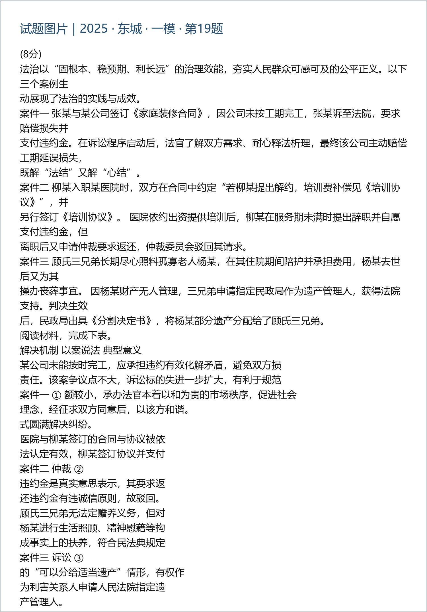

#### 设问
阅读材料，完成下表。
案件 | 解决机制 | 以案说法 | 典型意义
案件一 | ① | 某公司未能按时完工，应承担违约责任。该案争议点不大，诉讼标的额较小，承办法官本着以和为贵的理念，经征求双方同意后，以该方式圆满解决纠纷。 | 有效化解矛盾，避免双方损失进一步扩大，有利于规范市场秩序，促进社会和谐。
案件二 | 仲裁 | 医院与柳某签订的合同与协议被依法认定有效，柳某签订协议并支付违约金是真实意思表示，其要求返还违约金有违诚信原则，故驳回。 | ②
案件三 | 诉讼 | 顾氏三兄弟无法定赡养义务，但对杨某进行生活照顾、精神慰藉等构成事实上的扶养，符合民法典规定的“可以分给适当遗产”情形，有权作为利害关系人申请人民法院指定遗产管理人。 | ③

#### 细则
19. 阅读材料，完成表格。（8分）
（一）本题标准和变通
①解决机制（1分）：调解/诉讼调解/诉讼 1分
（对写“诉讼”得分的原因给予解释：该案已进入诉讼程序，虽然没有“审判”但也是通过
诉讼程序的某个环节，以出具调解书的方式解决，也属于诉讼解决机制）
②柳某与医院的案例（3分）
第一层：对劳动者的意义 2分
树立劳动者权利和义务相统一的法治意识 2分
可替换：督促劳动者履行义务 2分
酌情替换：规范劳动者行为 1分
第二层：对医院的意义/对双方劳动关系的意义 1分
维护用人单位的合法权益 1分
可替换：构建和谐劳动关系 1分
本案例其他酌情替代：体现了公平原则、公平正义 1分 （柳某案例总分不超过3分）
③顾氏三兄弟照顾老人案例（4分）
第一层：遗产管理制度 1分
落实遗产管理制度 1分
可替换：
合理处置老人遗产，规范遗产分配问题 1分
有利于对公民合法财产的保护和继承 1分
为遗产继承、财产分割提供案例支持 1分
第二层：社会主义核心价值观/中华优秀传统美德/社会角度 3分（1个2分，2个3分）
友善的社会主义核心价值观；
守望相助、尊老敬老的中华优秀传统美德；
社会层面：社会和谐、良好的社会氛围、对社会的引领和示范作用
（注意：2个点至少要出现1次具体内容，如友善、守望相助、孝老爱亲等，如果没有任何
具体内容，该层最高2分）

#### 细则图
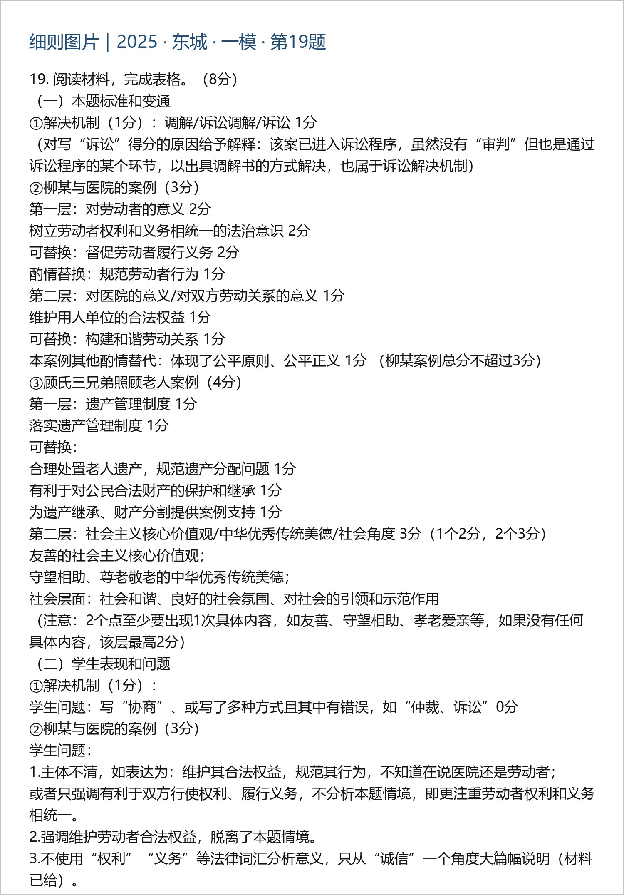
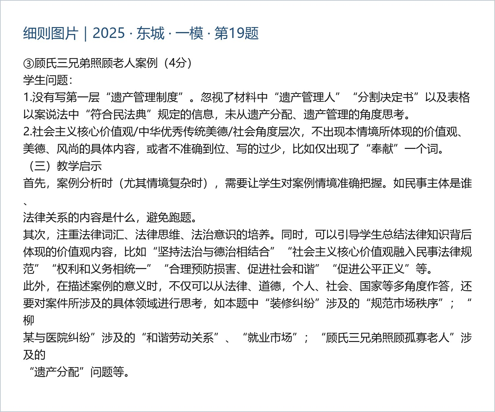

#### 答案落点
- 19. 阅读材料，完成表格。
- （8分）（一）本题标准和变通①解决机制（1分）：调解/诉讼调解/诉讼 1分（对写“诉讼”得分的原因给予解释：该案已进入诉讼程序，虽然没有“审判”但也是通过诉讼程序的某个环节，以出具调解书的方式解决，
- 也属于诉讼解决机制）②柳某与医院的案例（3分）第一层：对劳动者的意义 2分树立劳动者权利和义务相统一的法治意识 2分可替换：督促劳动者履行义务 2分酌情替换：规范劳动者行为 1分第二层：对医院的意义/对双方劳动关系的意义 1分维护用人单位的合法权益 1分可替换：构建和谐劳动关系 1分本案例其他酌情替代：体现了公平原则、公平正义 1分 （柳某案例总分不超过3分）③顾氏三兄弟照顾老人案例（4分）第一层：遗产管理制度 1分落实遗产管理制度 1分可替换：合理处置老人遗产，
- 规范遗产分配问题 1分有利于对公民合法财产的保护和继承 1分为遗产继承、财产分割提供案例支持 1分第二层：社会主义核心价值观/中华优秀传统美德/社会角度 3分（1个2分，2个3分）友善的社会主义核心价值观；
- 守望相助、尊老敬老的中华优秀传统美德；
- 社会层面：社会和谐、良好的社会氛围、对社会的引领和示范作用（注意：2个点至少要出现1次具体内容，如友善、守望相助、孝老爱亲等，如果没有任何具体内容，该层最高2分）

### 2026 · 丰台 · 期末 · 第18题

- 题目来源：2026 · 丰台 · 期末 · 第18题
- 框架归位：A10 纠纷解决程序｜B5 意义价值
- 同题组：本题组仅本分问。

#### 材料
《中华人民共和国未成年人保护法》第四十四条：爱国主义教育基地、图书馆、青少年宫、儿童活动中心、儿童之家应当对未成年人免费开放。博物馆、纪念馆、科技馆、展览馆、美术馆、文化馆、社区公益性互联网上网服务场所以及影剧院、体育场馆、动物园、植物园、公园等场所，应当按照有关规定对未成年人免费或者优惠开放。

某区人民检察院调查发现，有部分影院在网络票务平台和现场购票场所均未对未成年人免票或优惠购票政策作出明确提示，部分影院现场购票场所处将优惠观影的未成年人群体限定于身高1.3米或1.2米以下的未成年人，缩小了应享受观影优惠的未成年人范围，违反了《中华人民共和国未成年人保护法》第四十四条的规定。

该区人民检察院在全面梳理相关法律及规范性文件的基础上，依法对该区文化和旅游局以行政公益诉讼立案并制发检察建议。要求主管部门监督影院依法对未成年人免费或者优惠开放，对未成年人观影优惠政策在网络票务平台和现场购票场所作出明确提示。

收到检察建议后，该区文化和旅游局通过沟通督促、加强监管和宣传教育等方式整改落实，确保未成年人优惠观影政策落实。

#### 设问
结合材料，运用法治知识，阐述该检察公益诉讼案例的积极意义。

#### 细则
知识板块：政治与法治、法律与生活。能力板块：解释与论证。
检察权（法律监督）+公共利益2分：该案为各地检察机关办理类似案件提供了有效示范，推动检察机关依法行使检察权，有效维护社会公共利益。
政府积极履职+维护市场秩序2分：通过检察建议督促政府有关部门履行法定职责，切实维护良好市场秩序/文化市场健康发展。
市场主体（部分影院的法定义务+未成年人的合法权益）2分：纠正部分影院的侵权违法行为，引导电影院等市场主体自觉履行法律规定的义务，保障未成年人的合法权益。
全社会（法治意识、法治环境+弘扬社会主义核心价值观）2分：增强全社会成员的法治意识，营造全社会保护未成年人健康成长的法治环境。

#### 答案落点
- 知识板块：政治与法治、法律与生活。
- 能力板块：解释与论证。
- 检察权（法律监督）+公共利益2分：该案为各地检察机关办理类似案件提供了有效示范，推动检察机关依法行使检察权，有效维护社会公共利益。
- 政府积极履职+维护市场秩序2分：通过检察建议督促政府有关部门履行法定职责，切实维护良好市场秩序/文化市场健康发展。
- 市场主体（部分影院的法定义务+未成年人的合法权益）2分：纠正部分影院的侵权违法行为，引导电影院等市场主体自觉履行法律规定的义务，保障未成年人的合法权益。
- 全社会（法治意识、法治环境+弘扬社会主义核心价值观）2分：增强全社会成员的法治意识，营造全社会保护未成年人健康成长的法治环境。

### 2026 · 房山 · 二模 · 第17题

- 题目来源：2026 · 房山 · 二模 · 第17题
- 框架归位：A10 纠纷解决程序｜B6 维权路径
- 同题组：本题组仅本分问。

#### 材料
外国巨轮更名为“尊重”（RESPECT），只为向中国法治致敬。在“尼莉莎”轮扣押案中，希腊申请人主动向青岛海事法院申请扣船，法院创造性地对船舶实施“活扣押”，允许完成剩余航程，促成当事人达成和解，为利害关系人挽回巨额损失，为此希腊籍船东特意将船舶更名。这是中国法治赢得世界尊重的生动注脚。

“保障”：在法律制度层面，出台外商投资法及其实施条例，加强对内外资企业的保护；在司法实践层面，注重保护中外当事人合法权益……

“速度”：上海持续优化“调解、仲裁、诉讼”相衔接国际商事一站式线上解纷平台，当事人可全天候网上立案、在线调解、远程参加庭审、在线接收材料。

“经验”：在一起损失金额存在较大争议的船舶碰撞纠纷中，某海事法院引入外国船东保赔协会参与调解，探索人民法院引导、船舶航运相关组织共同参与的涉外海事纠纷化解模式。

#### 设问
中国走向世界，以负责任大国参与国际事务，必须善于运用法治。结合材料，运用法治知识，谈谈中国是如何加强涉外法治建设的。

#### 细则
17.（8分）
完善涉外法律法规体系，出台外商投资法及其实施条例，平等保护内外资企业合法权益；创新涉外司法实践，公正司法，创造性适用“活扣押”等措施，提升司法公信力；打造“调解、仲裁、诉讼”衔接的一站式线上多元纠纷解决平台，高效率实现公平正义；以和为贵，创新诉讼调解，构建多元主体参与的涉外海事纠纷化解模式。中国以法治方式践行大国责任和担当，推动涉外法治建设。
细则：完善涉外法律法规体系/加强涉外立法2分；创新司法实践/公正司法/完善涉外法治实施体系2分；多元纠纷解决平台/高效率2分；创新诉讼调解/构建多元主体参与的涉外海事纠纷化解模式2分；可加1分但总分不超8分：中国以法治方式和法治思维践行大国责任和担当，推动涉外法治建设。

#### 答案落点
- 17.（8分）完善涉外法律法规体系，出台外商投资法及其实施条例，平等保护内外资企业合法权益；
- 创新涉外司法实践，公正司法，创造性适用“活扣押”等措施，提升司法公信力；
- 打造“调解、仲裁、诉讼”衔接的一站式线上多元纠纷解决平台，高效率实现公平正义；
- 以和为贵，创新诉讼调解，构建多元主体参与的涉外海事纠纷化解模式。
- 中国以法治方式践行大国责任和担当，推动涉外法治建设。
- 细则：完善涉外法律法规体系/加强涉外立法2分；
- 创新司法实践/公正司法/完善涉外法治实施体系2分；

### 2026 · 石景山 · 一模 · 第18题

- 题目来源：2026 · 石景山 · 一模 · 第18题
- 框架归位：A10 纠纷解决程序｜B7 短答识别
- 同题组：本题组仅本分问。

#### 材料
证据是打官司决胜负的关键砝码。根据我国法律关于举证责任分配的相关规定，在诉讼中，如果负有
举证责任的一方不能提供充分证据，将承担其主张不能成立的法律后果。
案件一
被告人朱某、宁某未经著作权人、注册商标权利人同意，生产、销售假冒泡泡玛特公司“温度”系列、
“夜之城”系列玩具产品，经营额达 100 余万元。侦查终结后，公安机关将案件移送人民检察院。人民检
察院经审查，以侵犯著作权罪、销售侵权复制品罪提起公诉，要求追究两被告人的刑事责任。
案件二
原告某公司因不服被告某区人社局作出的《认定工伤决定书》以及被告某区政府对区人社局的决定作
出维持决定的《行政复议决定书》，向区法院提起行政诉讼，要求撤销区人社局的认定工伤决定和区政府
的行政复议决定。
案件三
某日，业主卢某在开窗过程中，窗户忽然脱落，其下意识试图抓住脱落的窗户，奈何窗户太重，只能
看着窗户砸向张某的车辆，张某将卢某诉至法院，要求赔偿其维修车辆的费用。
阅读材料，参考示例，分析案件中举证责任的分配方式及理由，完成下表。
案例 举证责任的分配方式 理由
本案属于刑事诉讼中的公诉案件，公诉案件由作为国家机关
本案中，被告人朱某、宁某
的人民检察院承担被告人有罪的举证责任，保障控辩双方公
案例一 有罪的举证责任由人民检察
平对抗；这也是无罪推定原则的必然要求，有利于保障人
院承担。
权。
本案中，作为被告的区人社
案例二 局及区政府应当提供作出该 ①
行政行为的证据和所依据的
案例 举证责任的分配方式 理由
规范性文件。

#### 原题图
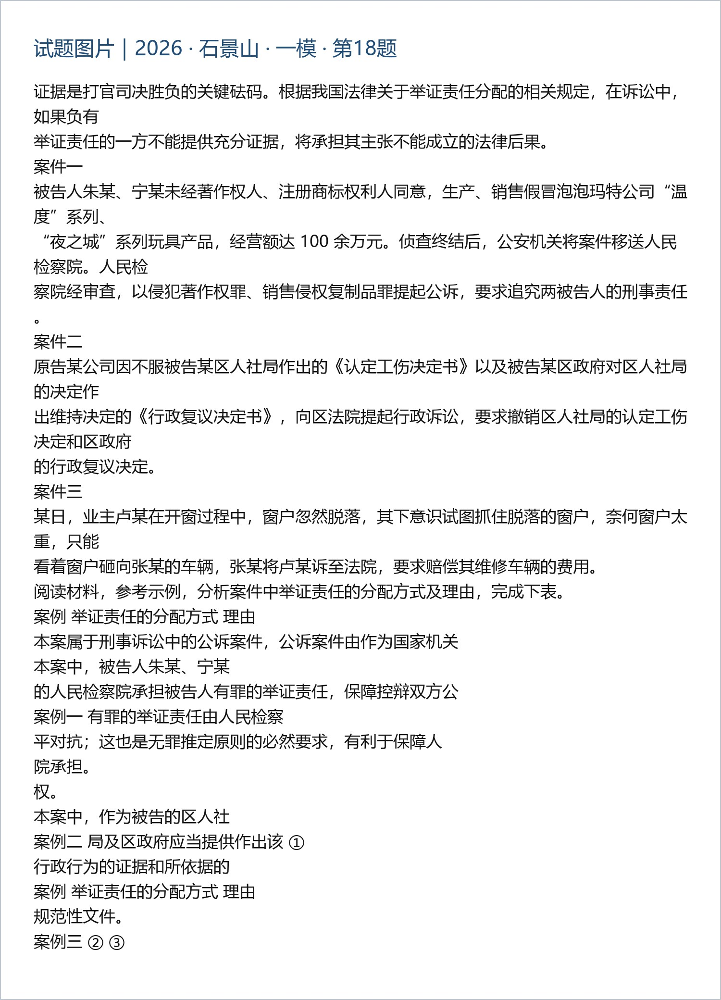

#### 设问
案例三 ② ③

#### 细则
18．（8分）
①本案属于行政诉讼（1分），行政诉讼的核心问题是行政机关的行政行为是否合法，而行政相对人在举证能力上无法与行政机关抗衡（1分）。
②本案中，原告张某需要对自己车辆受到损害的事实（1分），以及损害与窗户坠落存在因果关系进行举证（1分）；被告卢某作为建筑物的使用人，需要对事故发生没有过错承担举证责任（1分）。
③本案属于民事诉讼（1分），实行“谁主张，谁举证”的原则（1分），但在有些情况下，案件当事人因欠缺专业知识或远离证据难以举证，出于公平合理的考虑，实行举证责任倒置原则。/本案属于建筑物发生坠落造成他人损害，适用过错推定原则，关于过错的举证责任倒置。（1分）

#### 细则图
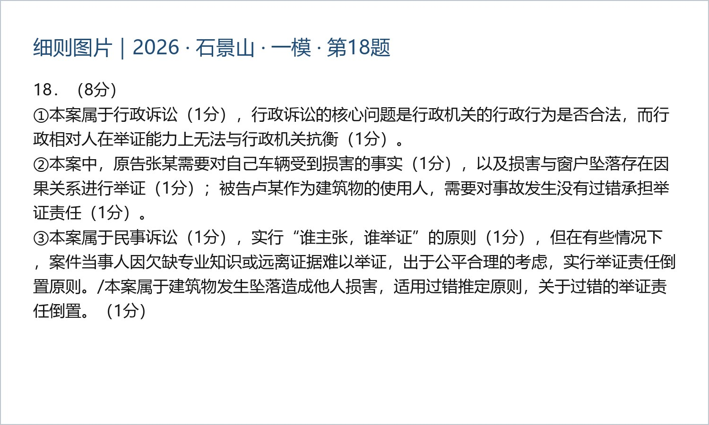

#### 答案落点
- 18．（8分）①本案属于行政诉讼（1分），行政诉讼的核心问题是行政机关的行政行为是否合法，而行政相对人在举证能力上无法与行政机关抗衡（1分）。
- ②本案中，原告张某需要对自己车辆受到损害的事实（1分），以及损害与窗户坠落存在因果关系进行举证（1分）；
- 被告卢某作为建筑物的使用人，需要对事故发生没有过错承担举证责任（1分）。
- ③本案属于民事诉讼（1分），实行“谁主张，谁举证”的原则（1分），但在有些情况下，案件当事人因欠缺专业知识或远离证据难以举证，出于公平合理的考虑，实行举证责任倒置原则。
- /本案属于建筑物发生坠落造成他人损害，适用过错推定原则，关于过错的举证责任倒置。

### 2026 · 门头沟 · 一模 · 第18题第1问

- 题目来源：2026 · 门头沟 · 一模 · 第18题第1问
- 框架归位：A10 纠纷解决程序｜B6 维权路径
- 同题组：本题组仅本分问。

#### 材料
防治生态环境污染，是千秋大计。某地环境污染民事公益诉讼案，是一起由社会组织
依法起诉、人民法院主持调解并全程督导履行的环境司法案件。
【风险呈现】涉案赤泥库原本是某市铝土矿排出的废弃物堆积地，占地1840亩，堆
存强碱性、强腐蚀性工业固废1664.3万立方米。长期扬尘污染威胁1公里外的全国重点
文物保护单位；且未按规定封场，存在溃坝等地质灾害风险，严重危及周边生态环境与公
共安全。
【司法推动】2016 年，该市一家以维护生态环境公共利益为宗旨的环境公益社会组
织，对涉案企业提起环境民事公益诉讼。审理中，法院对当事人达成的首份和解协议进行
审查，认定其未约定封场措施，不足以保护社会公共利益，不予确认。经法院组织技术论
证、引导协商，双方于2018年达成调解协议，主要内容包括企业自筹资金、五年内完成
封场和环境修复、环保组织享有监督权，等等。法院出具民事调解书予以确认。
【治理见效】结案后，人民法院主动与行政部门沟通标准，定期现场回访，持续跟踪
修复进度。至 2023 年 12 月，封场项目竣工并通过环境保护和安全验收，本案民事调解
书的内容已全部履行完毕，实现了生态安全、产业转型与公众获得感的同步提升，生态效
益、经济效益与社会效益有机统一。

#### 设问
（1）结合材料，运用《法律与生活》的知识，说明本案是如何消除损害风险，维护
生态环境公共利益的。（8分）

#### 细则
18．（15分）
（1）（8分）《法律与生活》诉讼主体、纠纷解决方式、法律效力等相关知识
示例：
第一，从提起诉讼的主体看：该公益社会组织自觉承担社会责任，对涉案企业提起环境民事公益诉讼。知识对接：公民、法人或者其他组织认为自己所享有或依法由自己管理、支配的民事权益受到侵害，可以向人民法院提出诉讼请求。
第二，从纠纷解决方式看：该案是通过和解、司法调解、诉讼的方式予以解决的。知识对接：和解、调解、诉讼各有优势，功能各有侧重，为人们提供了多元的纠纷解决途径。（《法律与生活》第82页）
第三，从法律效力看，法院依法对当事人达成的首份和解协议进行审查，经过调解后还出具民事调解书予以确认，实现从“纸面责任”到“刚性约束”的跃升。知识对接：经人民法院依法确认有效的和解和调解协议，具有强制执行效力。
细则：

#### 答案落点
- 18．（15分）（1）（8分）《法律与生活》诉讼主体、纠纷解决方式、法律效力等相关知识示例：第一，从提起诉讼的主体看：该公益社会组织自觉承担社会责任，对涉案企业提起环境民事公益诉讼。
- 知识对接：公民、法人或者其他组织认为自己所享有或依法由自己管理、支配的民事权益受到侵害，可以向人民法院提出诉讼请求。
- 第二，从纠纷解决方式看：该案是通过和解、司法调解、诉讼的方式予以解决的。
- 知识对接：和解、调解、诉讼各有优势，功能各有侧重，为人们提供了多元的纠纷解决途径。
- （《法律与生活》第82页）第三，从法律效力看，法院依法对当事人达成的首份和解协议进行审查，经过调解后还出具民事调解书予以确认，实现从“纸面责任”到“刚性约束”的跃升。
- 知识对接：经人民法院依法确认有效的和解和调解协议，具有强制执行效力。

## 跨模块背景题（不纳入选必二核心轴）

本节只保留与同题组材料相关、但主知识不属于选必二核心轴的分问，帮助学生辨别模块边界。

### 2026 · 西城 · 二模 · 第18题第3问

- 题目来源：2026 · 西城 · 二模 · 第18题第3问
- 框架归位：跨模块背景题｜主知识：政治与法治/法治中国（不纳入选必二核心轴）
- 同题组：2026 · 西城 · 二模 · 第18题第1问；2026 · 西城 · 二模 · 第18题第2问；2026 · 西城 · 二模 · 第18题第3问

#### 材料
材料二 该案因涉及生成式AI的法律地位、责任边界、监管规范等新型法律与治理问题，被最高人民法院列为典型案例。该案判决坚持“平衡AI产业创新与用户合法权益保护”，为全国法院审理同类案件提供了统一裁判标准，也为AI企业规范经营、行政机关强化监管、公众理性使用AI提供了明确指引。

#### 原题图
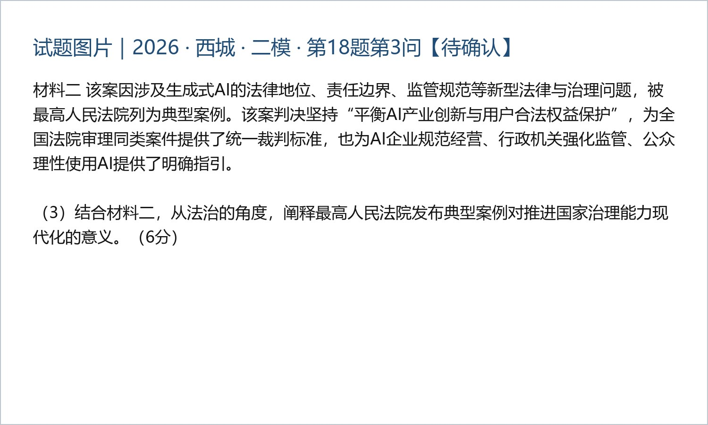

#### 设问
（3）结合材料二，从法治的角度，阐释最高人民法院发布典型案例对推进国家治理能力现代化的意义。（6分）

#### 细则
（3）结合材料二，从法治的角度，阐释最高人民法院发布典型案例对推进国家治理能力现代化的意义。（6分）
完善数字治理规则，健全法律实施机制，提升治理法治化水平。（任一，1分）
发挥典型案例的示范指引与警示教育作用，规范权力运行，提升司法公正，推进依法行政。（任二，3分；一点2分，两点3分）
引导公众依法行使权利、履行义务。（1分）
保障公民合法权益与社会公共利益，助力国家对新兴产业领域的治理能力提升，推进国家治理能力现代化。（任一，1分）
细则：完善数字治理规则、实施规则；变通为纳入法治轨道、有法可依、完善司法体制、完善法律规范、法治实施。司法公正；变通为公正司法、“事实为依据，法律为准绳”、司法权威。推进政府依法行政；变通为政府履行职能、严格执法。示范与警示作用；变通为宣传教育、发挥司法的规则引领与价值导向功能。公众依法行使权利、履行义务；变通为法治意识、全民尊法守法。保障公民合法权益与社会公共利益；变通为平衡公民权益与公共利益。

#### 细则图
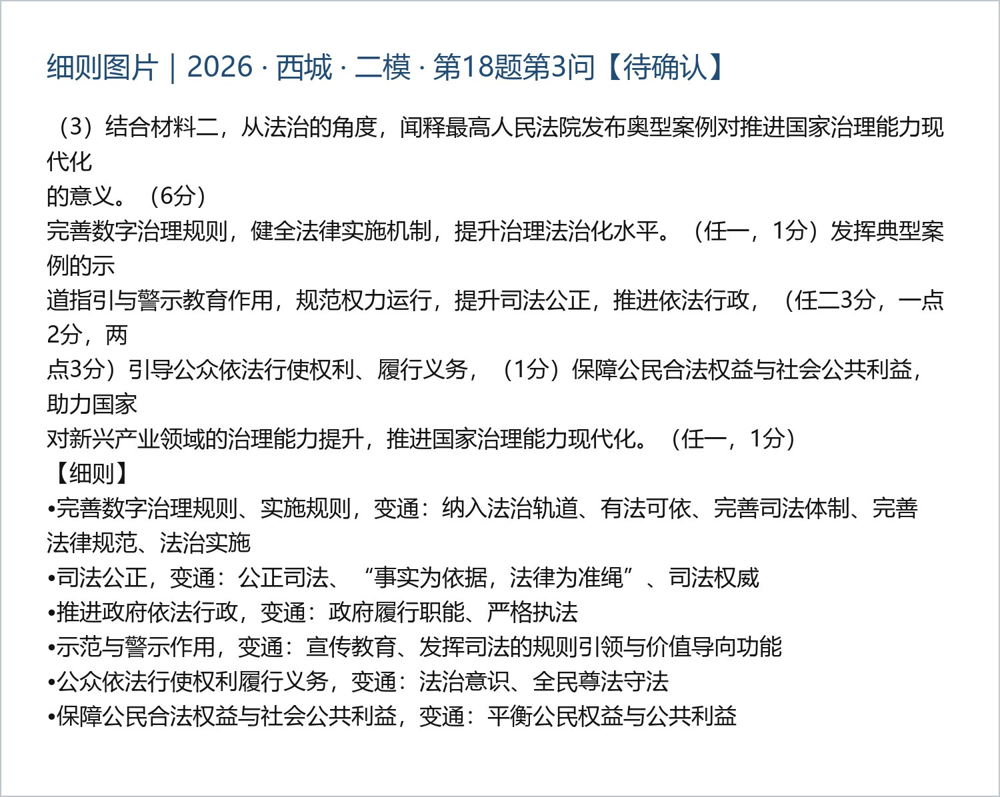

#### 答案落点
- （3）结合材料二，从法治的角度，阐释最高人民法院发布典型案例对推进国家治理能力现代化的意义。
- （6分）完善数字治理规则，健全法律实施机制，提升治理法治化水平。
- （任一，1分）发挥典型案例的示范指引与警示教育作用，规范权力运行，提升司法公正，推进依法行政。
- （任二，3分；
- 一点2分，两点3分）引导公众依法行使权利、履行义务。
- （1分）保障公民合法权益与社会公共利益，助力国家对新兴产业领域的治理能力提升，推进国家治理能力现代化。
- （任一，1分）细则：完善数字治理规则、实施规则；
